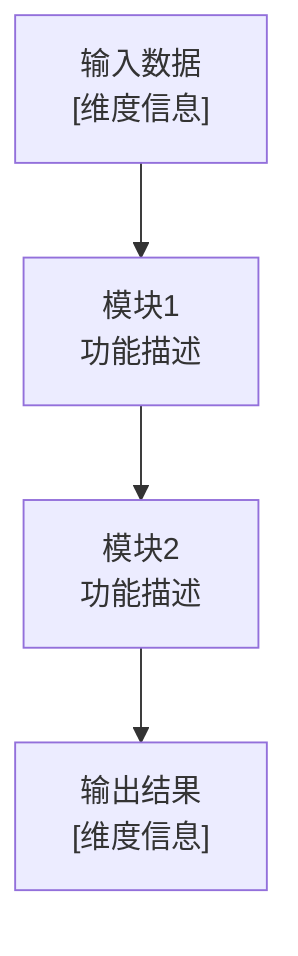

# 技术报告和流程图生成器

## 功能描述

根据指定的算法文件夹或技术描述，自动生成包含详细技术分析和Mermaid流程图的完整技术报告。该命令模仿DINO项目的文档结构，生成包含问题背景、方法原理、代码实现和流程图的高质量中文技术文档。

## 参数说明

`$ARGUMENTS` 可以是以下格式之一：

1. **算法文件夹路径**: 如 `DINO[IDEA-端到端检测]/`
2. **论文或技术名称**: 如 `"YOLO目标检测算法"`
3. **代码仓库路径**: 如 `models/detr/`
4. **配置文件路径**: 如 `config/model.yaml`

## 使用示例

```
/generate-tech-report DINO[IDEA-端到端检测]/
/generate-tech-report "Transformer在计算机视觉中的应用"
/generate-tech-report models/backbone/resnet.py
/generate-tech-report DINOv2/
```

## 执行步骤

### 1. 参数解析与内容分析

```python
# 检测参数类型
if os.path.exists($ARGUMENTS):
    # 文件夹或文件路径
    content_source = "local_files"
    base_path = $ARGUMENTS
else:
    # 技术名称或描述
    content_source = "description"
    topic = $ARGUMENTS
```

### 2. 源码分析阶段

#### 2.1 文件结构扫描
- 使用 `Glob` 工具递归搜索源码文件*.py, *.yaml, *.md, 查找README.md中是否有论文url, 用`WebFetch`获取论文链接
- 使用 `Grep` 搜索关键函数名、类名和配置参数
- 分析项目结构和模块依赖关系

#### 2.2 核心算法识别
```python
# 搜索核心算法实现
key_patterns = [
    "class.*Transformer", "class.*DETR", "class.*DINO",
    "def forward", "def loss", "def __init__",
    "attention", "encoder", "decoder", "backbone"
]
```

#### 2.3 配置参数提取
- 解析配置文件（config/*.py, *.yaml）
- 提取训练参数、模型参数和超参数设置

### 3. 技术报告生成

#### 3.1 文档结构设计
基于DINO.md的结构模板：

```markdown
# [算法名称]: [英文标题]

[论文链接] | [代码仓库]

## 摘要
- 核心创新点总结
- 主要性能指标
- 与前序工作的对比

## 一、核心技术点1
### 1.1 问题背景
### 1.2 方法原理
#### 1.2.1 数学定义
#### 1.2.2 算法实现（带详细注释）
#### 1.2.3 关键配置参数
### 1.3 实验效果

## 二、核心技术点2
[同样的结构]

## 三、整体架构与关键组件
### 3.1 模型架构
### 3.2 损失函数
### 3.3 训练配置

## 四、实验结果与分析
### 4.1 数据集性能
### 4.2 消融实验
### 4.3 收敛速度对比

## 五、总结
```

#### 3.2 代码片段处理
- 提取关键函数和类的实现
- 添加详细的中文注释
- 标注文件路径和行号（格式：`file_path:line_number`）

#### 3.3 数学公式处理
- 识别算法中的数学原理
- 使用LaTeX格式编写公式
- 结合代码实现解释公式含义

### 4. Mermaid流程图生成

#### 4.1 整体架构流程图


#### 4.2 数据流程图
- 跟踪数据在各模块间的维度变化
- 标注关键的tensor shape转换
- 展示并行处理分支

#### 4.3 训练流程图


#### 4.4 算法细节流程图
- 针对每个核心算法生成详细流程图
- 包含条件分支和循环逻辑
- 展示注意力机制、编码解码过程等

### 5. 文件输出与整理

#### 5.1 生成主技术报告
文件名：`[算法名称].md`
包含完整的技术分析和代码实现说明

#### 5.2 生成流程图文档  
文件名：`[算法名称]_流程图_Mermaid.md`
包含所有Mermaid图表和维度变化说明

#### 5.3 代码示例文件（可选）
如果需要，生成关键算法的独立实现示例

### 6. 质量检查与优化

#### 6.1 技术准确性检查
- 验证代码引用的正确性
- 确认数学公式的准确性
- 检查技术描述的逻辑性

#### 6.2 文档完整性检查
- 确保所有章节都有内容
- 验证图表引用的正确性
- 检查格式一致性

#### 6.3 中文表达优化
- 使用准确的技术术语
- 保持描述的简洁性和可读性
- 确保逻辑结构清晰

## 高级功能

### 实验对比分析
- 自动提取并对比不同模型的性能数据
- 生成性能对比表格
- 分析算法优势和局限性

### 代码复杂度分析
- 计算关键函数的时间复杂度
- 分析模型参数量和计算量
- 评估内存使用情况

### 相关工作关联
- 搜索相关算法的引用关系
- 分析技术演进路径
- 提供扩展阅读建议

## 输出格式

### 主要输出文件
1. `[算法名称].md` - 完整技术报告
2. `[算法名称]_流程图_Mermaid.md` - 流程图集合
3. `[算法名称]_实现示例.py` - 关键代码示例（可选）

### 报告包含内容
- 📋 技术背景和动机分析
- 🔬 详细的方法原理说明
- 💻 带注释的代码实现片段
- 📊 Mermaid格式的多层次流程图
- 📈 实验结果和性能分析
- 🎯 总结和未来方向

### 流程图类型
- 整体架构图
- 数据流程图  
- 训练流程图
- 算法细节图
- 维度变化图
- 损失计算图

## 注意事项

1. **文件引用格式**: 所有代码片段必须包含 `file_path:line_number` 格式的引用
2. **中文技术表达**: 使用准确的中文技术术语，避免直译
3. **图表一致性**: 确保所有Mermaid图表使用一致的样式和命名规范
4. **代码完整性**: 提取的代码片段应包含足够的上下文信息
5. **数学公式**: 所有公式使用LaTeX格式，并提供中文解释

## 错误处理

- 如果指定路径不存在，尝试在当前目录搜索相关文件
- 如果无法找到足够的源码信息，基于技术描述生成框架性文档
- 对于复杂的算法，优先生成核心流程，再逐步完善细节
- 如果Mermaid图表过于复杂，拆分为多个子图

该命令旨在成为研究者和开发者的得力助手，快速生成高质量的算法技术文档，促进技术理解和知识传播。