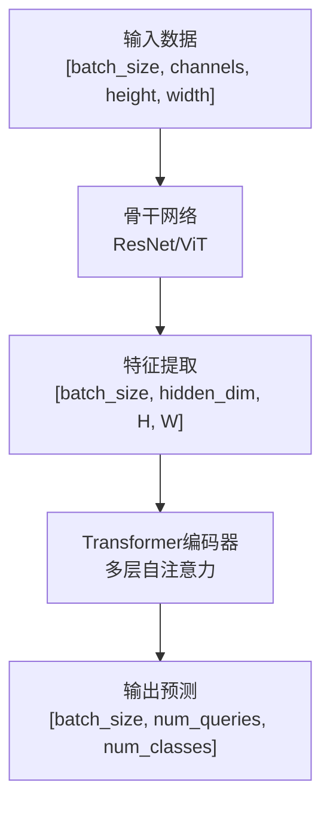
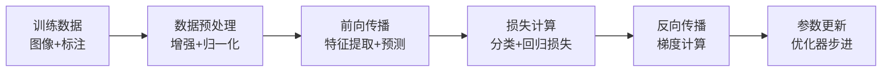

# 技术报告和流程图生成器

## 功能描述

根据指定的算法文件夹或技术描述，自动生成包含核心创新点的详细技术分析和Mermaid流程图的完整技术报告。该命令模仿DINO项目的文档结构，生成包含问题背景、方法原理、代码实现和流程图的高质量中文技术文档。

## 参数说明

`$ARGUMENTS` 可以是以下格式之一：

1. **算法文件夹路径**: 如 `DINO[IDEA-端到端检测]/`
2. **论文或技术名称**: 如 `"YOLO目标检测算法"`
3. **代码仓库路径**: 如 `models/detr/`
4. **配置文件路径**: 如 `config/model.yaml`

## 使用示例

```
/generate-tech-report DINO[IDEA-端到端检测]/
/generate-tech-report "Transformer在计算机视觉中的应用"
/generate-tech-report models/backbone/resnet.py
/generate-tech-report DINOv2/
```

## 执行步骤

### 1. 参数解析与内容分析

```python
# 检测参数类型
if os.path.exists($ARGUMENTS):
    # 文件夹或文件路径
    content_source = "local_files"
    base_path = $ARGUMENTS
else:
    # 技术名称或描述
    content_source = "description"
    topic = $ARGUMENTS
```

### 2. 论文资源获取与理论分析阶段

#### 2.1 论文资源获取
- 使用 `Glob` 搜索项目中的README.md和文档文件
- 使用 `Grep` 搜索论文链接、arXiv链接和DOI
- 如果找到论文链接，使用 `WebFetch` 获取论文内容

#### 2.2 论文图片资源检索
- 使用 `Glob` 搜索算法文件夹下的ASSETS目录：
- 搜索常见图片格式：`*.png`, `*.jpg`, `*.jpeg`, `*.svg`, `*.pdf`
- 分析图片文件名，识别可能的论文图片类型：
  ```python
  image_types = {
      "architecture": ["arch", "model", "network", "structure"],
      "results": ["result", "performance", "comparison", "table"],
      "algorithm": ["flow", "algorithm", "process", "pipeline"],
      "attention": ["attention", "heatmap", "visualization"],
      "loss": ["loss", "curve", "training"]
  }
  ```

#### 2.3 论文内容深度分析
```python
# 论文分析重点
analysis_focus = [
    "摘要和核心贡献点",
    "问题定义和动机",
    "方法原理和数学公式", 
    "算法流程和架构设计",
    "实验设置和性能指标",
    "与现有方法的对比分析"
]
```

#### 2.4 理论框架构建
- 提取论文中的关键技术创新点
- 理解方法的数学原理和理论基础
- 识别算法的核心流程和关键步骤
- 分析方法的优势和潜在局限性

### 3. 基于论文的详细技术报告生成

#### 3.1 论文驱动的文档框架生成
基于论文内容构建完整的技术报告结构：

```markdown
# [算法名称]: [英文标题]

[论文链接] | [代码仓库]

## 摘要
- 基于论文摘要的核心创新点总结
- 论文报告的主要性能指标
- 与前序工作的理论对比分析

## 一、问题背景与动机
### 1.1 现有方法的局限性（从论文Introduction提取）
### 1.2 本文要解决的核心问题
### 1.3 方法的理论价值和应用前景

## 二、方法原理与理论基础
### 2.1 整体方法概述
### 2.2 核心算法原理
#### 2.2.1 数学公式推导（基于论文公式）
#### 2.2.2 算法流程描述
#### 2.2.3 关键设计思想
### 2.3 理论创新点分析

## 三、算法详细设计
### 3.1 模型架构设计（从论文方法部分提取）
### 3.2 损失函数设计
### 3.3 训练策略和技巧

## 四、实验设计与结果分析
### 4.1 实验设置（数据集、评价指标）
### 4.2 主实验结果分析
### 4.3 消融实验分析
### 4.4 与现有方法的对比

## 五、代码实现分析（后续添加）
[预留位置，后续通过源码分析填充]

## 六、总结与展望
### 6.1 主要贡献总结
### 6.2 方法优势与局限性
### 6.3 未来改进方向
```

#### 3.2 论文内容详细解析与图片整合
- 提取论文中的核心数学公式，使用LaTeX格式
- 理解并描述算法的理论依据和设计动机
- 分析方法相对于现有技术的创新性
- 总结实验结果和性能表现

**图片资源整合策略**：
```python
# 图片插入规则
def insert_images_to_sections():
    sections_image_mapping = {
        "模型架构": ["architecture", "model", "network"],
        "算法流程": ["algorithm", "flow", "pipeline"],
        "实验结果": ["results", "performance", "comparison"],
        "注意力可视化": ["attention", "heatmap", "visualization"],
        "训练曲线": ["loss", "curve", "training"]
    }
    
    # 为每个章节查找对应图片
    for section, keywords in sections_image_mapping.items():
        found_images = search_ASSETS_images(keywords)
        if found_images:
            insert_actual_images(section, found_images)
        else:
            insert_placeholder_links(section, keywords)
```

#### 3.3 图片占位符生成规则
当ASSETS文件夹中没有找到对应图片时，生成占位链接：

```markdown
<!-- 架构图占位符 -->

*图1: [算法名称]整体架构图 - 待添加*

<!-- 流程图占位符 -->
  
*图2: [算法名称]算法流程图 - 待添加*

<!-- 结果图占位符 -->

*图3: 在[数据集]上的性能对比 - 待添加*

<!-- 注意力图占位符 -->

*图4: 注意力权重可视化 - 待添加*
```

#### 3.4 理论流程图生成
基于论文中的方法描述生成Mermaid流程图：
- 整体方法流程图
- 算法核心步骤图
- 理论模型架构图

### 4. 源码分析与代码片段插入阶段

#### 4.1 代码结构扫描
- 使用 `Glob` 工具递归搜索源码文件*.py, *.yaml, *.md
- 使用 `Grep` 搜索关键函数名、类名和配置参数
- 分析项目结构和模块依赖关系

#### 4.2 核心算法代码定位
```python
# 基于论文理论搜索对应的代码实现
key_patterns = [
    "class.*Transformer", "class.*DETR", "class.*DINO",
    "def forward", "def loss", "def __init__",
    "attention", "encoder", "decoder", "backbone"
]
```

#### 4.3 代码与理论的对应分析
- 将找到的代码实现与论文中的理论描述进行匹配
- 提取关键函数和类的实现
- 添加详细的中文注释解释代码逻辑
- 标注文件路径和行号（格式：`file_path:line_number`）

#### 4.4 技术报告的代码段补充
- 在第五章"代码实现分析"中插入对应的代码片段
- 为每个理论点添加相应的代码实现说明
- 通过代码验证论文中的算法描述

#### 5.1 基于代码的详细流程图生成
结合源码实现生成精确的数据流程图：



#### 5.2 训练和推理流程详细图


#### 5.3 算法核心模块流程图
- 基于代码实现生成精确的模块间数据流
- 标注真实的tensor维度变化
- 展示关键操作的计算复杂度

### 6. 文件输出与整理

#### 6.1 生成主技术报告
文件名：`[[year]算法名称].md`
生成策略：
- **阶段一**：基于论文内容生成完整的理论框架
- **阶段二**：通过源码分析补充代码实现细节
- **最终报告**：理论与实现完美结合的综合技术文档

#### 6.2 生成流程图文档  
文件名：`[算法名称]_流程图_Mermaid.md`
包含所有Mermaid图表和维度变化说明：
- 理论流程图（基于论文）
- 实现流程图（基于代码）
- 数据流和控制流图

#### 6.3 生成代码分析报告（可选）
文件名：`[算法名称]_代码分析.md`
专门的代码实现分析文档，包含：
- 关键函数逐行解析
- 参数配置说明
- 性能优化技巧

### 7. 质量检查与优化

#### 7.1 论文-代码一致性检查
- 验证代码实现与论文描述的一致性
- 确认数学公式在代码中的正确实现
- 检查算法流程的理论与实践对应关系

#### 7.2 文档完整性检查
- 确保理论部分内容完整
- 验证代码片段的上下文充分性
- 检查流程图的准确性和清晰度

#### 7.3 技术表达优化
- 使用准确的中文技术术语
- 保持理论描述的严谨性
- 确保代码注释的详细性和准确性

## 优化后的执行流程总结

### 新的生成策略优势

1. **理论优先，代码补充**：
   - 先通过论文建立完整的理论框架
   - 再通过源码验证和补充实现细节
   - 确保技术报告的理论完整性和实现准确性

2. **分阶段生成**：
   - 阶段一：论文驱动的理论分析（章节1-4）
   - 阶段二：代码驱动的实现分析（章节5）
   - 阶段三：综合优化和质量检查

3. **理论与实践的有机结合**：
   - 每个理论点都有对应的代码实现
   - 数学公式与代码逻辑相互验证
   - 流程图同时体现理论和实现层面

## 输出格式

### 主要输出文件
1. `[year_算法名称].md` - 完整技术报告（理论+代码+图片）
2. `[算法名称]_流程图_Mermaid.md` - 多层次流程图集合
3. `[算法名称]_代码分析.md` - 详细代码实现分析（可选）

### 报告包含内容
- 📋 基于论文的问题背景和动机分析
- 🔬 详细的理论原理和数学推导
- 🖼️ 论文配图（实际图片或占位链接）
- 💻 与理论对应的代码实现片段
- 📊 理论+实现双重驱动的Mermaid流程图
- 📈 论文实验结果与代码性能分析
- 🎯 理论价值与实现优势的综合总结

### 图片处理策略
- **自动检索**：扫描ASSETS文件夹中的论文相关图片
- **智能匹配**：根据文件名关键词匹配图片到相应章节
- **占位符生成**：未找到图片时生成标准化占位链接
- **统一格式**：确保所有图片引用格式一致

### 流程图类型
- 理论架构图（基于论文方法）
- 实现架构图（基于源码结构）
- 数据流程图（真实tensor维度）
- 训练流程图（实际训练步骤）
- 算法细节图（核心逻辑流程）

## 注意事项

1. **文件引用格式**: 所有代码片段必须包含 `file_path:line_number` 格式的引用
2. **图片引用格式**: 所有图片必须包含相对路径引用 `./ASSETS/图片名称.扩展名`
3. **占位符标准**: 未找到的图片使用统一的占位符格式，并标注"待添加"
4. **中文技术表达**: 使用准确的中文技术术语，避免直译
5. **图表一致性**: 确保所有Mermaid图表使用一致的样式和命名规范
6. **代码完整性**: 提取的代码片段应包含足够的上下文信息
7. **数学公式**: 所有公式使用LaTeX格式，并提供中文解释
8. **图片检索策略**: 优先使用ASSETS文件夹中的实际图片，确保图片文件名描述性强

## 错误处理

- **路径错误**: 如果指定路径不存在，尝试在当前目录搜索相关文件
- **源码缺失**: 如果无法找到足够的源码信息，基于技术描述生成框架性文档
- **图片缺失**: 如果ASSETS文件夹不存在或为空，生成完整的占位符图片链接
- **复杂算法**: 对于复杂的算法，优先生成核心流程，再逐步完善细节
- **图表复杂**: 如果Mermaid图表过于复杂，拆分为多个子图
- **图片格式**: 支持多种图片格式(png/jpg/jpeg/svg/pdf)，优先选择高质量图片

## 图片文件命名建议

为了提高图片自动匹配的准确性，建议ASSETS文件夹中的图片使用以下命名规范：

```
ASSETS/
├── model_architecture.png        # 模型架构图
├── algorithm_flow.png           # 算法流程图  
├── experimental_results.png     # 实验结果对比
├── attention_visualization.png  # 注意力可视化
├── training_curves.png         # 训练曲线
├── loss_function.png           # 损失函数图
└── performance_comparison.png   # 性能对比表
```

该命令旨在成为研究者和开发者的得力助手，快速生成高质量的算法技术文档，促进技术理解和知识传播。通过智能的图片检索和占位符生成，确保文档的完整性和可扩展性。