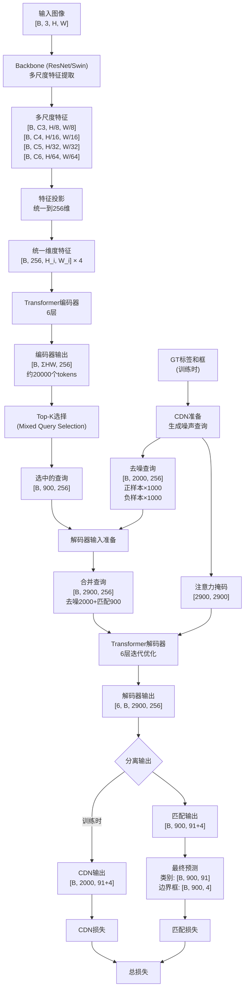
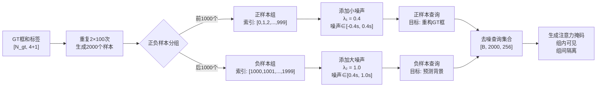
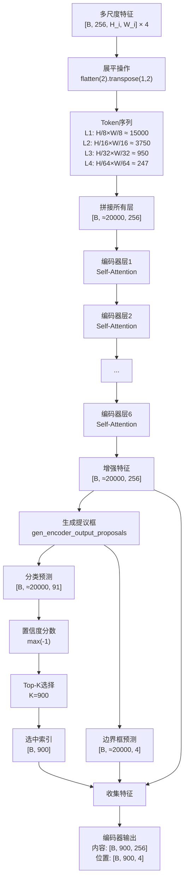
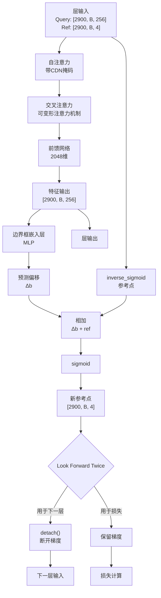
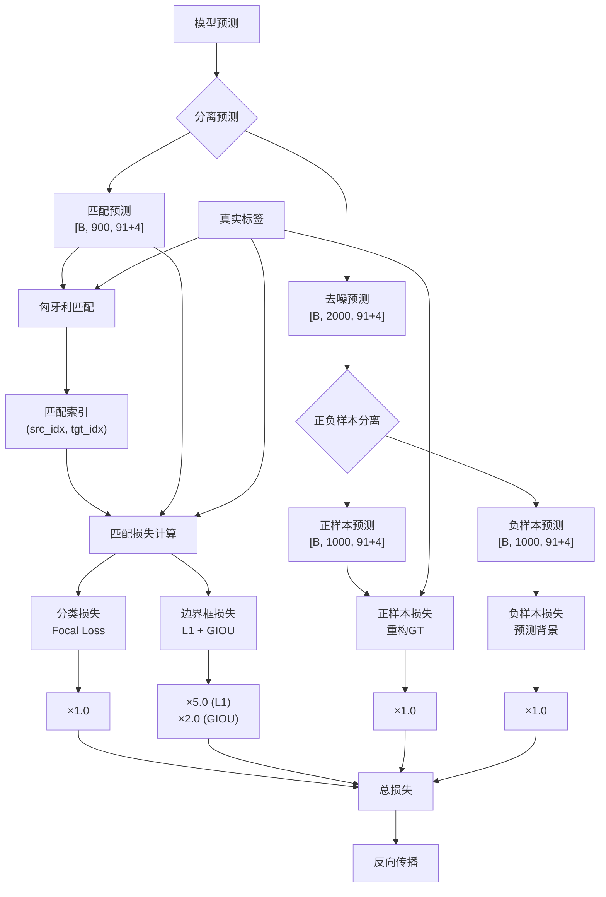
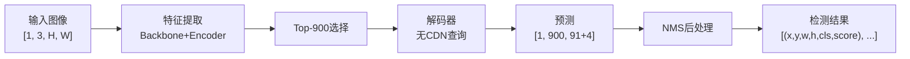
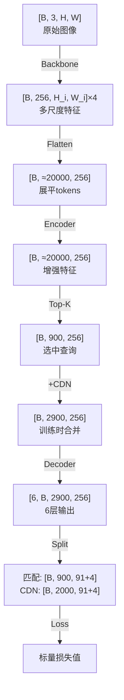

# DINO 数据流程图（Mermaid版）

> 注：如果某些图表无法正常显示，可以使用支持Mermaid的Markdown编辑器（如VSCode + Mermaid插件、Typora等）查看

## 一、整体架构流程图

## 二、CDN详细流程

## 三、编码器处理流程

## 四、解码器层内处理（Look Forward Twice）

## 五、损失计算流程

## 六、推理流程（简化版）

## 七、关键维度变化总结

这些Mermaid图表清晰地展示了DINO模型的完整数据流程，包括关键的维度变化、处理步骤和模块间的连接关系。