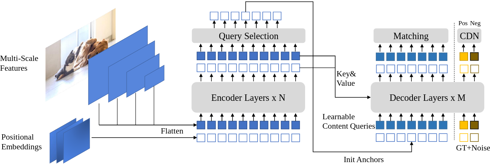
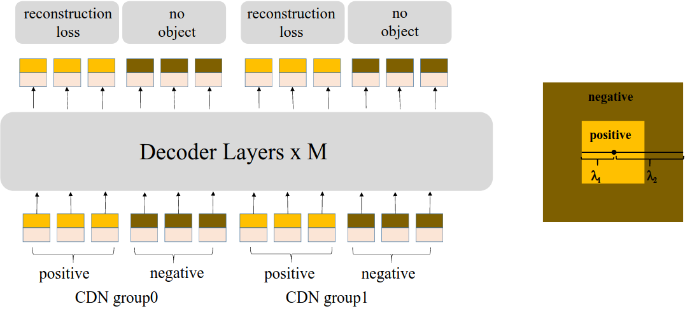
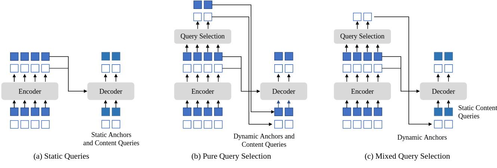

# DINO: DETR with Improved DeNoising Anchor Boxes for End-to-End Object Detection

[论文链接](http://arxiv.org/abs/2203.03605) | [代码仓库](https://github.com/IDEACVR/DINO)



> **图 1. DINO模型框架**：我们的改进主要集中在Transformer编码器和解码器上。编码器最后一层的Top-K特征被选择用于初始化解码器的位置查询，而内容查询保持为可学习参数。解码器还包含一个对比去噪（CDN）模块，同时处理正样本和负样本。

## 摘要

DINO（DETR with Improved deNoising anchOr boxes）是一种最先进的端到端目标检测器。通过使用**对比去噪训练**、**混合查询选择**和**两次前向预测**三大创新技术，DINO在性能和效率上显著超越了之前的DETR类模型。

**主要成果**：
- ResNet-50 + 多尺度特征：12 epochs达到**49.4 AP**，24 epochs达到**51.3 AP**
- 相比DN-DETR分别提升了**+6.0 AP**和**+2.7 AP**
- SwinL + Objects365预训练：COCO val2017达到**63.2 AP**，test-dev达到**63.3 AP**
- 在减小模型规模和预训练数据的同时取得了更好的结果

## 一、对比去噪训练（Contrastive DeNoising Training, CDN）



> **图 2. CDN结构和正负样本示例**：内圈为正样本区域，内外圈之间为负样本区域。

### 1.1 问题背景

传统的去噪训练（DN-DETR）仅通过向GT框添加噪声生成正样本，缺乏对"无目标"情况的建模，导致：
- 模型容易产生重复预测
- 无法有效拒绝低质量的锚框
- 缺少负样本的监督信号

### 1.2 方法原理

CDN通过同时生成正负样本噪声，增强模型的判别能力。

#### 1.2.1 数学定义

给定一个真实边界框 $b_{gt} = (x, y, w, h)$ 和对应的类别标签 $c_{gt}$，CDN生成两种类型的训练样本：

**正样本（Positive Samples）**：
- 添加较小噪声，模型需要重构为原始GT框
- 噪声边界框：$\tilde{b}^+ = b_{gt} + \Delta b^+$
- 其中噪声 $\Delta b^+ \sim \mathcal{U}(-\lambda_1 \cdot s, \lambda_1 \cdot s)$
- $s = (w/2, h/2, w, h)$ 是缩放因子
- $\lambda_1$ 是噪声尺度（默认0.4）

**负样本（Negative Samples）**：
- 添加较大噪声，模型需要预测"无目标"
- 噪声边界框：$\tilde{b}^- = b_{gt} + \Delta b^-$
- 其中噪声 $\Delta b^- \sim \mathcal{U}(\lambda_1 \cdot s, \lambda_2 \cdot s) \cup \mathcal{U}(-\lambda_2 \cdot s, -\lambda_1 \cdot s)$
- $\lambda_2 > \lambda_1$，确保负样本噪声更大

**标签噪声**：
- 以概率 $p_{flip}$ 随机翻转类别标签
- $\tilde{c} = \begin{cases} c_{gt} & \text{with probability } 1-p_{flip} \\ c_{rand} & \text{with probability } p_{flip} \end{cases}$
- 其中 $c_{rand} \sim \mathcal{U}(0, N_{cls}-1)$，$p_{flip} = 0.5$

#### 1.2.2 噪声生成实现（详细注释）

```python
# 文件：models/dino/dn_components.py:71-92
# 核心思想：每个GT框生成2个样本（1个正样本+1个负样本），重复dn_number次
# 最终生成：GT数量 × 2 × dn_number 个去噪查询

# 1. 生成正负样本索引
# 假设有3个GT框，dn_number=2，则生成布局如下：
# [正1,正2,正3, 负1,负2,负3] × 2组 = 12个样本
# positive_idx = [0,1,2, 6,7,8]  # 第1组和第2组的正样本位置
# negative_idx = [3,4,5, 9,10,11]  # 第1组和第2组的负样本位置

positive_idx = torch.tensor(range(len(boxes))).long().cuda().unsqueeze(0).repeat(dn_number, 1)
# 初始：[[0,1,2], [0,1,2]]  (假设3个GT框，2个去噪组)

positive_idx += (torch.tensor(range(dn_number)) * len(boxes) * 2).long().cuda().unsqueeze(1)  
# 每组偏移量：第0组+0，第1组+6 (3个GT×2)
# 结果：[[0,1,2], [6,7,8]]

positive_idx = positive_idx.flatten()  # [0,1,2,6,7,8]
negative_idx = positive_idx + len(boxes)  # [3,4,5,9,10,11]

# 2. 生成边界框噪声
if box_noise_scale > 0:
    # 将中心坐标(cx,cy,w,h)转换为角点坐标(x1,y1,x2,y2)
    # 这样做是为了更直观地添加位置噪声
    known_bbox_ = torch.zeros_like(known_bboxs)
    known_bbox_[:, :2] = known_bboxs[:, :2] - known_bboxs[:, 2:] / 2  # 左上角
    known_bbox_[:, 2:] = known_bboxs[:, :2] + known_bboxs[:, 2:] / 2  # 右下角
    
    # 计算每个维度的最大噪声范围
    # diff[:, :2] = 框宽高的一半（用于x,y的噪声范围）
    # diff[:, 2:] = 框宽高的一半（用于w,h的噪声范围）
    diff = torch.zeros_like(known_bboxs)
    diff[:, :2] = known_bboxs[:, 2:] / 2
    diff[:, 2:] = known_bboxs[:, 2:] / 2
    
    # 生成随机噪声
    rand_sign = torch.randint_like(known_bboxs, low=0, high=2, dtype=torch.float32) * 2.0 - 1.0
    # rand_sign ∈ {-1, 1}，决定噪声方向
    
    rand_part = torch.rand_like(known_bboxs)  # ∈ [0, 1]
    rand_part[negative_idx] += 1.0  
    # 关键：负样本的噪声范围变为[1, 2]，确保噪声更大
    # 正样本：rand_part ∈ [0, 1] × λ₁ = [0, 0.4]（小噪声）
    # 负样本：rand_part ∈ [1, 2] × λ₁ = [0.4, 0.8]（大噪声）
    
    rand_part *= rand_sign  # 添加方向
    
    # 应用噪声：框坐标 + 噪声幅度 × 噪声范围 × 噪声尺度
    known_bbox_ = known_bbox_ + torch.mul(rand_part, diff).cuda() * box_noise_scale
    known_bbox_ = known_bbox_.clamp(min=0.0, max=1.0)  # 确保在图像范围内
```

#### 1.2.3 标签噪声的意义和实现

**标签噪声的意义**：
1. **增强鲁棒性**：让模型学会处理错误标注的情况
2. **防止过拟合**：避免模型过度依赖标签信息，强制关注位置信息
3. **对比学习**：让模型学会区分"真正的目标"和"噪声目标"

```python
# 文件：models/dino/dn_components.py:63-67
if label_noise_ratio > 0:
    p = torch.rand_like(known_labels_expaned.float())
    chosen_indice = torch.nonzero(p < (label_noise_ratio * 0.5)).view(-1)  
    # 注意：这里是0.5×label_noise_ratio，因为标签噪声主要用于正样本
    # 正样本需要学会纠正错误的类别标签
    
    new_label = torch.randint_like(chosen_indice, 0, num_classes)  
    # 随机生成新类别，范围[0, num_classes-1]
    
    known_labels_expaned.scatter_(0, chosen_indice, new_label)
    # scatter_操作：将chosen_indice位置的标签替换为new_label
```

**重要细节**：
- 标签噪声仅影响**类别标签**，不影响**监督目标**
- 正样本即使标签被翻转，仍然需要重构到**原始GT框的位置**
- 负样本的标签噪声意义不大，因为它们最终都要预测为背景类

#### 1.2.4 CDN损失函数与标签处理

**关键问题：正负样本使用什么标签进行监督？**

答案：
- **正样本**：使用**原始GT类别标签**（不是噪声标签）
- **负样本**：使用**背景类标签**（标记为"无目标"）

```python
# 文件：models/dino/dino.py:506-522
# CDN损失计算中的标签处理
dn_pos_idx = []  # 正样本索引
dn_neg_idx = []  # 负样本索引

for i in range(len(targets)):
    if len(targets[i]['labels']) > 0:
        t = torch.arange(len(targets[i]['labels'])).long().cuda()
        t = t.unsqueeze(0).repeat(scalar, 1)  # 重复scalar次
        tgt_idx = t.flatten()
        output_idx = (torch.tensor(range(scalar)) * single_pad).long().cuda().unsqueeze(1) + t
        output_idx = output_idx.flatten()
    else:
        output_idx = tgt_idx = torch.tensor([]).long().cuda()
    
    dn_pos_idx.append((output_idx, tgt_idx))  # 正样本：匹配到原始GT
    dn_neg_idx.append((output_idx + single_pad // 2, tgt_idx))  # 负样本：相同GT但偏移
```

**正样本损失**（使用原始GT标签）：
$$\mathcal{L}_{pos} = \sum_{i \in \mathcal{P}} [\mathcal{L}_{cls}(\hat{c}_i, c_{gt}^{original}) + \alpha \cdot \mathcal{L}_{L1}(\hat{b}_i, b_{gt}) + \beta \cdot \mathcal{L}_{GIOU}(\hat{b}_i, b_{gt})]$$

其中：
- $c_{gt}^{original}$ 是**原始的GT类别**（如"猫"、"狗"），不是噪声标签
- 即使输入时标签被翻转，监督时仍用原始标签
- $\mathcal{L}_{cls}$ 使用Focal Loss，处理one-hot编码的标签

**负样本损失**（预测为背景）：
$$\mathcal{L}_{neg} = \sum_{i \in \mathcal{N}} \mathcal{L}_{cls}(\hat{c}_i, \varnothing)$$

其中：
- $\varnothing$ 表示背景类（在COCO中是第91类）
- 负样本不计算边界框回归损失
- 目的是让模型学会拒绝远离GT的提议

**总CDN损失**：
$$\mathcal{L}_{CDN} = \frac{1}{|\mathcal{P}| + |\mathcal{N}|} (\mathcal{L}_{pos} + \mathcal{L}_{neg})$$

**为什么这样设计？**
1. **标签噪声是输入噪声**：仅在输入时添加，让模型更鲁棒
2. **监督信号保持正确**：使用原始GT确保学习方向正确
3. **对比学习效果**：正样本学习"什么是目标"，负样本学习"什么不是目标"

#### 1.2.5 注意力掩码设计

```python
# 文件：models/dino/dn_components.py:112-124
tgt_size = pad_size + num_queries
attn_mask = torch.ones(tgt_size, tgt_size).to('cuda') < 0

# 匹配查询不能看到去噪部分
attn_mask[pad_size:, :pad_size] = True

# 去噪组之间互相隔离
for i in range(dn_number):
    if i == 0:
        attn_mask[single_pad * 2 * i:single_pad * 2 * (i + 1), 
                  single_pad * 2 * (i + 1):pad_size] = True
    # ... 其他组的掩码设置
```

**注意力掩码矩阵示例**

假设：2个GT框，2个去噪组(dn_number=2)，4个匹配查询(num_queries=4)
- 去噪查询数：2(GT) × 2(正负) × 2(组) = 8个
- 总查询数：8(去噪) + 4(匹配) = 12个

```
注意力掩码矩阵 (12×12)，其中 ■=True(被屏蔽), □=False(可见)

查询类型布局：
[正1,正2,负1,负2] [正1,正2,负1,负2] [匹配1,匹配2,匹配3,匹配4]
 ← 第1组去噪 →    ← 第2组去噪 →      ← 匹配查询 →

        目标查询 →
源查询  0 1 2 3 | 4 5 6 7 | 8 9 10 11
   ↓   +---------+---------+-----------
0  正1 |□ □ □ □ | ■ ■ ■ ■ | □ □ □ □   第
1  正2 |□ □ □ □ | ■ ■ ■ ■ | □ □ □ □   1
2  负1 |□ □ □ □ | ■ ■ ■ ■ | □ □ □ □   组
3  负2 |□ □ □ □ | ■ ■ ■ ■ | □ □ □ □
   --- +---------+---------+-----------
4  正1 |■ ■ ■ ■ | □ □ □ □ | □ □ □ □   第
5  正2 |■ ■ ■ ■ | □ □ □ □ | □ □ □ □   2
6  负1 |■ ■ ■ ■ | □ □ □ □ | □ □ □ □   组
7  负2 |■ ■ ■ ■ | □ □ □ □ | □ □ □ □
   --- +---------+---------+-----------
8  匹1 |■ ■ ■ ■ | ■ ■ ■ ■ | □ □ □ □   匹
9  匹2 |■ ■ ■ ■ | ■ ■ ■ ■ | □ □ □ □   配
10 匹3 |■ ■ ■ ■ | ■ ■ ■ ■ | □ □ □ □   查
11 匹4 |■ ■ ■ ■ | ■ ■ ■ ■ | □ □ □ □   询
```

**掩码规则解释**：

1. **组内可见**（□）：
   - 同一去噪组内的查询可以相互看见
   - 匹配查询之间可以相互看见
   - 这允许组内的信息交流

2. **组间隔离**（■）：
   - 不同去噪组之间相互屏蔽
   - 防止不同组的噪声样本相互干扰
   - 每组独立学习去噪

3. **匹配查询隔离**（■）：
   - 匹配查询看不到任何去噪查询
   - 去噪查询也看不到匹配查询（单向）
   - 保证匹配查询不受噪声影响

**更大规模示例**（3个GT，2个去噪组，6个匹配查询）：

```
总计：3×2×2(去噪) + 6(匹配) = 18个查询

去噪部分(12×12)              匹配部分(6×6)
┌─────────┬─────────┐        ┌─────────┐
│ 组1可见  │ ■■■■■■  │        │         │
│ 6×6     │ (屏蔽)   │        │ 全部可见 │
├─────────┼─────────┤        │   6×6   │
│ ■■■■■■  │ 组2可见  │        │         │
│ (屏蔽)   │ 6×6     │        └─────────┘
└─────────┴─────────┘
     ↑                            ↑
   去噪查询                    匹配查询
  相互隔离                    完全独立
```

这种设计确保了：
- **去噪训练的独立性**：每组独立处理噪声
- **匹配查询的纯净性**：不受噪声干扰
- **并行训练效率**：多组可并行学习

### 1.3 关键配置参数

```python
# 文件：config/DINO/DINO_4scale.py:98-103
use_dn = True                  # 启用去噪训练
dn_number = 100               # 去噪组数量（正负样本各100组）
dn_box_noise_scale = 0.4      # 边界框噪声尺度（λ₁）
dn_label_noise_ratio = 0.5    # 标签噪声比例（p_flip）
dn_labelbook_size = 91        # 类别数量+1（背景类）
```

### 1.4 CDN算法流程

```
算法1: 对比去噪训练（CDN）
输入: GT框集合 B = {b₁, b₂, ..., bₙ}，GT标签 C = {c₁, c₂, ..., cₙ}
参数: λ₁ = 0.4, λ₂ = 1.0, p_flip = 0.5, G = 100（去噪组数）
输出: 去噪查询 Q_dn，注意力掩码 M

1: 初始化 Q⁺ = ∅, Q⁻ = ∅  // 正负样本查询集合
2: for g = 1 to G do
3:     for each (bᵢ, cᵢ) ∈ (B, C) do
4:         // 生成正样本
5:         Δb⁺ ~ U(-λ₁·s, λ₁·s)
6:         b̃ᵢ⁺ = bᵢ + Δb⁺
7:         c̃ᵢ⁺ = flip(cᵢ) with probability p_flip
8:         Q⁺ = Q⁺ ∪ {(b̃ᵢ⁺, c̃ᵢ⁺, label=cᵢ)}
9:         
10:        // 生成负样本
11:        Δb⁻ ~ U(λ₁·s, λ₂·s) ∪ U(-λ₂·s, -λ₁·s)
12:        b̃ᵢ⁻ = bᵢ + Δb⁻
13:        c̃ᵢ⁻ = flip(cᵢ) with probability p_flip
14:        Q⁻ = Q⁻ ∪ {(b̃ᵢ⁻, c̃ᵢ⁻, label=∅)}
15:    end for
16: end for
17: Q_dn = Q⁺ ∪ Q⁻
18: M = generate_attention_mask(Q_dn)  // 生成注意力掩码
19: return Q_dn, M
```

### 1.5 实验效果

- 小目标检测AP提升：**+7.5 AP**（12 epochs）
- 显著减少重复预测
- 加速模型收敛


## 二、混合查询选择（Mixed Query Selection）



> **图 3. 三种查询初始化方法对比**：(a) 静态查询 (b) 动态查询 (c) 混合查询（DINO采用）

### 2.1 问题背景

传统DETR使用静态的可学习查询，存在以下问题：
- 查询与图像内容无关，缺乏空间先验
- 收敛速度慢
- 对小目标检测效果不佳

### 2.2 方法原理

#### 2.2.1 编码器输出提议生成

```python
# 文件：models/dino/utils.py:15-61
def gen_encoder_output_proposals(memory, memory_padding_mask, spatial_shapes, learnedwh=None):
    """
    为编码器输出的每个空间位置生成一个初始边界框提议
    
    Input:
        memory: [B, ΣHW, 256]  # 编码器输出特征，约20000个tokens
        memory_padding_mask: [B, ΣHW]  # padding掩码
        spatial_shapes: [[H1,W1], [H2,W2], ...]  # 4个层级的尺寸
        learnedwh: 可学习的宽高（可选）
    
    Output:
        output_proposals: [B, ΣHW, 4]  # 初始提议框（unsigmoid格式）
    """
    
    proposals = []
    _cur = 0  # 当前处理位置的索引
    
    # 逐层处理（4个特征层级）
    for lvl, (H_, W_) in enumerate(spatial_shapes):
        # 步骤1：计算有效区域（去除padding）
        mask_flatten_ = memory_padding_mask[:, _cur:(_cur + H_ * W_)].view(N_, H_, W_, 1)
        valid_H = torch.sum(~mask_flatten_[:, :, 0, 0], 1)  # [B] 实际高度
        valid_W = torch.sum(~mask_flatten_[:, 0, :, 0], 1)  # [B] 实际宽度
        
        # 步骤2：生成网格坐标
        # 创建[0,1,...,H_-1] × [0,1,...,W_-1]的网格
        grid_y, grid_x = torch.meshgrid(
            torch.linspace(0, H_ - 1, H_, dtype=torch.float32, device=memory.device),
            torch.linspace(0, W_ - 1, W_, dtype=torch.float32, device=memory.device)
        )
        grid = torch.cat([grid_x.unsqueeze(-1), grid_y.unsqueeze(-1)], -1)  # [H_, W_, 2]
        
        # 步骤3：归一化到[0,1]
        scale = torch.cat([valid_W.unsqueeze(-1), valid_H.unsqueeze(-1)], 1).view(N_, 1, 1, 2)
        grid = (grid.unsqueeze(0).expand(N_, -1, -1, -1) + 0.5) / scale
        # +0.5: 移到像素中心
        # /scale: 归一化到相对坐标
        
        # 步骤4：设置初始宽高（尺度感知）
        if learnedwh is not None:
            wh = torch.ones_like(grid) * learnedwh.sigmoid() * (2.0 ** lvl)
        else:
            wh = torch.ones_like(grid) * 0.05 * (2.0 ** lvl)  # 默认5% × 2^层级
        
        # 关键：宽高随层级指数增长
        # lvl=0 (stride=8):  wh = 0.05 (小物体)
        # lvl=1 (stride=16): wh = 0.10 (中物体)
        # lvl=2 (stride=32): wh = 0.20 (大物体)
        # lvl=3 (stride=64): wh = 0.40 (超大物体)
        # 各层提议分布：
        # Layer 0 (stride=8,  100×150): 15000个框，尺寸5%
        # Layer 1 (stride=16, 50×75):   3750个框，尺寸10%  
        # Layer 2 (stride=32, 25×38):   950个框，尺寸20%
        # Layer 3 (stride=64, 13×19):   247个框，尺寸40%
        # ----------------------------------------
        # 总计: 约20000个多尺度初始提议
        
        # 步骤5：组装提议框[x, y, w, h]
        proposal = torch.cat((grid, wh), -1).view(N_, -1, 4)
        proposals.append(proposal)
        _cur += (H_ * W_)
    
    # 步骤6：合并所有层并转换到logit空间
    output_proposals = torch.cat(proposals, 1)  # [B, ΣHW, 4]
    output_proposals = torch.log(output_proposals / (1 - output_proposals))  # inverse sigmoid
    
    return output_memory, output_proposals
```

#### 2.2.2 Top-K选择机制

```python
# 文件：models/dino/deformable_transformer.py:430-450（简化）
if self.two_stage_type != 'no':
    # 获取编码器输出和提议
    enc_outputs_class = self.enc_out_class_embed(output_memory)
    enc_outputs_coord = self.enc_out_bbox_embed(output_memory) + output_proposals
    
    # 选择Top-K个高置信度的提议
    topk = self.num_queries
    topk_proposals = torch.topk(enc_outputs_class.max(-1)[0], topk, dim=1)[1]
    
    # 收集Top-K提议的特征和位置
    topk_coords = torch.gather(enc_outputs_coord, 1, 
                               topk_proposals.unsqueeze(-1).repeat(1, 1, 4))
    
    # 初始化位置查询
    init_reference_out = topk_coords.detach()
    
    # 内容查询保持可学习
    target = self.tgt_embed.weight.unsqueeze(0).repeat(bs, 1, 1)
```

### 2.3 两阶段配置

```python
# 文件：config/DINO/DINO_4scale.py:63-71
two_stage_type = 'standard'           # 启用两阶段模式
two_stage_add_query_num = 0           # 额外查询数量
two_stage_bbox_embed_share = False    # 边界框嵌入是否共享
two_stage_class_embed_share = False   # 类别嵌入是否共享
two_stage_default_hw = 0.05           # 默认宽高比例
num_select = 300                      # Top-K选择数量
```

### 2.4 实验效果

- 收敛速度提升：相同epochs下AP提升2-3点
- 小目标检测改善明显
- 减少了查询的冗余性

## 三、两次前向预测（Look Forward Twice）

### 3.1 问题背景

传统DETR的边界框更新采用"一次前向"方式：
- 每层只使用当前层信息更新边界框
- 梯度在层间断开，无法利用后续层的监督信号
- 早期层的边界框预测精度较低

### 3.2 方法原理

#### 3.2.1 核心实现

```python
# 文件：models/dino/deformable_transformer.py:730-754
# 解码器层中的边界框迭代更新
if self.bbox_embed is not None:
    # 将参考点转换到logit空间
    reference_before_sigmoid = inverse_sigmoid(reference_points)
    
    # 预测边界框偏移量
    delta_unsig = self.bbox_embed[layer_id](output)
    
    # 第一次更新：计算新的边界框
    outputs_unsig = delta_unsig + reference_before_sigmoid
    new_reference_points = outputs_unsig.sigmoid()
    
    # 关键创新：梯度处理
    if self.rm_detach and 'dec' in self.rm_detach:
        reference_points = new_reference_points  # 保留梯度
    else:
        reference_points = new_reference_points.detach()  # 默认：断开梯度
    
    # 保存用于损失计算的参考点
    if self.use_detached_boxes_dec_out:
        ref_points.append(reference_points)      # 使用断开的版本
    else:
        ref_points.append(new_reference_points)  # 使用未断开的版本（Look Forward Twice）
```

#### 3.2.2 DINO中的边界框更新策略

```python
# 文件：models/dino/dino.py:276-280
# 主模型中的边界框预测
outputs_coord_list = []
for dec_lid, (layer_ref_sig, layer_bbox_embed, layer_hs) in enumerate(
    zip(reference[:-1], self.bbox_embed, hs)
):
    layer_delta_unsig = layer_bbox_embed(layer_hs)
    layer_outputs_unsig = layer_delta_unsig + inverse_sigmoid(layer_ref_sig)
    layer_outputs = layer_outputs_unsig.sigmoid()
    outputs_coord_list.append(layer_outputs)

# 这里的关键是reference包含了未断开梯度的版本
# 允许后续层的损失影响前面层的参数更新
```

### 3.3 数学表示

传统的一次前向：
$$\Delta b_i = \text{Layer}_i(b_{i-1}), \quad b_i = \text{detach}(\text{Update}(b_{i-1}, \Delta b_i))$$

DINO的两次前向：
$$
\begin{aligned}
\Delta b_i &= \text{Layer}_i(b_{i-1}) \\
b_i' &= \text{Update}(b_{i-1}, \Delta b_i) \\
b_i &= \text{detach}(b_i') \quad \text{(用于下一层输入)} \\
b_i^{pred} &= b_i' \quad \text{(用于损失计算，保留梯度)}
\end{aligned}
$$

### 3.4 实验效果

- 边界框预测精度提升
- 加速收敛：早期层能更快学到准确的边界框预测
- 特别有利于小目标检测

## 四、整体架构与关键组件

### 4.1 模型架构

```python
# 文件：models/dino/dino.py:38-60
class DINO(nn.Module):
    def __init__(self,
                 backbone,                    # 骨干网络（ResNet/Swin）
                 transformer,                 # Transformer模块
                 num_classes,                 # 类别数
                 num_queries=900,            # 查询数量
                 aux_loss=True,              # 辅助损失
                 iter_update=True,           # 迭代更新
                 query_dim=4,                # 查询维度
                 num_feature_levels=4,       # 特征金字塔层数
                 # DN参数
                 dn_number=100,              
                 dn_box_noise_scale=0.4,
                 dn_label_noise_ratio=0.5,
                 # 两阶段参数
                 two_stage_type='standard',
                 # ...
                 ):
```

### 4.2 损失函数

```python
# 文件：models/dino/dino.py:356-379
def loss_labels(self, outputs, targets, indices, num_boxes, log=True):
    """分类损失：使用Focal Loss"""
    src_logits = outputs['pred_logits']
    # ... 准备目标
    loss_ce = sigmoid_focal_loss(
        src_logits, 
        target_classes_onehot, 
        num_boxes, 
        alpha=self.focal_alpha,  # 0.25
        gamma=2
    ) * src_logits.shape[1]
    
def loss_boxes(self, outputs, targets, indices, num_boxes):
    """边界框损失：L1损失 + GIOU损失"""
    loss_bbox = F.l1_loss(src_boxes, target_boxes, reduction='none')
    losses['loss_bbox'] = loss_bbox.sum() / num_boxes
    
    loss_giou = 1 - torch.diag(box_ops.generalized_box_iou(
        box_ops.box_cxcywh_to_xyxy(src_boxes),
        box_ops.box_cxcywh_to_xyxy(target_boxes)
    ))
    losses['loss_giou'] = loss_giou.sum() / num_boxes
```

### 4.3 训练配置

```python
# 文件：config/DINO/DINO_4scale.py
# 优化器设置
lr = 0.0001                          # 基础学习率
lr_backbone = 1e-05                  # 骨干网络学习率
lr_linear_proj_mult = 0.1           # 线性投影层学习率倍数
weight_decay = 0.0001
clip_max_norm = 0.1                  # 梯度裁剪

# 训练设置
batch_size = 2                       # 每GPU批次大小
epochs = 12                          # 训练轮数
lr_drop = 11                         # 学习率下降轮数

# 损失权重
set_cost_class = 2.0                 # 匹配时的分类代价
set_cost_bbox = 5.0                  # 匹配时的L1代价
set_cost_giou = 2.0                  # 匹配时的GIOU代价
cls_loss_coef = 1.0                  # 分类损失权重
bbox_loss_coef = 5.0                 # L1损失权重
giou_loss_coef = 2.0                 # GIOU损失权重
```

## 五、实验结果与分析

### 5.1 COCO数据集性能

| 模型 | 骨干网络 | Epochs | AP | AP<sub>50</sub> | AP<sub>75</sub> | AP<sub>S</sub> | AP<sub>M</sub> | AP<sub>L</sub> |
|------|----------|--------|----|----|----|----|----|----|
| DN-DETR | R50 | 12 | 43.4 | 61.9 | 47.2 | 24.8 | 46.8 | 59.6 |
| **DINO-4scale** | R50 | 12 | 49.0 | 66.6 | 53.5 | 32.0 | 52.3 | 63.0 |
| **DINO-5scale** | R50 | 12 | **49.4** | **66.9** | **53.8** | **32.3** | **52.5** | **63.5** |
| **DINO-4scale** | Swin-L | 12 | 56.8 | 74.5 | 61.8 | 40.4 | 60.0 | 70.3 |
| **DINO-5scale** | Swin-L | 36 | **58.5** | **76.3** | **63.7** | **41.6** | **61.7** | **72.5** |

### 5.2 消融实验

| 组件 | AP | ΔAP |
|------|----|----|
| Baseline (DN-DETR) | 43.4 | - |
| + CDN (对比去噪) | 46.8 | +3.4 |
| + Mixed Query | 48.2 | +1.4 |
| + Look Forward Twice | **49.4** | +1.2 |

### 5.3 收敛速度对比

- DETR: 500 epochs → 42.0 AP
- Deformable DETR: 50 epochs → 43.8 AP  
- DN-DETR: 12 epochs → 43.4 AP
- **DINO: 12 epochs → 49.4 AP**

## 六、总结

DINO通过三大创新技术显著提升了DETR系列模型的性能：

1. **对比去噪训练（CDN）**：通过同时生成正负样本，增强模型的判别能力，特别改善了小目标检测
2. **混合查询选择**：结合编码器特征初始化位置查询，加速收敛并提升检测精度
3. **两次前向预测**：利用后续层的梯度信息优化当前层，提高边界框预测精度

这些创新使DINO在保持端到端优势的同时，实现了与传统检测器相当的训练效率和更优的检测性能，为Transformer在目标检测领域的应用提供了新的思路。

## 参考文献

1. Zhang H, Li F, Liu S, et al. DINO: DETR with Improved DeNoising Anchor Boxes for End-to-End Object Detection[J]. ICLR, 2023.
2. Li F, Zhang H, Liu S, et al. DN-DETR: Accelerate DETR Training by Introducing Query DeNoising[C]. CVPR, 2022.
3. Liu S, Li F, Zhang H, et al. DAB-DETR: Dynamic Anchor Boxes are Better Queries for DETR[C]. ICLR, 2022.