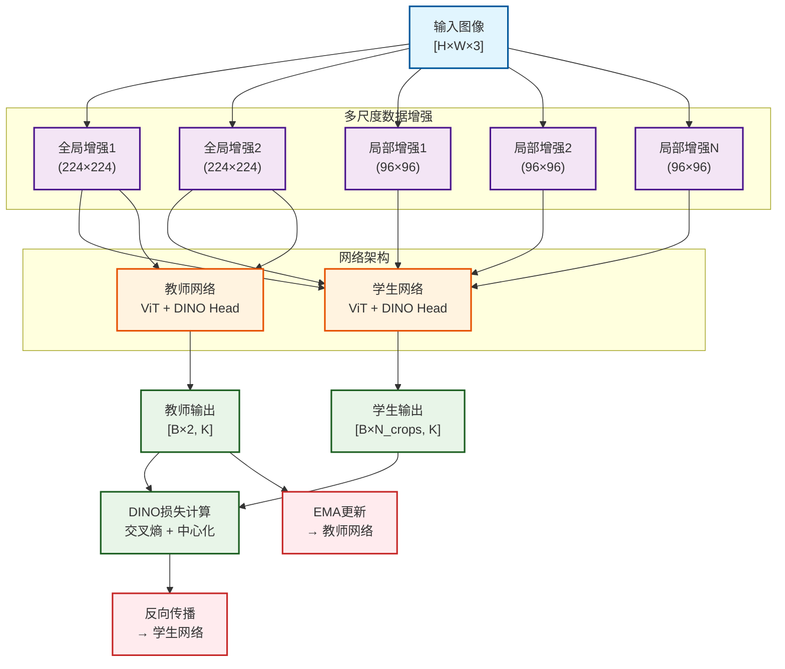
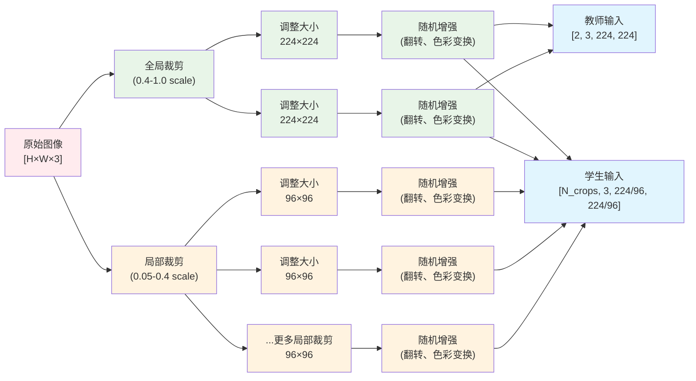
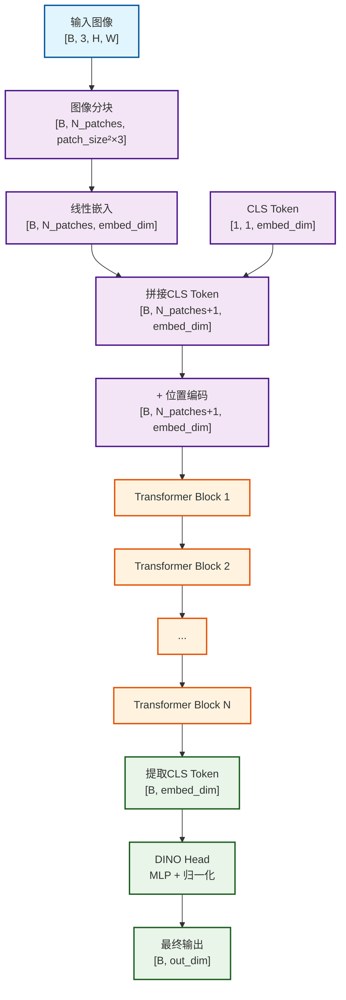
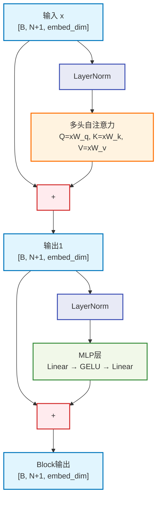
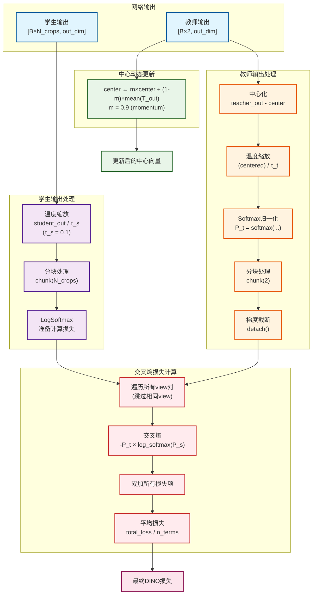
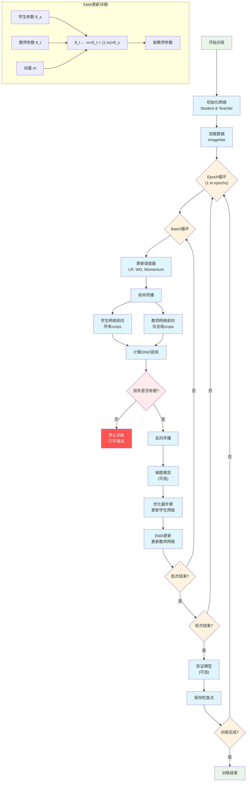
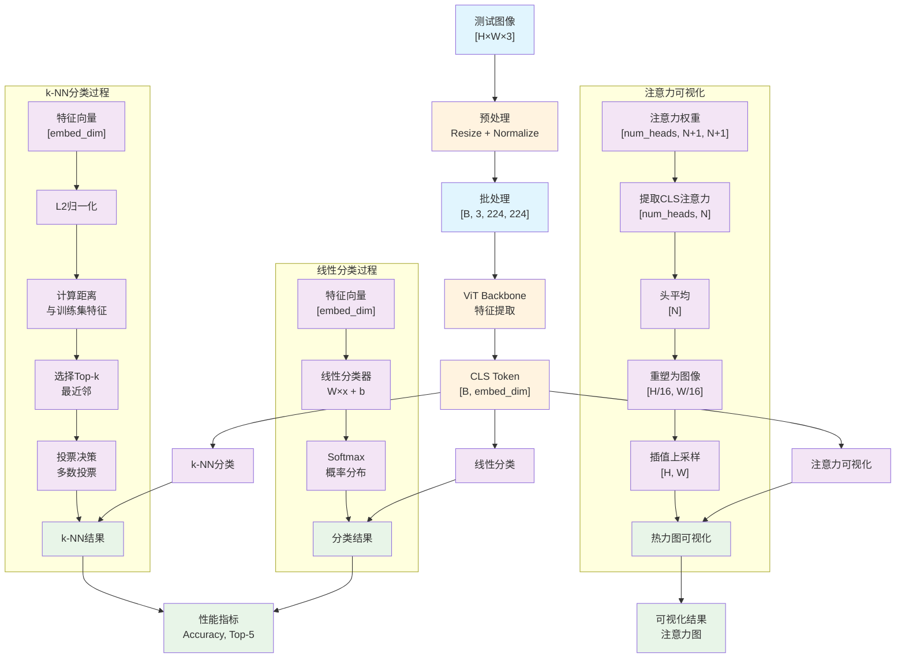

# DINO自监督学习算法流程图集合

## 1. 整体架构流程图

## 2. 数据增强和多尺度裁剪流程图

## 3. Vision Transformer前向传播流程图

### 单个Transformer Block详细结构

## 4. DINO损失计算流程图

## 5. 训练流程图

## 6. 推理和评估流程图

## 7. 数据维度变化图

```mermaid
flowchart LR
    %% 输入阶段
    subgraph Input["输入阶段"]
        direction TB
        OrigImg["原始图像<br/>[H×W×3]<br/>例: 256×256×3"]
        MultiCrop["多尺度裁剪<br/>[N_crops, 3, H', W']<br/>例: 10×3×224×224"]
        OrigImg --> MultiCrop
    end
    
    %% 嵌入阶段  
    subgraph Embed["嵌入阶段"]
        direction TB
        Patches["图像分块<br/>[N_crops, N_patches, P²×3]<br/>例: 10×196×768"]
        LinearEmbed["线性嵌入<br/>[N_crops, N_patches, D]<br/>例: 10×196×384"]
        AddCLS["+ CLS Token<br/>[N_crops, N_patches+1, D]<br/>例: 10×197×384"]
        PosEncode["+ 位置编码<br/>[N_crops, N_patches+1, D]<br/>例: 10×197×384"]
        
        Patches --> LinearEmbed
        LinearEmbed --> AddCLS
        AddCLS --> PosEncode
    end
    
    %% Transformer阶段
    subgraph Trans["Transformer阶段"]
        direction TB
        Block1["Block 1<br/>[N_crops, N+1, D]<br/>例: 10×197×384"]
        BlockDots["...<br/>维度保持不变"]
        BlockN["Block N<br/>[N_crops, N+1, D]<br/>例: 10×197×384"]
        
        Block1 --> BlockDots
        BlockDots --> BlockN
    end
    
    %% 输出阶段
    subgraph Output["输出阶段"]
        direction TB
        ExtractCLS["提取CLS Token<br/>[N_crops, D]<br/>例: 10×384"]
        DinoHead["DINO Head<br/>[N_crops, bottleneck]<br/>例: 10×256"]
        FinalProj["最终投影<br/>[N_crops, K]<br/>例: 10×65536"]
        
        ExtractCLS --> DinoHead
        DinoHead --> FinalProj
    end
    
    %% 流程连接
    Input --> Embed
    MultiCrop -.->|Patch分割 P=16| Patches
    Embed --> Trans
    PosEncode --> Block1
    Trans --> Output
    BlockN --> ExtractCLS
    
    %% 关键参数说明
    subgraph Params["关键参数"]
        direction TB
        P1["P = patch_size = 16<br/>分块大小"]
        P2["D = embed_dim = 384/768<br/>嵌入维度"] 
        P3["N_patches = 224/16² = 196<br/>分块数量"]
        P4["K = out_dim = 65536<br/>输出维度"]
        P5["N_crops = 2全局 + 8局部<br/>数据增强数量"]
    end
    
    %% 样式定义
    classDef inputStyle fill:#e3f2fd,stroke:#1976d2,stroke-width:2px
    classDef embedStyle fill:#f3e5f5,stroke:#7b1fa2,stroke-width:2px  
    classDef transStyle fill:#fff3e0,stroke:#f57c00,stroke-width:2px
    classDef outputStyle fill:#e8f5e8,stroke:#388e3c,stroke-width:2px
    classDef paramStyle fill:#fafafa,stroke:#616161,stroke-width:2px,stroke-dasharray: 3 3
    
    class Input,OrigImg,MultiCrop inputStyle
    class Embed,Patches,LinearEmbed,AddCLS,PosEncode embedStyle
    class Trans,Block1,BlockDots,BlockN transStyle
    class Output,ExtractCLS,DinoHead,FinalProj outputStyle
    class Params,P1,P2,P3,P4,P5 paramStyle
```

## 总结

这些流程图全面展示了DINO算法的各个关键环节：

1. **整体架构图**: 展示了教师-学生网络的完整训练框架
2. **数据增强图**: 详细说明了多尺度裁剪的实现方式
3. **ViT前向传播图**: 展示了Vision Transformer的详细计算过程
4. **损失计算图**: 说明了DINO损失函数的计算逻辑
5. **训练流程图**: 展示了完整的训练循环和参数更新过程
6. **推理评估图**: 说明了模型的不同评估方式
7. **维度变化图**: 追踪了数据在网络中的维度变化

这些图表有助于深入理解DINO算法的技术细节和实现原理。