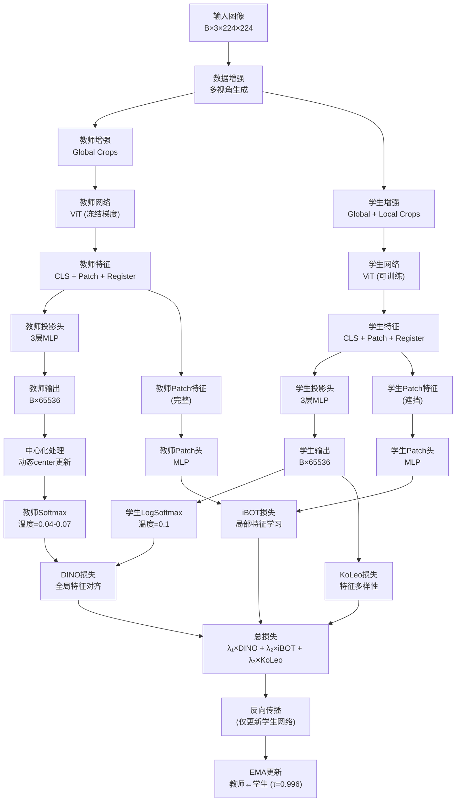
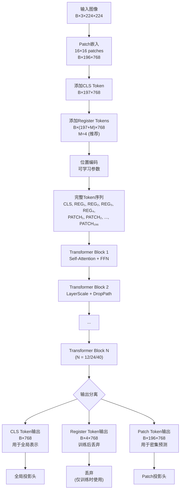
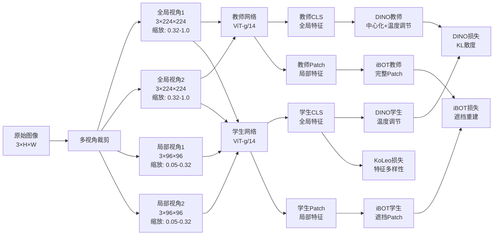
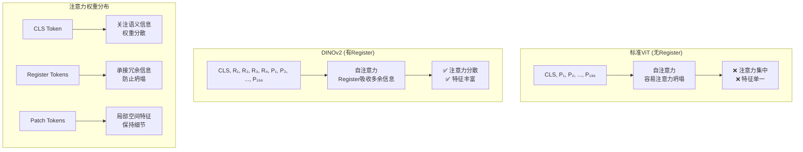
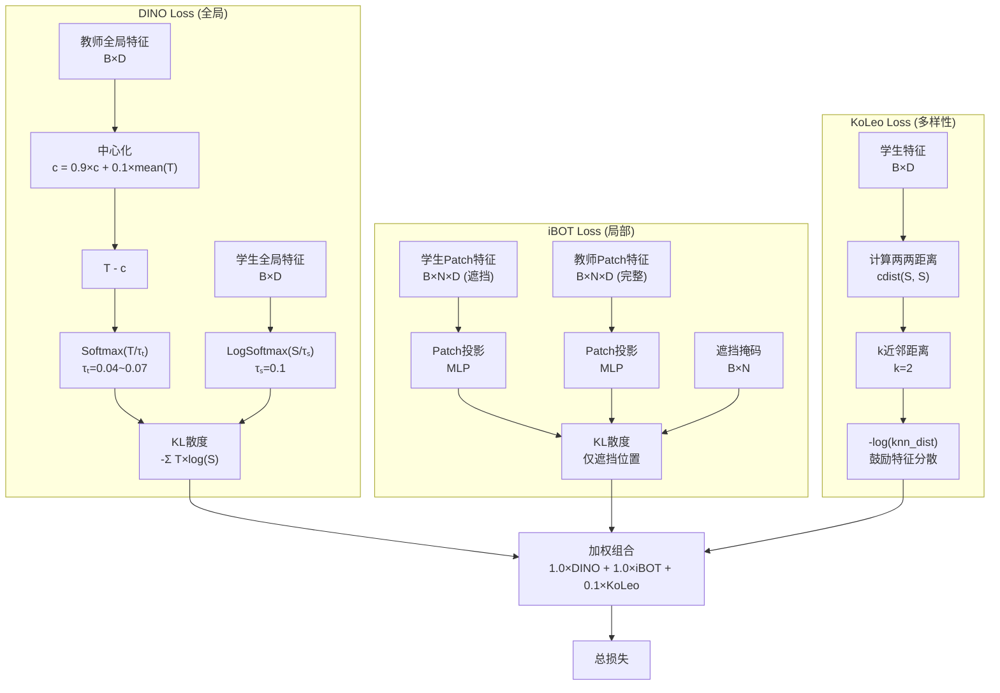
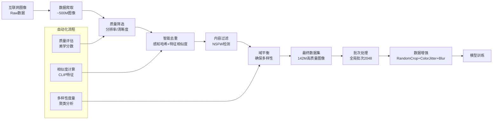
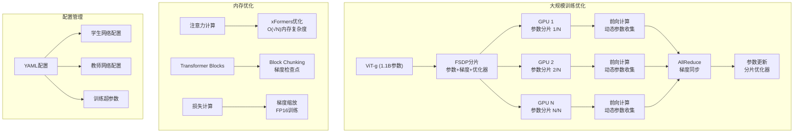
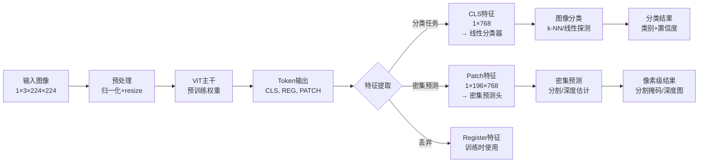
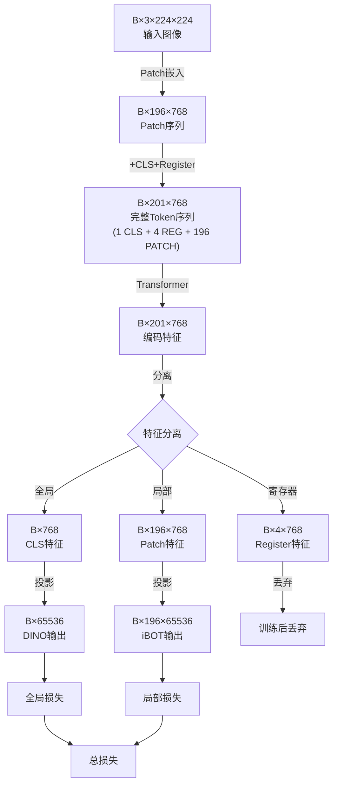
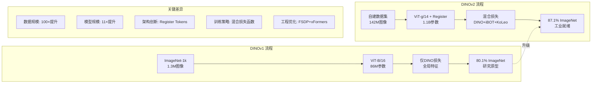

# DINOv2 数据流程图（Mermaid版）

> 注：如果某些图表无法正常显示，可以使用支持Mermaid的Markdown编辑器（如VSCode + Mermaid插件、Typora等）查看

## 一、整体架构流程图

## 二、Vision Transformer with Register Tokens

## 三、自监督学习流程详解

## 四、Register Tokens 注意力机制

## 五、损失函数计算流程

## 六、训练数据处理管道

## 七、工程优化架构

## 八、推理流程

## 九、关键维度变化总结

## 十、与DINOv1对比流程

这些Mermaid流程图全面展示了DINOv2的核心架构、训练流程和关键创新点，包括Register Tokens机制、混合损失函数设计、大规模数据处理管道和工程优化方案。每个图表都详细标注了关键的维度变化和处理步骤，便于深入理解DINOv2的技术实现。