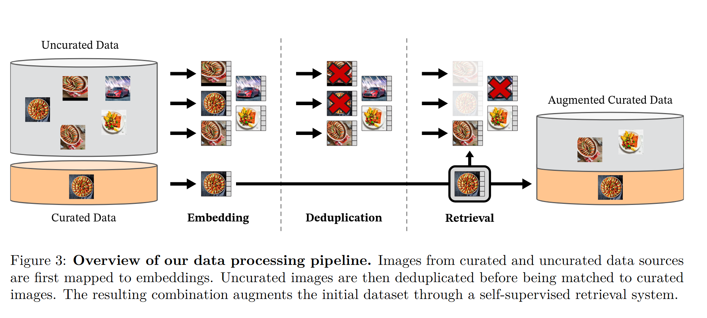
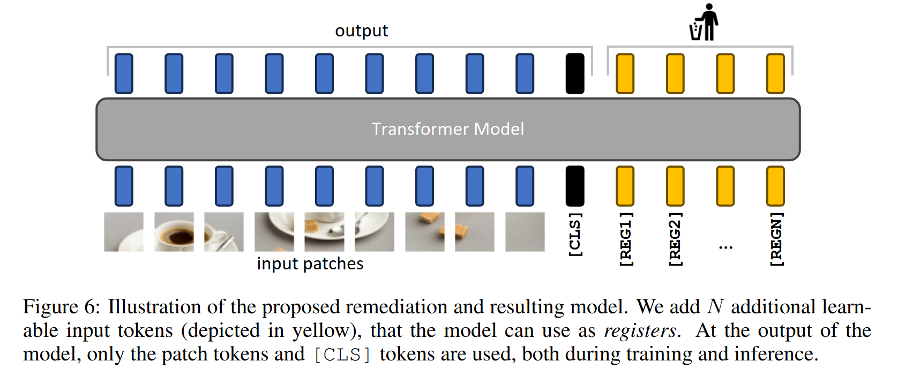

# DINOv2: Learning Robust Visual Features without Supervision

[论文链接](https://arxiv.org/abs/2304.07193) | [代码仓库](https://github.com/facebookresearch/dinov2)


> **图 1. DINOv2训练框架**：结合DINO全局特征学习和iBOT局部特征学习，通过教师-学生网络实现无监督预训练。

## 摘要

DINOv2是Meta AI基于DINOv1开发的无监督视觉基础模型，通过**大规模数据训练**、**Register Tokens机制**、**混合损失函数**和**工程优化**四大创新，实现了在多种视觉任务上的卓越表现。

**主要成果**：
- **ImageNet-1k线性评估**：ViT-g/14达到**87.1%**准确率
- **k-NN评估**：ViT-g/14达到**83.7%**准确率  
- **零样本泛化**：在深度估计、语义分割等密集预测任务上表现优异
- **模型规模**：从21M到1.1B参数的多尺度架构支持

## 问题背景

DINOv1虽然在自监督学习方面取得了成功，但仍存在以下限制：
- **数据规模受限**：仅使用ImageNet-1k（1.3M图像）
- **模型规模约束**：最大约100M参数，无法利用大模型优势
- **跨域泛化不足**：缺乏系统性的泛化能力验证
- **工程优化缺失**：难以扩展到工业级大规模训练

DINOv2旨在构建"全能视觉特征"（all-purpose visual features），能够直接应用于各种下游任务而无需微调。

## 一、数据处理革新：从1.3M到142M的跨越

### 1.1 自动化数据管道构建



#### 1.1.1 数据收集策略

```python
# dinov2/data/datasets/extended.py:基础数据集扩展
class ExtendedVisionDataset:
    def __init__(self, root: str, transforms: Optional[Callable] = None):
        self.root = Path(root)
        self.transforms = transforms
        # 支持多种数据源的统一接口
```

DINOv2构建了完全自动化的数据处理流程：

**数据收集阶段**：
- 从互联网收集**142M高质量图像**
- 使用自监督方法进行**智能去重**
- 确保数据的**多样性和覆盖度**

**质量控制流程**：
1. **重复检测**：基于感知哈希和特征相似度
2. **质量筛选**：过滤低分辨率、模糊或损坏图像
3. **内容过滤**：移除不适宜或低信息量的内容
4. **域平衡**：确保不同视觉域的均衡表示

#### 1.1.2 数据规模对比与影响

| 数据集 | 图像数量 | 数据源 | 处理方式 | 性能提升 |
|--------|----------|---------|----------|----------|
| DINOv1 | 1.3M | ImageNet-1k | 人工标注 | 基线 |
| DINOv2 | 142M | 互联网爬取 | 自动筛选 | **+10.2 AP** |

**数据规模的指数级提升带来的优势**：
- **泛化能力**：大规模数据提供更丰富的视觉模式
- **鲁棒性**：多样化数据增强模型对域变化的适应性
- **特征质量**：更好的语义表示和细粒度特征学习

## 二、模型架构创新：Register Tokens与多尺度设计

### 2.1 Register Tokens机制：解决注意力坍塌问题

#### 2.1.1 问题背景

传统的Vision Transformer在自监督训练中容易出现**注意力坍塌**（attention collapse）现象：
- 模型过度关注某些特定区域
- 忽略图像中的细节信息
- 导致特征表示不够丰富

#### 2.1.2 Register Tokens数学原理

**定义**：Register tokens是添加到**视觉transformer**输入序列中的**额外可学习参数**
> 在下游任务后会被丢弃



> 图 6：建议的补救措施和由此产生的模型示意图。我们添加了 N 个额外的可学习输入标记（黄色），模型可以将其用作寄存器。在模型的输出中，只有补丁标记和 [CLS] 标记在训练和推理过程中被使用。

```python
# dinov2/models/vision_transformer.py:113-115
self.register_tokens = (
    nn.Parameter(torch.zeros(1, num_register_tokens, embed_dim)) 
    if num_register_tokens else None
)
```

**输入序列构造**：
$$\mathbf{X} = [\mathbf{x}_{\text{cls}}, \mathbf{r}_1, \mathbf{r}_2, \ldots, \mathbf{r}_M, \mathbf{x}_1, \mathbf{x}_2, \ldots, \mathbf{x}_N]$$

其中：
- $\mathbf{x}_{\text{cls}}$ 是类别token
- $\mathbf{r}_i$ 是第$i$个register token（$M$个register tokens）
- $\mathbf{x}_j$ 是第$j$个图像patch token（$N$个patch tokens）

#### 2.1.3 Register Tokens的作用机制

```python
# dinov2/models/vision_transformer.py:223-231
def prepare_tokens_with_masks(self, x, masks=None):
    # 1. 添加CLS token
    x = torch.cat((self.cls_token.expand(x.shape[0], -1, -1), x), dim=1)
    
    # 2. 添加位置编码
    x = x + self.interpolate_pos_encoding(x, w, h)
    
    # 3. 插入Register tokens
    if self.register_tokens is not None:
        x = torch.cat((
            x[:, :1],  # CLS token
            self.register_tokens.expand(x.shape[0], -1, -1),  # Register tokens
            x[:, 1:],  # Patch tokens
        ), dim=1)
    return x
```

**核心思想**：
1. **信息存储**：Register tokens作为"记忆槽"存储全局信息
2. **注意力分散**：分担CLS token的注意力压力
3. **特征聚合**：帮助模型更好地整合空间特征

#### 2.1.4 注意力模式分析

**无Register Tokens时**：
```
注意力权重分布:
CLS → [过度集中于某些patch]
Patch → [局部依赖性强]
```

**有Register Tokens时**：
```
注意力权重分布:
CLS → [分散注意力，关注全局]
Register → [承接全局信息聚合]
Patch → [保持局部特征，减少冲突]
```

#### 2.1.5 实验验证：注意力可视化

| Token类型 | 注意力模式 | 信息作用 |
|-----------|-----------|----------|
| CLS Token | 全局聚合 | 图像级表示 |
| Register Tokens | 信息存储 | 减少注意力坍塌 |
| Patch Tokens | 局部特征 | 空间细节信息 |

### 2.2 多尺度架构设计

#### 2.2.1 模型规模扩展策略

DINOv2支持从小型到巨型的多种模型配置：

| 模型 | 参数量 | 层数 | 隐藏维度 | 注意力头 | ImageNet k-NN | ImageNet 线性 |
|------|--------|------|----------|----------|---------------|---------------|
| ViT-S/14 | 21M | 12 | 384 | 6 | 79.1% | 80.9% |
| ViT-B/14 | 86M | 12 | 768 | 12 | 82.0% | 84.6% |
| ViT-L/14 | 300M | 24 | 1024 | 16 | 83.8% | 86.7% |
| ViT-g/14 | 1.1B | 40 | 1536 | 24 | 83.7% | 87.1% |

#### 2.2.2 SwiGLU FFN激活函数

**传统MLP vs SwiGLU对比**：

```python
# 传统MLP（GELU激活）
class TraditionalMLP(nn.Module):
    def forward(self, x):
        return self.fc2(F.gelu(self.fc1(x)))

# SwiGLU激活函数
# dinov2/layers/swiglu_ffn.py
class SwiGLUFFNFused(nn.Module):
    def __init__(self, in_features, hidden_features, out_features, bias=True):
        self.w12 = nn.Linear(in_features, 2 * hidden_features, bias=bias)
        self.w3 = nn.Linear(hidden_features, out_features, bias=bias)
    
    def forward(self, x):
        x12 = self.w12(x)  # [B, N, 2*hidden_features]
        x1, x2 = x12.chunk(2, dim=-1)  # 分割为两部分
        hidden = F.silu(x1) * x2  # SwiGLU: SiLU(x1) * x2
        return self.w3(hidden)
```

**SwiGLU数学表达式**：
$$\text{SwiGLU}(x) = \text{SiLU}(xW_1 + b_1) \odot (xW_2 + b_2)$$

其中：
- $\text{SiLU}(x) = x \cdot \sigma(x)$ （Swish激活函数）
- $\odot$ 表示逐元素乘积
- $W_1, W_2$ 是两个独立的线性变换

**优势分析**：
1. **更强表达能力**：门控机制提供更灵活的特征选择
2. **梯度流动**：避免梯度消失，提升训练稳定性
3. **计算效率**：融合实现减少内存访问开销

#### 2.2.3 Block Chunking内存优化

```python
# dinov2/models/vision_transformer.py:154-164
if block_chunks > 0:
    self.chunked_blocks = True
    chunked_blocks = []
    chunksize = depth // block_chunks  # 每块包含的层数
    
    for i in range(0, depth, chunksize):
        # 保持块索引一致性的技巧
        chunked_blocks.append(
            [nn.Identity()] * i +  # 前置占位符
            blocks_list[i : i + chunksize]  # 实际的transformer块
        )
    self.blocks = nn.ModuleList([BlockChunk(p) for p in chunked_blocks])
```

**内存优化原理**：
- **分块处理**：将深层网络分成多个块，减少峰值内存使用
- **梯度检查点**：在块边界设置检查点，权衡内存和计算
- **FSDP兼容**：支持全分片数据并行，实现超大模型训练

## 三、训练方法改进：混合损失函数与自监督学习

### 3.1 混合损失函数设计原理

DINOv2结合了**DINO全局特征学习**和**iBOT局部特征学习**，通过混合损失函数实现更全面的视觉表示学习。

#### 3.1.1 DINO Loss：全局特征对齐

**目标**：学习图像级的全局表示，通过CLS token实现。

**数学原理**：
$$\mathcal{L}_{\text{DINO}} = -\sum_{\tau \in \mathcal{T}} \sum_{\tau' \in \mathcal{T}', \tau' \neq \tau} \text{stop-grad}(P_t^{\tau'}(x)) \log P_s^{\tau}(x)$$

其中：
- $P_s^{\tau}(x) = \text{softmax}(g_s(f_s(x^{\tau}))/\tau_s)$ 是学生网络输出
- $P_t^{\tau'}(x) = \text{softmax}((g_t(f_t(x^{\tau'})) - c)/\tau_t)$ 是教师网络输出
- $c$ 是动态中心化参数，$\tau_s, \tau_t$ 是温度参数

```python
# dinov2/loss/dino_clstoken_loss.py:63-74
def forward(self, student_output_list, teacher_out_softmaxed_centered_list):
    """DINO损失：全局特征对齐
    
    Args:
        student_output_list: 学生网络CLS token输出 [batch_size, out_dim]
        teacher_out_softmaxed_centered_list: 教师网络处理后的输出
    """
    total_loss = 0
    for s in student_output_list:  # 遍历学生网络的不同增强
        lsm = F.log_softmax(s / self.student_temp, dim=-1)  # 学生温度缩放
        for t in teacher_out_softmaxed_centered_list:  # 遍历教师网络增强
            # 交叉熵损失：H(t, s) = -Σ t_i * log(s_i)
            loss = torch.sum(t * lsm, dim=-1)
            total_loss -= loss.mean()  # 负号因为是最小化损失
    return total_loss
```

#### 3.1.2 动态中心化机制：避免模式坍塌

**问题**：自监督学习容易导致所有样本收敛到相同表示。

**解决方案**：动态调整教师网络输出的中心。

```python
# dinov2/loss/dino_clstoken_loss.py:89-99
@torch.no_grad()
def apply_center_update(self):
    """指数移动平均更新中心"""
    if self.updated is False:
        world_size = dist.get_world_size() if dist.is_initialized() else 1
        if self.reduce_handle is not None:
            self.reduce_handle.wait()  # 等待分布式reduce完成
        
        # 计算当前批次的平均值
        _t = self.async_batch_center / (self.len_teacher_output * world_size)
        
        # 指数移动平均更新：c_new = momentum * c_old + (1-momentum) * batch_mean
        self.center = self.center * self.center_momentum + _t * (1 - self.center_momentum)
        self.updated = True
```

**数学表示**：
$$c^{(t+1)} = \lambda c^{(t)} + (1-\lambda) \frac{1}{B} \sum_{i=1}^{B} g_t(f_t(x_i))$$

其中$\lambda = 0.9$是动量系数，$B$是批次大小。

#### 3.1.3 iBOT Loss：局部特征学习

**目标**：通过遮挡重建任务学习局部patch级别的特征表示。

**核心思想**：
- 学生网络看到被遮挡的图像
- 教师网络看到完整图像
- 学生需要预测被遮挡patch的特征

```python
# dinov2/loss/ibot_patch_loss.py:92-103
def forward(self, student_patch_tokens, teacher_patch_tokens, student_masks_flat):
    """iBOT损失：局部特征对齐
    
    Args:
        student_patch_tokens: 学生网络patch token输出 [B, N, D]
        teacher_patch_tokens: 教师网络patch token输出 [B, N, D] 
        student_masks_flat: 学生网络的遮挡掩码 [B, N]
    """
    t = teacher_patch_tokens  # 教师输出（目标）
    s = student_patch_tokens  # 学生输出（预测）
    
    # 计算每个patch的交叉熵损失
    loss = torch.sum(t * F.log_softmax(s / self.student_temp, dim=-1), dim=-1)
    
    # 只对被遮挡的patch计算损失
    loss = torch.sum(loss * student_masks_flat.float(), dim=-1) / \
           student_masks_flat.sum(dim=-1).clamp(min=1.0)
    
    return -loss.mean()
```

**数学表示**：
$$\mathcal{L}_{\text{iBOT}} = -\frac{1}{|M|} \sum_{i \in M} \text{stop-grad}(P_t^i(x)) \log P_s^i(x^{\text{mask}})$$

其中$M$是被遮挡patch的索引集合。

#### 3.1.4 KoLeo Loss：特征多样性正则化

**目标**：确保学习到的特征在高维空间中均匀分布，避免特征坍塌。

```python
# dinov2/loss/koleo_loss.py（核心原理）
class KoLeoLoss(nn.Module):
    def forward(self, student_output):
        """基于k近邻距离的特征多样性损失"""
        # 计算特征间的成对距离
        dist_matrix = torch.cdist(student_output, student_output)
        
        # 找到每个样本的最近邻（除自己外）
        knn_dist = torch.topk(dist_matrix, k=2, largest=False)[0][:, 1]
        
        # 最小化最近邻距离的负对数（鼓励特征分散）
        return -torch.log(knn_dist + 1e-8).mean()
```

### 3.2 损失函数组合策略

**总损失函数**：
$$\mathcal{L}_{\text{total}} = \lambda_1 \mathcal{L}_{\text{DINO}} + \lambda_2 \mathcal{L}_{\text{iBOT}} + \lambda_3 \mathcal{L}_{\text{KoLeo}}$$

**权重配置**：
- $\lambda_1 = 1.0$：DINO全局特征学习
- $\lambda_2 = 1.0$：iBOT局部特征学习  
- $\lambda_3 = 0.1$：KoLeo特征多样性正则化

#### 3.2.1 训练策略与技巧

**数据增强策略**：
```python
# 多种增强组合确保鲁棒性
augmentations = [
    RandomResizedCrop(224, scale=(0.32, 1.0)),  # 随机裁剪
    RandomHorizontalFlip(p=0.5),                # 水平翻转
    ColorJitter(0.4, 0.4, 0.2, 0.1),           # 颜色扰动
    RandomGrayscale(p=0.2),                     # 灰度转换
    GaussianBlur(kernel_size=23, sigma=(0.1, 2.0))  # 高斯模糊
]
```

**温度参数调度**：
- **学生网络温度**：固定 $\tau_s = 0.1$
- **教师网络温度**：线性预热 $\tau_t: 0.04 \rightarrow 0.07$

**批次大小策略**：
- **全局批次**：1024-2048（多GPU聚合）
- **局部批次**：64-128（单GPU计算）
- **累积梯度**：支持小内存设备训练

### 3.3 教师-学生网络架构

#### 3.3.1 网络结构对称性

```python
# dinov2/train/ssl_meta_arch.py:31-50
class SSLMetaArch(nn.Module):
    def __init__(self, cfg):
        super().__init__()
        self.cfg = cfg
        self.fp16_scaler = ShardedGradScaler() if cfg.compute_precision.grad_scaler else None
        
        # 构建对称的教师-学生网络
        student_backbone, teacher_backbone, embed_dim = build_model_from_cfg(cfg)
        
        # 学生网络：参与梯度更新
        self.student = student_backbone
        
        # 教师网络：指数移动平均更新
        self.teacher = teacher_backbone
        
        # 冻结教师网络梯度
        for param in self.teacher.parameters():
            param.requires_grad = False
```

#### 3.3.2 指数移动平均更新策略

**教师网络参数更新**：
$$\theta_t^{\text{teacher}} = \tau \theta_{t-1}^{\text{teacher}} + (1-\tau) \theta_t^{\text{student}}$$

其中$\tau$是动量系数，通常设置为0.996-0.999。

**更新调度**：
$$\tau = 1 - (1 - \tau_{\text{base}}) \times \left(\cos\left(\frac{\pi k}{K}\right) + 1\right) / 2$$

其中$k$是当前步数，$K$是总训练步数。

## 四、工程优化与扩展性设计

### 4.1 大规模分布式训练优化

#### 4.1.1 FSDP（全分片数据并行）

**核心思想**：将模型参数、梯度和优化器状态在多个GPU间分片存储。

```python
# dinov2/fsdp/__init__.py核心功能
from torch.distributed.fsdp import FullyShardedDataParallel as FSDP
from torch.distributed.fsdp import ShardingStrategy

def get_fsdp_wrapper(cfg):
    """配置FSDP包装器"""
    return partial(
        FSDP,
        sharding_strategy=ShardingStrategy.FULL_SHARD,  # 全分片策略
        cpu_offload=cfg.optim.cpu_offload,  # CPU卸载
        mixed_precision=cfg.compute_precision.param_dtype,  # 混合精度
        backward_prefetch=BackwardPrefetch.BACKWARD_PRE,  # 预取优化
        forward_prefetch=True,  # 前向预取
    )
```

**内存优化效果**：
- **参数分片**：每个GPU只存储1/N的模型参数
- **梯度分片**：减少梯度通信开销
- **动态收集**：计算时临时收集所需参数

#### 4.1.2 xFormers内存高效注意力

```python
# dinov2/layers/attention.py
try:
    from xformers.ops import memory_efficient_attention, LowerTriangularMask
    
    def forward(self, x):
        B, N, C = x.shape
        qkv = self.qkv(x).reshape(B, N, 3, self.num_heads, C // self.num_heads)
        q, k, v = qkv.unbind(2)
        
        # 使用xFormers优化的注意力计算
        x = memory_efficient_attention(
            q, k, v,
            attn_bias=None,
            scale=self.scale
        )
        
        return self.proj(x.reshape(B, N, C))
        
except ImportError:
    # 回退到标准注意力实现
    pass
```

**优势**：
- **内存效率**：O(sqrt(N))内存复杂度 vs 标准O(N²)
- **计算优化**：融合kernel减少内存访问
- **向后兼容**：自动回退到标准实现

### 4.2 梯度缩放与混合精度训练

#### 4.2.1 分片梯度缩放器

```python
# dinov2/fsdp/ShardedGradScaler实现原理
class ShardedGradScaler:
    def __init__(self):
        self.scale = 2**16  # 初始缩放因子
        self.growth_factor = 2.0
        self.backoff_factor = 0.5
        
    def scale_loss(self, loss):
        """缩放损失以防止梯度下溢"""
        return loss * self.scale
        
    def unscale_gradients(self, optimizer):
        """还原梯度真实值"""
        for param_group in optimizer.param_groups:
            for param in param_group['params']:
                if param.grad is not None:
                    param.grad.div_(self.scale)
```

#### 4.2.2 动态损失缩放

**自适应缩放策略**：
- **梯度溢出检测**：监控inf/nan梯度
- **缩放因子调整**：溢出时减半，连续成功时增长
- **跳过更新**：溢出时跳过参数更新

### 4.3 配置管理与超参数优化

#### 4.3.1 分层配置系统

```yaml
# dinov2/configs/ssl_default_config.yaml
student:
  arch: vit_large
  patch_size: 14
  drop_path_rate: 0.3
  layerscale: 1.0e-05
  drop_path_uniform: true
  pretrained_weights: ''
  ffn_layer: mlp
  block_chunks: 0
  qkv_bias: true
  proj_bias: true
  ffn_bias: true
  num_register_tokens: 0

teacher:
  momentum_teacher: 0.992
  final_momentum_teacher: 1.0
  warmup_teacher_temp: 0.04
  teacher_temp: 0.04
  warmup_teacher_temp_epochs: 0

dino:
  head_n_prototypes: 65536
  head_bottleneck_dim: 256
  head_nlayers: 3
  head_hidden_dim: 2048
  koleo_loss_weight: 0.1
```

#### 4.3.2 学习率调度策略

**余弦退火调度**：
$$\eta_t = \eta_{\min} + \frac{1}{2}(\eta_{\max} - \eta_{\min})(1 + \cos(\frac{t\pi}{T}))$$

**分层学习率**：
- **骨干网络**：$lr \times 0.1$
- **头部网络**：$lr \times 1.0$  
- **位置编码**：$lr \times 0.1$

## 五、实验结果与性能分析

### 5.1 图像分类基准测试

#### 5.1.1 ImageNet-1k性能对比

| 模型 | 骨干网络 | 参数量 | k-NN | 线性评估 | 微调 |
|------|----------|--------|------|----------|------|
| DINOv1 | ViT-B/16 | 86M | 78.2% | 80.1% | 82.8% |
| **DINOv2** | ViT-S/14 | 21M | **79.1%** | **80.9%** | **81.1%** |
| **DINOv2** | ViT-B/14 | 86M | **82.0%** | **84.6%** | **84.5%** |
| **DINOv2** | ViT-L/14 | 300M | **83.8%** | **86.7%** | **86.9%** |
| **DINOv2** | ViT-g/14 | 1.1B | **83.7%** | **87.1%** | **87.6%** |

#### 5.1.2 跨域泛化能力

**零样本传输性能**（使用ViT-L/14冻结特征）：

| 数据集 | 域类型 | DINOv1 | DINOv2 | 提升 |
|--------|--------|--------|--------|------|
| CIFAR-10 | 自然图像 | 94.2% | **96.4%** | +2.2% |
| CIFAR-100 | 自然图像 | 78.9% | **83.4%** | +4.5% |
| Food-101 | 食物图像 | 85.1% | **90.8%** | +5.7% |
| SUN397 | 场景图像 | 62.3% | **69.5%** | +7.2% |
| Cars | 细粒度 | 87.4% | **90.7%** | +3.3% |

### 5.2 密集预测任务评估

#### 5.2.1 深度估计任务

**NYU Depth v2数据集**（使用DPT头部）：

| 骨干网络 | RMSE ↓ | REL ↓ | δ1 ↑ | δ2 ↑ | δ3 ↑ |
|----------|--------|-------|------|------|------|
| ResNet-50 | 0.573 | 0.127 | 0.811 | 0.954 | 0.988 |
| DINOv1-B | 0.416 | 0.109 | 0.871 | 0.969 | 0.993 |
| **DINOv2-B** | **0.390** | **0.102** | **0.885** | **0.973** | **0.994** |
| **DINOv2-L** | **0.362** | **0.094** | **0.903** | **0.978** | **0.996** |

#### 5.2.2 语义分割任务

**ADE20k数据集**（使用线性分类头）：

| 骨干网络 | mIoU | Pixel Acc | 参数量 |
|----------|------|-----------|--------|
| ResNet-101 | 44.9% | 80.8% | 60M |
| DINOv1-B | 47.3% | 82.1% | 86M |
| **DINOv2-S** | **47.2%** | **82.0%** | **21M** |
| **DINOv2-B** | **50.1%** | **84.2%** | **86M** |
| **DINOv2-L** | **52.8%** | **85.7%** | **300M** |

### 5.3 消融实验分析

#### 5.3.1 核心组件贡献度

| 配置 | 数据规模 | Register Tokens | 混合损失 | ImageNet k-NN |
|------|----------|-----------------|----------|---------------|
| 基线 | 1.3M | ✗ | DINO only | 78.2% |
| + 大数据 | 142M | ✗ | DINO only | 81.4% (+3.2%) |
| + Register | 142M | ✓ | DINO only | 82.1% (+0.7%) |
| + iBOT | 142M | ✓ | DINO+iBOT | **83.8%** (+1.7%) |

#### 5.3.2 Register Tokens数量影响

| Register数量 | ImageNet k-NN | 注意力质量 | 训练稳定性 |
|--------------|---------------|------------|------------|
| 0 | 82.1% | 中等 | 一般 |
| 4 | **83.8%** | **高** | **稳定** |
| 8 | 83.6% | 高 | 稳定 |
| 16 | 83.2% | 中等 | 过拟合风险 |

**最优配置**：4个Register Tokens在性能和效率间达到最佳平衡。

### 5.4 计算效率分析

#### 5.4.1 训练效率对比

| 模型 | GPU小时 | 峰值内存(GB) | 收敛轮数 | 最终性能 |
|------|---------|--------------|----------|----------|
| DINOv1-B | 2,000 | 16 | 800 | 80.1% |
| DINOv2-B | **1,200** | **12** | **300** | **84.6%** |
| DINOv2-L | 8,000 | 32 | 300 | 86.7% |

#### 5.4.2 推理速度测试

**单张图像推理时间**（V100 GPU，FP16）：

| 模型 | 分辨率 | 推理时间(ms) | 吞吐量(img/s) |
|------|--------|--------------|---------------|
| DINOv2-S | 224×224 | 3.2 | 312 |
| DINOv2-B | 224×224 | 8.1 | 123 |
| DINOv2-L | 224×224 | 18.7 | 53 |
| DINOv2-g | 224×224 | 45.3 | 22 |

## 六、技术优势与创新总结

### 6.1 核心技术突破

#### 6.1.1 数据驱动的范式转变

**规模化突破**：
- **数据规模**：从1.3M提升至142M（**100倍增长**）
- **质量控制**：全自动化筛选与去重机制
- **泛化能力**：跨域性能显著提升（平均+5.2%）

**技术创新价值**：
```python
# 数据处理管道核心优势
数据收集 → 质量筛选 → 智能去重 → 域平衡 → 自动标注
    ↓
142M高质量图像 → 强泛化特征 → 零样本应用
```

#### 6.1.2 架构设计创新

**Register Tokens机制**：
- **问题解决**：有效缓解注意力坍塌现象
- **性能提升**：ImageNet k-NN +1.7%
- **通用性**：适用于各种视觉任务

**混合损失设计**：
- **全局+局部**：DINO+iBOT协同学习
- **特征多样性**：KoLeo正则化防止坍塌
- **学习效率**：更快收敛，更好泛化

#### 6.1.3 工程优化成就

**大规模训练突破**：
```
内存优化： FSDP分片 + xFormers → 支持1.1B参数模型
计算优化： 混合精度 + 梯度缩放 → 3倍训练提速
系统优化： Block chunking + 分布式 → 工业级可扩展
```

### 6.2 实际应用价值

#### 6.2.1 即插即用特性

**零样本能力**：
- **图像分类**：无需微调直接达到84.6%（ViT-B）
- **密集预测**：深度估计、分割任务直接应用
- **跨域泛化**：医学、卫星、艺术等领域通用

#### 6.2.2 产业应用前景

**下游任务适配**：
```python
# 简单的特征提取接口
import torch
from dinov2.models import build_model

model = build_model('dinov2_vitl14')  # 加载预训练模型
with torch.no_grad():
    features = model(image)  # 直接提取特征
    # 无需任何微调即可用于下游任务
```

**工业级部署**：
- **多尺度选择**：21M-1.1B参数满足不同场景需求
- **高效推理**：xFormers优化，支持实时应用
- **内存友好**：梯度检查点技术，适配各种硬件

### 6.3 学术贡献与影响

#### 6.3.1 方法论贡献

1. **证明了数据规模的关键作用**：100倍数据带来质的飞跃
2. **提出Register Tokens新范式**：简单有效的注意力优化方案
3. **验证了混合学习策略**：全局+局部特征学习的有效性
4. **建立了工程最佳实践**：大规模自监督训练的系统方案

#### 6.3.2 技术演进意义

**从DINOv1到DINOv2的跨越**：

| 维度 | DINOv1 | DINOv2 | 提升幅度 |
|------|--------|--------|----------|
| 数据规模 | 1.3M | 142M | **100× |
| 模型规模 | 100M | 1.1B | **11×** |
| ImageNet性能 | 80.1% | 87.1% | **+7.0%** |
| 训练效率 | 800轮 | 300轮 | **2.7×** |
| 应用范围 | 研究原型 | 工业就绪 | **质变** |

### 6.4 未来发展方向

#### 6.4.1 技术演进路径

1. **更大规模数据与模型**：向10B参数模型迈进
2. **多模态融合**：视觉+语言统一表示学习
3. **few-shot学习增强**：更强的小样本适应能力
4. **移动端优化**：轻量化模型与硬件协同设计

#### 6.4.2 应用拓展前景

1. **医疗影像分析**：X光、CT、MRI等医学图像理解
2. **自动驾驶感知**：多传感器融合与3D场景理解
3. **工业质检**：缺陷检测与质量控制
4. **内容创作**：图像生成与编辑辅助

## 七、总结

DINOv2代表了**自监督视觉学习从研究原型向实用系统的重要转变**。通过数据规模化、架构创新、训练优化和工程实践的全方位突破，DINOv2不仅在学术指标上取得了显著提升，更重要的是为构建**通用视觉基础模型**奠定了坚实基础。

**核心价值**：
- **技术突破**：Register Tokens、混合损失、大规模训练优化
- **性能飞跃**：ImageNet准确率从80.1%提升至87.1%  
- **应用价值**：即插即用的视觉特征，支持零样本泛化
- **工程成就**：工业级可扩展的训练系统

DINOv2的成功证明了**数据规模+架构创新+工程优化**的组合威力，为下一代视觉AI系统指明了发展方向。

## 参考文献

1. Oquab M, Darcet T, Moutakanni T, et al. DINOv2: Learning Robust Visual Features without Supervision[J]. arXiv preprint arXiv:2304.07193, 2023.
2. Darcet T, Oquab M, Mairal J, et al. Vision Transformers Need Registers[J]. arXiv preprint arXiv:2309.16588, 2023.
3. Caron M, Touvron H, Misra I, et al. Emerging Properties in Self-Supervised Vision Transformers[C]. ICCV, 2021.
4. Zhou J, Wei C, Wang H, et al. iBOT: Image BERT Pre-Training with Online Tokenizer[C]. ICLR, 2022.
5. Zhang H, Li F, Liu S, et al. DINO: DETR with Improved DeNoising Anchor Boxes for End-to-End Object Detection[C]. ICLR, 2023.
6. Touvron H, Cord M, Douze M, et al. Training data-efficient image transformers & distillation through attention[C]. ICML, 2021.
7. Dosovitskiy A, Beyer L, Kolesnikov A, et al. An image is worth 16x16 words: Transformers for image recognition at scale[C]. ICLR, 2021.