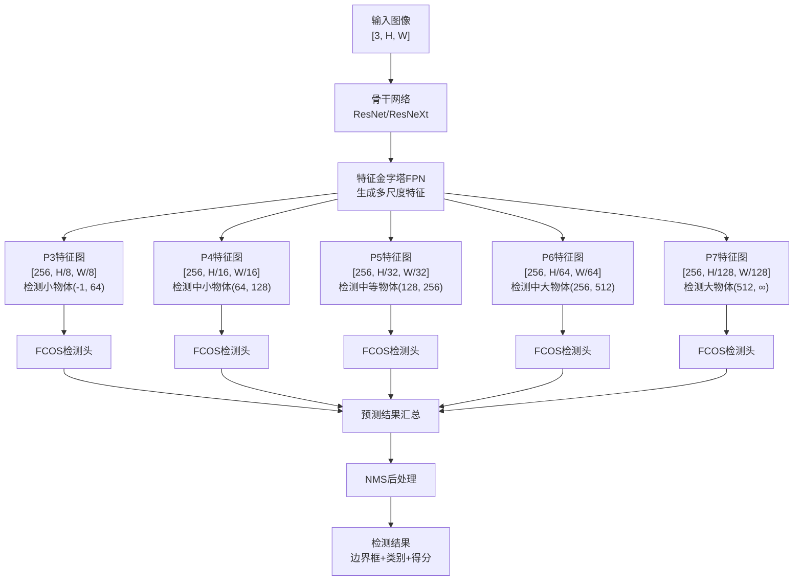
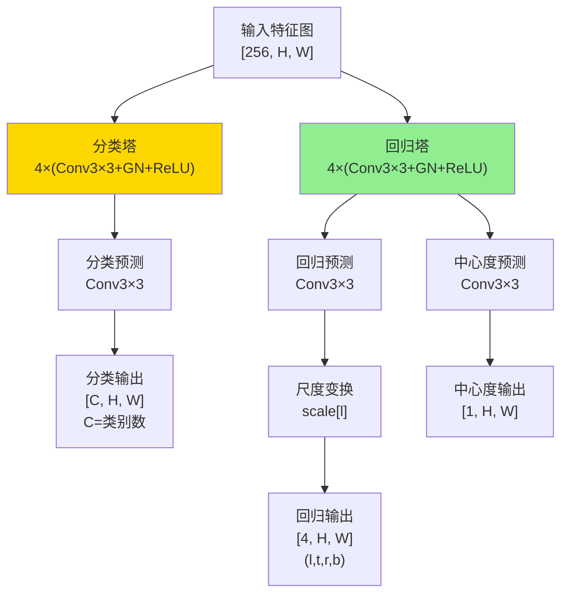
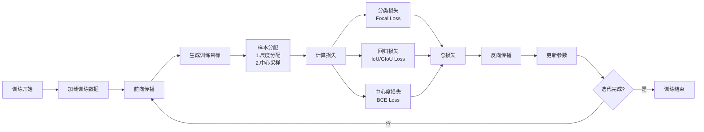
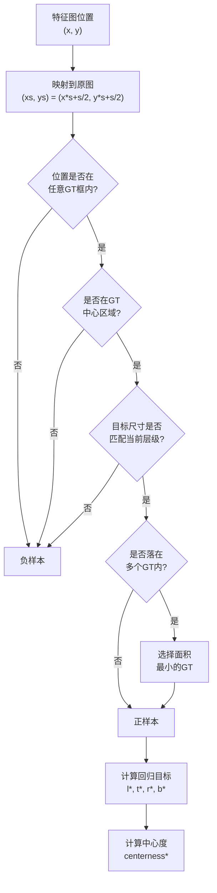
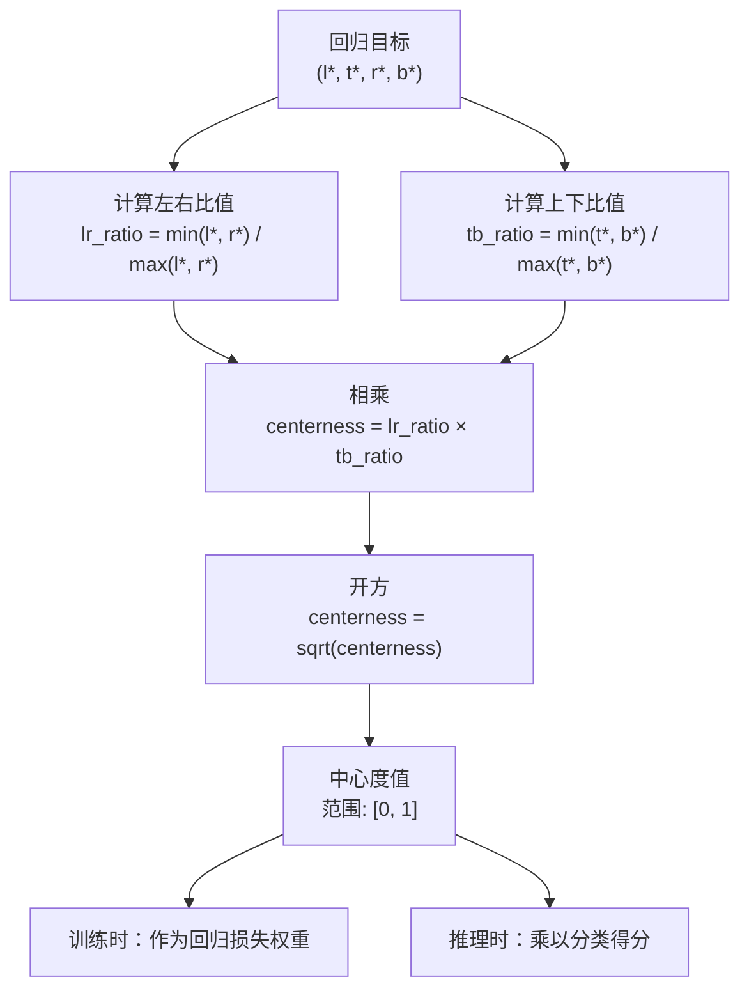
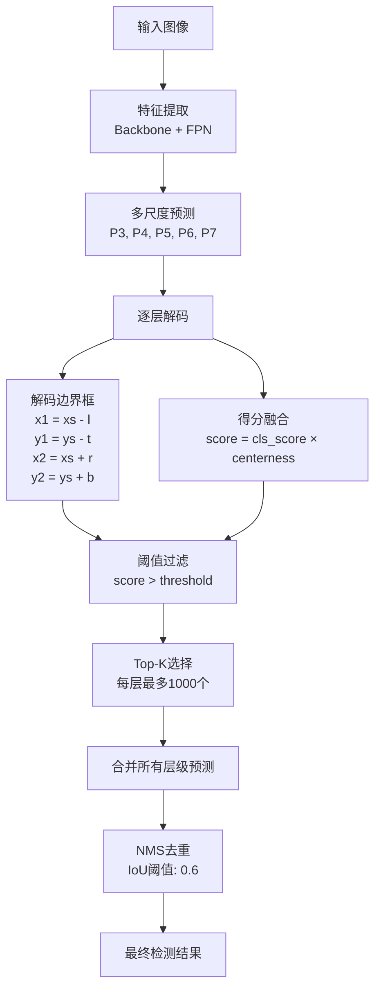
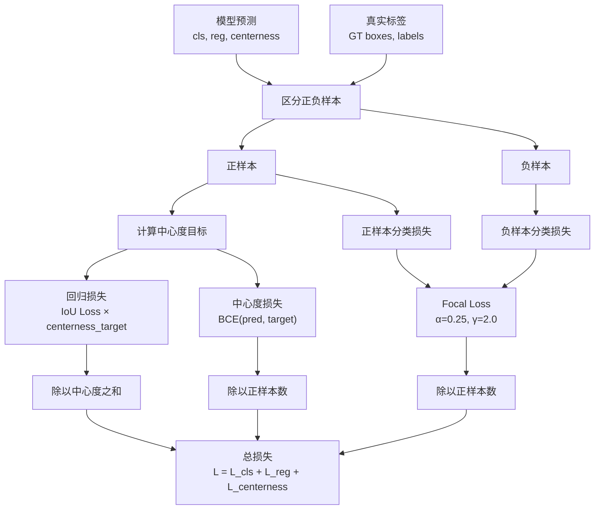
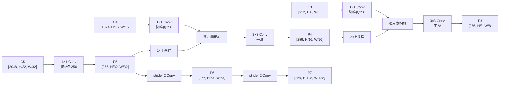
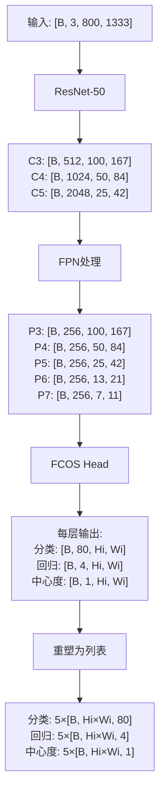
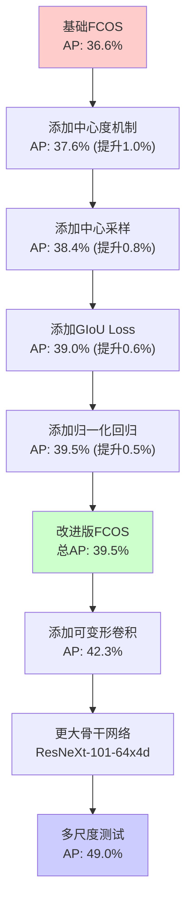

# FCOS 流程图集合

本文档包含FCOS算法的各种Mermaid流程图，展示算法的整体架构、数据流程、训练过程等关键环节。

## 1. 整体架构流程图

## 2. FCOS检测头详细结构

## 3. 训练流程图

## 4. 正负样本分配流程

## 5. 中心度计算流程

## 6. 推理流程图

## 7. 损失计算详细流程

## 8. 特征金字塔数据流

## 9. 维度变化示意图

## 10. 改进技术对比流程

## 总结

这些流程图全面展示了FCOS算法的各个关键环节：

1. **整体架构**：展示了从输入到输出的完整流程
2. **检测头结构**：详细说明了分类、回归和中心度三个分支
3. **训练流程**：包含了前向传播、损失计算和反向传播
4. **样本分配**：说明了如何确定正负样本
5. **中心度机制**：展示了中心度的计算和使用方式
6. **推理流程**：从特征提取到最终检测结果
7. **损失计算**：三种损失的详细计算过程
8. **FPN结构**：特征金字塔的构建过程
9. **维度变化**：数据在网络中的维度变化
10. **改进对比**：各项改进技术的贡献

这些流程图有助于深入理解FCOS的工作原理和实现细节。