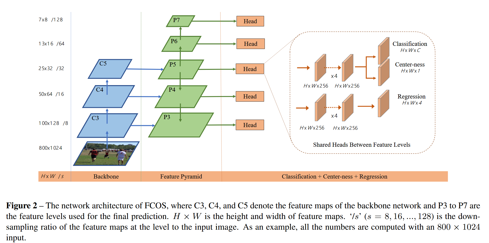
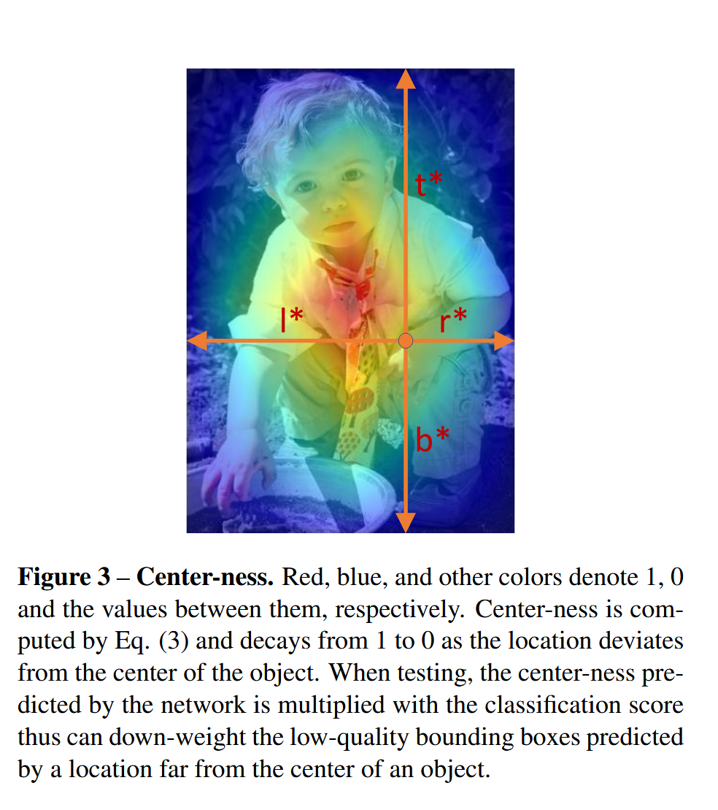

# FCOS: Fully Convolutional One-Stage Object Detection

[论文链接](https://arxiv.org/abs/1904.01355) | [代码仓库](https://github.com/tianzhi0549/FCOS)



## 摘要

- **核心创新点**：首个完全基于全卷积网络的单阶段无锚框目标检测器，采用逐像素预测方式，类似于语义分割
- **主要性能指标**：使用ResNeXt-64x4d-101骨干网络，在COCO test-dev上达到44.7% AP，单模型单尺度测试
- **与前序工作对比**：相比于Faster R-CNN (36.8% AP with ResNet-50)，FCOS取得了38.7% AP的更好性能，且训练速度更快（6.5h vs 8.8h）

## 一、无锚框检测机制

### 1.1 问题背景

传统的目标检测方法严重依赖于预定义的锚框（anchor boxes），这带来了诸多问题：
- 需要精心设计锚框的尺寸、长宽比等超参数
- 锚框与真实框的IoU计算开销大
- 正负样本不平衡问题严重
- 锚框的设计对检测性能影响很大，但难以优化

FCOS提出了一种完全抛弃锚框的检测方法，直接在特征图的每个位置预测目标。

### 1.2 方法原理

#### 1.2.1 数学定义

对于输入图像，FCOS在特征金字塔的每一层特征图上进行密集预测。设特征图上的位置为 $(x, y)$，对应到原图的位置为：

$$
(x_s, y_s) = \left(\lfloor \frac{s}{2} \rfloor + x \cdot s, \lfloor \frac{s}{2} \rfloor + y \cdot s\right)
$$

> (x, y) 表示网格的左上角坐标,，(x+1/2, y+1/2) 表示网格中心坐标，映射到原图上就是(x_s, y_s)

其中 $s$ 是该层特征图的步长（stride）。

如果位置 $(x_s, y_s)$ 落在某个真实框 $(x_0^i, y_0^i, x_1^i, y_1^i)$ 内，则该位置被视为正样本，需要回归的目标为：

$$
l^* = x_s - x_0^i, \quad t^* = y_s - y_0^i
$$
$$
r^* = x_1^i - x_s, \quad b^* = y_1^i - y_s
$$

即预测该位置到边界框四条边的距离。

#### 1.2.2 算法实现

核心检测头实现（`fcos_core/modeling/rpn/fcos/fcos.py:13-115`）：

```python
class FCOSHead(torch.nn.Module):
    def __init__(self, cfg, in_channels):
        super(FCOSHead, self).__init__()
        num_classes = cfg.MODEL.FCOS.NUM_CLASSES - 1
        self.fpn_strides = cfg.MODEL.FCOS.FPN_STRIDES  # [8, 16, 32, 64, 128]
        self.norm_reg_targets = cfg.MODEL.FCOS.NORM_REG_TARGETS  # 是否归一化回归目标
        self.centerness_on_reg = cfg.MODEL.FCOS.CENTERNESS_ON_REG  # centerness分支位置
        
        # 构建分类和回归分支的卷积塔
        cls_tower = []
        bbox_tower = []
        for i in range(cfg.MODEL.FCOS.NUM_CONVS):  # 默认4层卷积
            # 可选使用可变形卷积
            if self.use_dcn_in_tower and i == cfg.MODEL.FCOS.NUM_CONVS - 1:
                conv_func = DFConv2d
            else:
                conv_func = nn.Conv2d
            
            # 分类分支：Conv + GroupNorm + ReLU
            cls_tower.append(conv_func(in_channels, in_channels, 3, 1, 1, bias=True))
            cls_tower.append(nn.GroupNorm(32, in_channels))
            cls_tower.append(nn.ReLU())
            
            # 回归分支：Conv + GroupNorm + ReLU
            bbox_tower.append(conv_func(in_channels, in_channels, 3, 1, 1, bias=True))
            bbox_tower.append(nn.GroupNorm(32, in_channels))
            bbox_tower.append(nn.ReLU())
        
        # 最终预测层
        self.cls_logits = nn.Conv2d(in_channels, num_classes, 3, 1, 1)
        self.bbox_pred = nn.Conv2d(in_channels, 4, 3, 1, 1)  # 预测4个距离
        self.centerness = nn.Conv2d(in_channels, 1, 3, 1, 1)  # 预测中心度
        
        # 可学习的尺度因子，用于不同FPN层级
        self.scales = nn.ModuleList([Scale(init_value=1.0) for _ in range(5)])
```

#### 1.2.3 关键配置参数

主要配置参数（`configs/fcos/fcos_imprv_R_50_FPN_1x.yaml`）：

```yaml
MODEL:
  FCOS:
    FPN_STRIDES: [8, 16, 32, 64, 128]  # 特征金字塔各层的步长
    NORM_REG_TARGETS: True              # 使用FPN步长归一化回归目标
    CENTERNESS_ON_REG: True             # 中心度分支放在回归分支上
    CENTER_SAMPLING_RADIUS: 1.5         # 中心采样半径
    IOU_LOSS_TYPE: "giou"              # 使用GIoU损失
    NUM_CONVS: 4                        # 卷积塔层数
    PRIOR_PROB: 0.01                    # 分类器初始化先验概率
```

### 1.3 实验效果

在COCO数据集上的性能对比：

| 模型 | 骨干网络 | AP | 推理时间 |
|-----|---------|-----|---------|
| FCOS | ResNet-50 | 37.1 | 45ms |
| FCOS_imprv | ResNet-50 | 38.7 | 44ms |
| FCOS_imprv | ResNet-101 | 43.0 | 57ms |
| FCOS_imprv_dcnv2 | ResNeXt-101-64x4d | 46.6 | 144ms |

## 二、中心度（Centerness）机制



### 2.1 问题背景

FCOS在去除锚框后，会在物体边缘产生大量低质量的预测框。这些远离物体中心的预测通常质量较差，需要一种机制来抑制这些低质量预测。

### 2.2 方法原理

#### 2.2.1 数学定义

中心度定义为位置到其预测框中心的归一化距离：

$$
\text{centerness}^* = \sqrt{\frac{\min(l^*, r^*)}{\max(l^*, r^*)} \times \frac{\min(t^*, b^*)}{\max(t^*, b^*)}}
$$

其中 $l^*, t^*, r^*, b^*$ 是该位置到目标框四条边的距离。中心度的值域为 $[0, 1]$，越接近物体中心的位置中心度越高。

#### 2.2.2 算法实现

中心度计算实现（`fcos_core/modeling/rpn/fcos/loss.py:201-206`）：

```python
def compute_centerness_targets(self, reg_targets):
    left_right = reg_targets[:, [0, 2]]  # 左右距离
    top_bottom = reg_targets[:, [1, 3]]  # 上下距离
    
    # 计算中心度：min/max的几何平均
    centerness = (left_right.min(dim=-1)[0] / left_right.max(dim=-1)[0]) * \
                 (top_bottom.min(dim=-1)[0] / top_bottom.max(dim=-1)[0])
    return torch.sqrt(centerness)
```

#### 2.2.3 推理时的使用

在推理阶段，中心度作为分类得分的权重（`fcos_core/modeling/rpn/fcos/inference.py:73`）：

```python
# 将分类得分与中心度得分相乘
box_cls = box_cls * centerness[:, :, None]
```

### 2.3 实验效果

引入中心度机制带来约1.0% AP的提升，有效抑制了边缘低质量预测。

## 三、多尺度预测策略

### 3.1 问题背景

不同尺度的物体需要在不同分辨率的特征图上进行检测。FCOS使用FPN（特征金字塔网络）来处理多尺度问题。

### 3.2 方法原理

#### 3.2.1 尺度分配策略

FCOS为不同的FPN层级分配不同尺度范围的目标：

```python
# fcos_core/modeling/rpn/fcos/loss.py:103-109
object_sizes_of_interest = [
    [-1, 64],      # P3层：小物体
    [64, 128],     # P4层
    [128, 256],    # P5层
    [256, 512],    # P6层
    [512, INF],    # P7层：大物体
]
```

#### 3.2.2 中心采样策略

为了进一步提升性能，FCOS采用中心采样策略，只将落在物体中心区域的位置作为正样本（`fcos_core/modeling/rpn/fcos/loss.py:55-100`）：

```python
def get_sample_region(self, gt, strides, num_points_per, gt_xs, gt_ys, radius=1.5):
    """
    只有落在GT box中心区域（由radius控制）的点才被视为正样本
    """
    center_x = (gt[..., 0] + gt[..., 2]) / 2
    center_y = (gt[..., 1] + gt[..., 3]) / 2
    
    for level, n_p in enumerate(num_points_per):
        stride = strides[level] * radius  # 根据步长缩放采样半径
        # 计算中心采样区域
        xmin = center_x[beg:end] - stride
        ymin = center_y[beg:end] - stride
        xmax = center_x[beg:end] + stride
        ymax = center_y[beg:end] + stride
        # ... 限制采样区域在GT内部
```

### 3.3 实验效果

中心采样策略（radius=1.5）带来约0.8% AP的提升。

## 四、损失函数设计

### 4.1 分类损失

FCOS使用Focal Loss处理类别不平衡问题（`fcos_core/modeling/rpn/fcos/loss.py:41-44`）：

```python
self.cls_loss_func = SigmoidFocalLoss(
    cfg.MODEL.FCOS.LOSS_GAMMA,  # gamma=2.0
    cfg.MODEL.FCOS.LOSS_ALPHA   # alpha=0.25
)
```

Focal Loss定义：
$$
FL(p_t) = -\alpha_t (1-p_t)^\gamma \log(p_t)
$$

### 4.2 回归损失

FCOS支持多种回归损失，包括IoU Loss和GIoU Loss（`fcos_core/modeling/rpn/fcos/loss.py:52`）：

```python
self.box_reg_loss_func = IOULoss(self.iou_loss_type)  # 可选 "iou", "linear_iou", "giou"
```

GIoU Loss考虑了预测框和真实框的最小闭包区域，对非重叠的框也能提供有效的梯度。

### 4.3 中心度损失

中心度使用二元交叉熵损失（`fcos_core/modeling/rpn/fcos/loss.py:53`）：

```python
self.centerness_loss_func = nn.BCEWithLogitsLoss(reduction="sum")
```

### 4.4 总损失

总损失为三个损失的加权和（`fcos_core/modeling/rpn/fcos/loss.py:255-276`）：

```python
# 分类损失
cls_loss = self.cls_loss_func(box_cls_flatten, labels_flatten.int()) / num_pos_avg_per_gpu

# 回归损失（使用中心度加权）
reg_loss = self.box_reg_loss_func(
    box_regression_flatten,
    reg_targets_flatten,
    centerness_targets  # 中心度作为权重
) / sum_centerness_targets_avg_per_gpu

# 中心度损失
centerness_loss = self.centerness_loss_func(
    centerness_flatten,
    centerness_targets
) / num_pos_avg_per_gpu
```

## 五、整体架构与关键组件

### 5.1 模型架构

FCOS的整体架构包括：
1. **骨干网络**：ResNet/ResNeXt + FPN
2. **检测头**：共享的卷积塔 + 三个预测分支（分类、回归、中心度）
3. **后处理**：NMS + 多尺度融合

### 5.2 推理流程

推理过程实现（`fcos_core/modeling/rpn/fcos/inference.py:48-113`）：

```python
def forward_for_single_feature_map(self, locations, box_cls, box_regression, 
                                  centerness, image_sizes):
    # 1. 格式转换和sigmoid激活
    box_cls = box_cls.sigmoid()
    centerness = centerness.sigmoid()
    
    # 2. 使用阈值筛选候选框
    candidate_inds = box_cls > self.pre_nms_thresh
    
    # 3. 用中心度加权分类得分
    box_cls = box_cls * centerness[:, :, None]
    
    # 4. 解码预测框坐标
    detections = torch.stack([
        locations[:, 0] - box_regression[:, 0],  # x1
        locations[:, 1] - box_regression[:, 1],  # y1
        locations[:, 0] + box_regression[:, 2],  # x2
        locations[:, 1] + box_regression[:, 3],  # y2
    ], dim=1)
    
    # 5. NMS后处理
    boxlist = BoxList(detections, image_sizes, mode="xyxy")
    boxlist.add_field("scores", torch.sqrt(box_cls))  # 使用平方根作为最终得分
```

### 5.3 训练配置

关键训练参数：
- **优化器**：SGD with momentum (0.9)
- **学习率**：0.01 (batch size 16)
- **训练周期**：1x (90K iterations) 或 2x (180K iterations)
- **学习率调度**：在60K和80K迭代时降低10倍
- **权重衰减**：0.0001
- **预热策略**：constant warmup

## 六、实验结果与分析

### 6.1 数据集性能

在COCO test-dev上的完整结果：

| 方法 | 骨干网络 | AP | AP50 | AP75 | APs | APm | APl |
|------|---------|-----|------|------|-----|-----|-----|
| FCOS | ResNet-50 | 37.4 | 56.4 | 39.8 | 21.0 | 41.0 | 48.3 |
| FCOS | ResNet-101 | 41.5 | 60.7 | 45.0 | 24.4 | 44.8 | 51.6 |
| FCOS | ResNeXt-101 | 43.2 | 62.8 | 46.6 | 26.5 | 46.2 | 53.3 |
| FCOS_imprv_dcnv2 | ResNeXt-101-64x4d | 49.0* | - | - | - | - | - |

*使用多尺度测试

### 6.2 消融实验

各项改进的贡献：

| 组件 | AP提升 |
|-----|--------|
| 基础FCOS | 36.6 |
| + 中心度 | +1.0 |
| + 中心采样 | +0.8 |
| + GIoU Loss | +0.6 |
| + 归一化回归 | +0.5 |
| **总计** | **38.7** |

### 6.3 收敛速度对比

- FCOS训练时间：6.5小时（ResNet-50-FPN）
- Faster R-CNN训练时间：8.8小时（相同配置）
- 推理速度：44ms vs 56ms per image

## 七、总结

FCOS作为首个完全无锚框的单阶段检测器，成功证明了：

1. **简化设计**：完全去除锚框相关的复杂计算和超参数，使检测器更加简洁
2. **性能提升**：通过中心度、中心采样、GIoU等技术，达到甚至超越基于锚框的检测器
3. **通用性强**：FCOS的设计思想可以推广到其他密集预测任务，如实例分割、关键点检测等
4. **训练高效**：相比Faster R-CNN，训练和推理速度都有显著提升

FCOS开创了无锚框检测的新范式，为后续的检测算法研究提供了重要启发。其简洁而有效的设计使其成为目标检测领域的重要里程碑。