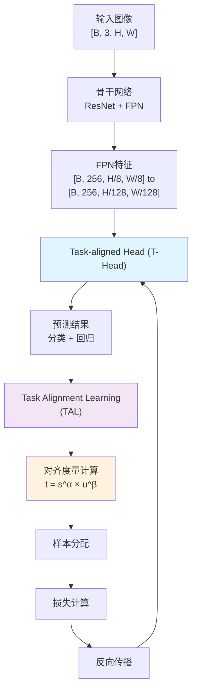
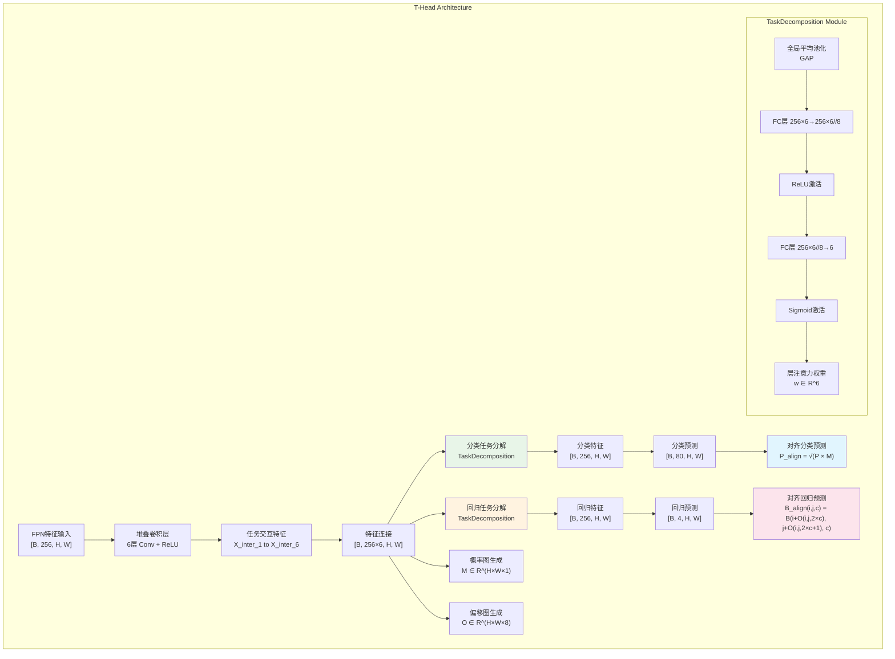
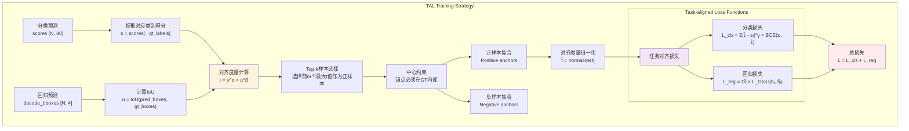
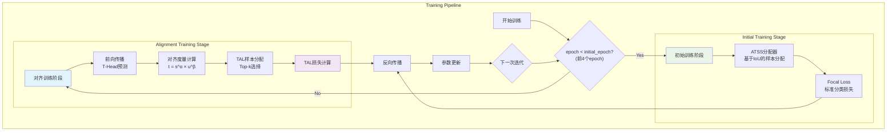
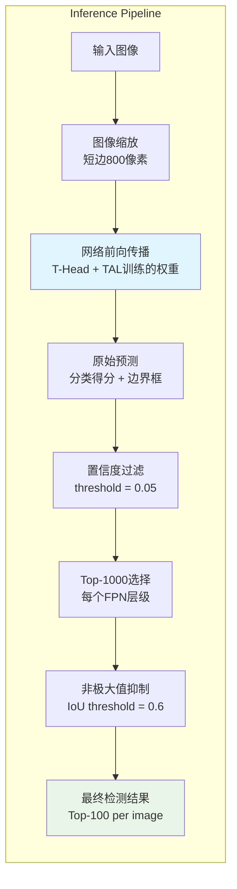
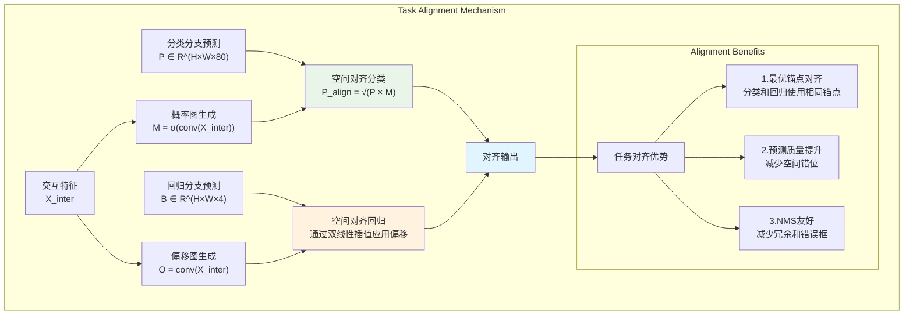
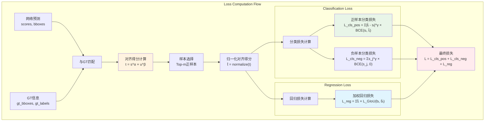
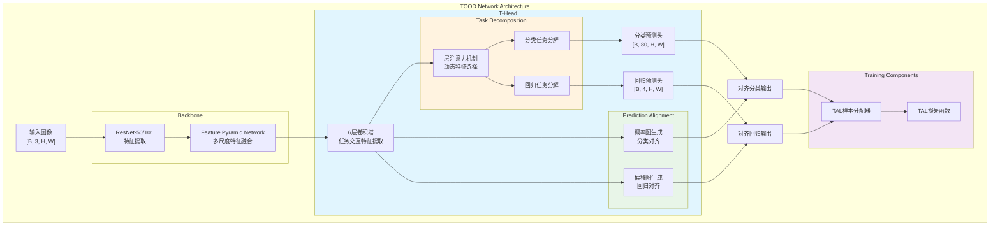

# TOOD算法流程图集合

## 1. TOOD整体架构流程图

## 2. Task-aligned Head (T-Head) 详细流程图

## 3. Task Alignment Learning (TAL) 流程图

## 4. 训练阶段完整流程图

## 5. 推理阶段流程图

## 6. 任务对齐机制详细流程

## 7. 损失函数计算流程

## 8. 网络架构层次图

---

**说明**:
- 所有流程图基于TOOD论文的原始设计和MMDetection代码实现
- α和β是任务对齐度量的超参数，论文中推荐α=1, β=6
- m是正样本选择的数量，论文中使用m=13
- γ是focal loss的聚焦参数，设置为2
- 图中的维度标注基于COCO数据集(80个类别)的标准设置