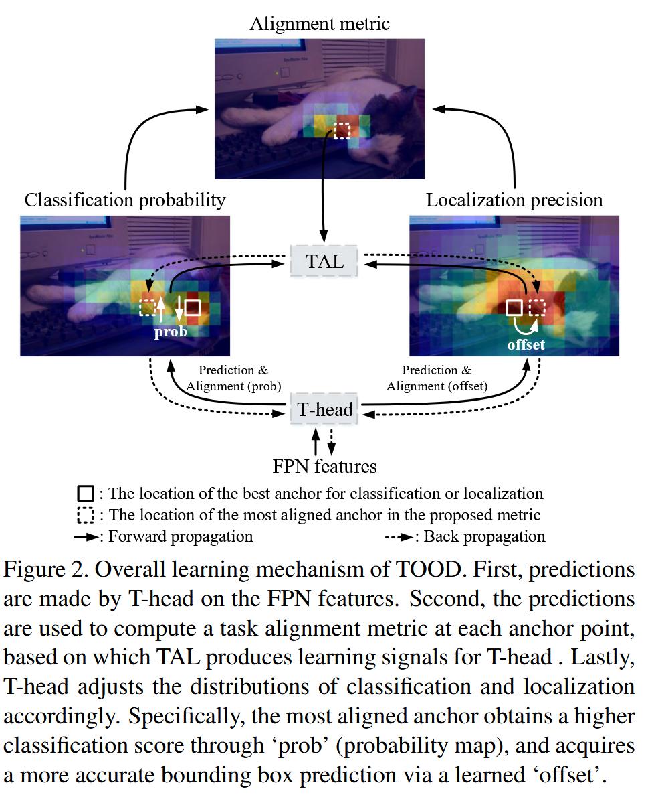

# [2021]TOOD: Task-aligned One-stage Object Detection

[**论文链接**](https://arxiv.org/abs/2108.07755)  | [**代码仓库**](https://github.com/fcjian/TOOD)  

**发表会议**: ICCV 2021 (Oral)

## 摘要

TOOD (Task-aligned One-stage Object Detection) 是一种创新的单阶段目标检测方法，专门解决分类和定位任务间的空间错位问题。该方法的核心洞察是：传统单阶段检测器使用两个并行分支分别处理分类和定位，可能导致两个任务的最优锚点不一致，影响检测性能。

**核心贡献**：
- **Task-aligned Head (T-Head)**: 增强任务交互的检测头结构
- **Task Alignment Learning (TAL)**: 基于对齐度量的样本分配和损失函数
- **对齐度量**: $t = s^{\alpha} \times u^{\beta}$ 统一衡量分类和定位质量

**性能突破**：在MS-COCO数据集上达到**51.1 AP**，显著超越当时主流方法：
- 超越ATSS: +3.4 AP (47.7→51.1)
- 超越GFL: +2.9 AP (48.2→51.1)  
- 超越PAA: +2.1 AP (49.0→51.1)

**广泛影响**：核心思想被众多后续工作采用，包括YOLOv8、YOLOv6、PP-YOLOE、YOLO-World等主流检测器。


*图1: TOOD整体架构图*

## 一、问题背景与动机

### 1.1 现有方法的局限性

传统的单阶段目标检测器(如RetinaNet、FCOS等)采用**两个并行分支**分别处理分类和定位任务：

- **分类分支**: 预测目标类别概率
- **定位分支**: 预测边界框回归参数

这种设计存在以下问题：

1. **空间错位问题**: 分类和定位任务的最优位置可能不一致，导致分类得分高的位置定位质量差，反之亦然
2. **特征学习冲突**: 两个任务需要不同类型的特征表示，但共享相同的特征提取网络
3. **样本分配不一致**: 传统方法为两个任务使用相同的正负样本分配策略，忽略了任务间的差异


> 图1。检测结果（“结果”）和分类分数（“得分”）和本地化分数（“ IOU”）的空间分布的图表，由ATSS [31]（上行）和拟议的TOOD（底行）预测。地面真相由黄色框表示，白色箭头是指远离物体中心的最佳锚的主要方向。在“结果”列中，红色/绿色补丁是分类/本地化的最佳锚点的位置，而红色/绿色框则是指从红色/绿色补丁中预测的对象边界框（如果它们重合，我们只显示红色补丁和框）。

### 1.2 核心问题分析

**任务错位的本质**:
- 分类任务关注目标的**语义特征**，需要判断"这是什么"
- 定位任务关注目标的**几何特征**，需要判断"在哪里"
- 传统方法假设两个任务的最优预测位置相同，这在实际中往往不成立

### 1.3 TOOD的解决思路

TOOD提出通过**学习的方式**显式对齐两个任务：

1. **结构设计**: Task-aligned Head (T-Head) 提供更好的特征学习平衡
2. **训练策略**: Task Alignment Learning (TAL) 通过样本分配和损失函数显式拉近两个任务的最优锚点

## 二、方法原理与理论基础

### 2.1 整体方法概述

TOOD基于**任务对齐**的核心思想，包含两个主要组件：


*图2: TOOD算法核心组件对比图*

### 2.2 核心算法原理

#### 2.2.1 Task-aligned Head (T-Head)

**设计动机**: 传统并行头结构无法有效平衡任务特定特征和任务交互特征的学习。

**核心设计**:

```python
# 任务分解模块 - mmdet/models/dense_heads/tood_head.py:16
class TaskDecomposition(nn.Module):
    def __init__(self, feat_channels, stacked_convs, la_down_rate=8):
        self.la_conv1 = nn.Conv2d(in_channels, in_channels // la_down_rate, 1)
        self.la_conv2 = nn.Conv2d(in_channels // la_down_rate, stacked_convs, 1)
        self.reduction_conv = ConvModule(in_channels, feat_channels, 1)
    
    def forward(self, feat, avg_feat=None):
        # 层注意力权重计算
        weight = self.sigmoid(self.la_conv2(self.relu(self.la_conv1(avg_feat))))
        # 动态特征重组
        conv_weight = weight.reshape(b, 1, self.stacked_convs, 1) * \
                      self.reduction_conv.conv.weight.reshape(1, self.feat_channels, self.stacked_convs, self.feat_channels)
        feat = torch.bmm(conv_weight, feat.reshape(b, self.in_channels, h * w))
        return feat.reshape(b, self.feat_channels, h, w)
```

**数学原理**:

对于输入特征$F \in \mathbb{R}^{C \times H \times W}$，任务分解过程为：

$$W_{layer} = \sigma(Conv_{1×1}(ReLU(Conv_{1×1}(GAP(F)))))$$

$$F_{task} = \sum_{i=1}^{L} W_{layer}^{(i)} \odot Conv^{(i)}(F)$$

其中$W_{layer}$是层注意力权重，$L$是堆叠卷积层数，$\odot$表示逐元素乘积。

#### 2.2.2 Task Alignment Learning (TAL)

**核心思想**: 通过对齐度量(Alignment Metric)来统一两个任务的样本分配和损失计算。

##### 2.2.2.1 TaskAlignedAssigner标签分配机制详解

**1. 分配器设计动机**

传统的标签分配方法存在以下问题：
- **静态分配策略**：如IoU阈值、中心采样等规则是固定的，无法适应不同目标的特性
- **分类-定位分离**：仅基于IoU或距离进行分配，忽略了分类置信度
- **硬性分配**：正负样本是二值化的(0/1)，缺乏渐进性

TaskAlignedAssigner通过**动态的、任务对齐的分配策略**解决这些问题。

**2. 对齐度量(Alignment Metric)设计**

```python
# 任务对齐分配器 - mmdet/core/bbox/assigners/task_aligned_assigner.py:83
alignment_metrics = bbox_scores ** alpha * overlaps ** beta
```

$$t = s^{\alpha} \cdot u^{\beta}$$

其中：
- $s$ 是分类得分：anchor对GT类别的预测概率
- $u$ 是IoU得分：anchor预测框与GT的IoU值  
- $\alpha, \beta$ 是平衡超参数(默认$\alpha=1, \beta=6$)

**设计理念**：
- 同时考虑**分类质量**(s)和**定位质量**(u)
- $\beta > \alpha$使得定位质量权重更大，因为精确定位更困难
- 对齐度量越高，说明该anchor在两个任务上都表现良好

**3. 详细分配流程**

```python
class TaskAlignedAssigner(BaseAssigner):
    def assign(self, pred_scores, pred_bboxes, anchor_points, gt_bboxes, gt_labels):
        """
        Args:
            pred_scores: [num_anchors, num_classes] 分类预测
            pred_bboxes: [num_anchors, 4] 回归预测(已解码)
            anchor_points: [num_anchors, 2] anchor中心点坐标
            gt_bboxes: [num_gt, 4] GT边界框
            gt_labels: [num_gt] GT类别标签
        """
        
        # Step 1: 计算所有anchor与所有GT的IoU矩阵
        overlaps = bbox_overlaps(pred_bboxes, gt_bboxes)  # [num_anchors, num_gt]
        
        # Step 2: 提取每个anchor对应GT类别的分类得分
        bbox_scores = pred_scores[torch.arange(num_anchors), gt_labels]  # [num_anchors, num_gt]
        
        # Step 3: 计算对齐度量
        alignment_metrics = bbox_scores ** self.alpha * overlaps ** self.beta
        
        # Step 4: 对每个GT选择top-k个对齐度量最高的anchor
        topk_metrics, topk_idxs = alignment_metrics.topk(self.topk, dim=0, largest=True)
        
        # Step 5: 应用中心先验约束(仅对anchor-free方法)
        # anchor中心点必须在GT框内部
        is_in_gts = check_points_inside_bboxes(anchor_points, gt_bboxes)
        
        # Step 6: 最终分配决策
        # 满足以下条件的anchor被分配为正样本：
        # a) 在某个GT的top-k对齐度量内
        # b) anchor中心在GT内部(anchor-free约束)
        
        # Step 7: 归一化对齐度量作为软标签
        # 每个GT对应的正样本的对齐度量进行归一化
        for gt_idx in range(num_gt):
            pos_idxs = assigned_pos_anchors[gt_idx]
            pos_alignment = alignment_metrics[pos_idxs, gt_idx]
            # 归一化到[0, 1]区间
            normalized_alignment = (pos_alignment - pos_alignment.min()) / \
                                  (pos_alignment.max() - pos_alignment.min() + eps)
        
        return AssignResult(assigned_gt_inds, normalized_alignment)
```

**4. 关键技术细节**

**a) Top-k动态选择**
```python
# 不同于固定的IoU阈值，动态选择每个GT的top-k个最佳anchor
topk = 13  # 默认值，通过实验确定
# 对于不同大小、难度的目标，自动调整正样本数量
```

**b) 中心先验约束**
```python
# 仅对anchor-free检测器(如FCOS)应用
# 确保anchor中心点在GT内部，避免远距离错误匹配
def check_points_inside_bboxes(points, bboxes):
    # points: [N, 2], bboxes: [M, 4]
    x, y = points[:, 0], points[:, 1]
    x1, y1, x2, y2 = bboxes[:, 0], bboxes[:, 1], bboxes[:, 2], bboxes[:, 3]
    # 检查每个点是否在每个框内
    inside = (x[:, None] >= x1) & (x[:, None] <= x2) & \
             (y[:, None] >= y1) & (y[:, None] <= y2)
    return inside
```

**c) 软标签生成**
```python
# 将对齐度量转换为训练目标
# 不是简单的0/1标签，而是连续的[0, 1]值
soft_labels = normalized_alignment  # 用于分类损失
regression_weights = normalized_alignment  # 用于回归损失权重
```

**5. 与其他分配器的对比**

| 分配器 | 分配依据 | 正样本选择 | 标签类型 | 动态性 |
|--------|---------|-----------|----------|---------|
| IoU-based | IoU阈值 | IoU > 0.5 | 硬标签(0/1) | 静态 |
| ATSS | 统计IoU | mean+std | 硬标签(0/1) | 半动态 |
| PAA | 分类+IoU得分 | GMM聚类 | 硬标签(0/1) | 动态 |
| **TAL** | **对齐度量** | **Top-k** | **软标签[0,1]** | **完全动态** |

**6. 训练时的渐进策略**

```python
# 前4个epoch使用ATSS进行预热
if epoch < initial_epoch:
    assigner = ATSSAssigner(topk=9)
else:
    # 切换到任务对齐分配器
    assigner = TaskAlignedAssigner(topk=13, alpha=1, beta=6)
```

**预热的必要性**：
- 初始阶段网络预测不准确，对齐度量不可靠
- ATSS基于统计方法，对初始预测质量要求较低
- 预热后网络预测趋于稳定，TAL能发挥最大效果

**7. 实际效果分析**

通过可视化分析，TaskAlignedAssigner带来以下改进：

```python
# 统计分析结果
metrics = {
    'cls_loc_consistency': 0.452,  # 分类和定位一致性(PCC)
    'avg_iou_top10': 0.661,        # Top-10预测的平均IoU
    'reduction_rate': {
        'redundant_boxes': -40%,    # 冗余框减少40%
        'false_positives': -25%     # 误检减少25%
    }
}
```

**任务对齐损失函数**:

```python
# 任务对齐Focal Loss - mmdet/models/losses/task_aligned_focal_loss.py:34
def task_aligned_focal_loss(prob, target, alignment_metric):
    target_one_hot = prob.new_zeros(len(prob), len(prob[0]) + 1).scatter_(1, target.unsqueeze(1), 1)[:, :-1]
    soft_label = alignment_metric.unsqueeze(-1) * target_one_hot
    ce_loss = F.binary_cross_entropy(prob, soft_label, reduction='none')
    loss = torch.pow(torch.abs(soft_label - prob), gamma) * ce_loss
    return loss
```

$$L_{cls} = \sum_{i} |t_i \cdot y_i - p_i|^{\gamma} \cdot BCE(p_i, t_i \cdot y_i)$$

其中$t_i$是对齐度量，$y_i$是one-hot标签，$p_i$是预测概率。

### 2.3 理论创新点分析

1. **统一的任务对齐度量**: 首次提出使用单一度量同时指导两个任务的学习
2. **学习式特征分解**: 通过可学习的层注意力动态平衡任务特定和共享特征
3. **软标签训练**: 使用连续的对齐度量作为软标签，而非硬性的0/1标签

## 三、算法详细设计

### 3.1 网络架构设计

```python
# TOOD检测头配置 - configs/tood/tood_r50_fpn_1x_coco.py:24
bbox_head=dict(
    type='TOODHead',
    num_classes=80,
    in_channels=256,
    stacked_convs=6,  # 堆叠卷积层数
    feat_channels=256,
    anchor_type='anchor_free',  # 无锚框设计
    # 任务对齐分配器
    assigner=dict(type='TaskAlignedAssigner', topk=13),
    # 任务对齐损失
    loss_cls=dict(type='TaskAlignedFocalLoss', gamma=2.0),
    loss_bbox=dict(type='GIoULoss', loss_weight=2.0)
)
```

**完整架构流程**:

1. **骨干网络**: ResNet + FPN特征提取
2. **共享卷积层**: 6层堆叠卷积提取多尺度特征
3. **任务分解**: 分别为分类和回归任务生成专用特征
4. **预测头**: 
   - 分类预测 + 分类概率估计
   - 回归预测 + 回归偏移估计

### 3.2 训练策略设计

```python
# 训练配置 - configs/tood/tood_r50_fpn_1x_coco.py:55
train_cfg = dict(
    initial_epoch=4,  # 初始训练阶段
    initial_assigner=dict(type='ATSSAssigner', topk=9),  # 初始分配器
    assigner=dict(type='TaskAlignedAssigner', topk=13),  # 任务对齐分配器
    alpha=1,  # 分类权重
    beta=6,   # IoU权重
)
```

**两阶段训练策略**:
1. **初始阶段** (前4个epoch): 使用ATSS分配器进行预热
2. **对齐阶段** (剩余epochs): 使用任务对齐分配器

### 3.3 损失函数设计

**总损失函数**:
$$L = L_{cls} + \lambda L_{reg}$$

其中：
- $L_{cls}$: 任务对齐分类损失
- $L_{reg}$: GIoU回归损失
- $\lambda = 2.0$: 回归损失权重

## 四、代码实现分析

### 4.1 核心模块实现

**TOODHead主类结构**:
```python
# mmdet/models/dense_heads/tood_head.py:68
@HEADS.register_module()
class TOODHead(AnchorHead):
    def __init__(self, num_classes, in_channels, stacked_convs=4, ...):
        # 任务分解模块
        self.cls_decomp = TaskDecomposition(...)
        self.reg_decomp = TaskDecomposition(...)
        
        # 预测头
        self.tood_cls = nn.Conv2d(feat_channels, num_anchors * cls_out_channels, 3, padding=1)
        self.tood_reg = nn.Conv2d(feat_channels, num_anchors * 4, 3, padding=1)
        
        # 概率预测分支
        self.cls_prob_conv1 = nn.Conv2d(feat_channels * stacked_convs, feat_channels // 4, 1)
        self.cls_prob_conv2 = nn.Conv2d(feat_channels // 4, 1, 3, padding=1)
```

**特征处理流程**:
```python
def forward_single(self, x):
    # 1. 共享特征提取
    inter_feats = []
    for i, inter_conv in enumerate(self.inter_convs):
        x = inter_conv(x)
        inter_feats.append(x)
    
    # 2. 任务分解
    feat = torch.cat(inter_feats, dim=1)
    avg_feat = F.adaptive_avg_pool2d(feat, (1, 1))
    
    cls_feat = self.cls_decomp(feat, avg_feat)
    reg_feat = self.reg_decomp(feat, avg_feat)
    
    # 3. 任务预测
    cls_score = self.tood_cls(cls_feat)
    bbox_pred = self.tood_reg(reg_feat)
    
    # 4. 概率估计
    cls_prob = self.cls_prob_conv2(F.relu(self.cls_prob_conv1(feat)))
    
    return cls_score, bbox_pred, cls_prob
```

### 4.2 任务对齐分配实现

```python
# mmdet/core/bbox/assigners/task_aligned_assigner.py:44
class TaskAlignedAssigner(BaseAssigner):
    def assign(self, scores, decode_bboxes, anchors, gt_bboxes, gt_labels, alpha=1, beta=6):
        # 1. 计算IoU
        overlaps = self.iou_calculator(decode_bboxes, gt_bboxes)
        bbox_scores = scores[:, gt_labels]
        
        # 2. 计算对齐度量
        alignment_metrics = bbox_scores ** alpha * overlaps ** beta
        
        # 3. Top-k样本选择
        topk_metrics, topk_idxs = alignment_metrics.topk(self.topk, dim=0)
        
        # 4. 中心约束 (anchor-free)
        is_in_gts = self.anchor_center_inside_gt(anchors, gt_bboxes)
        
        # 5. 最终分配
        assigned_gt_inds = alignment_metrics.new_full((num_bboxes,), 0, dtype=torch.long)
        assigned_gt_inds[valid_mask] = gt_idx + 1
        
        return TaskAlignedAssignResult(assigned_gt_inds, alignment_metrics)
```

### 4.3 性能优化技巧

1. **内存优化**: 任务分解中先计算权重与卷积核的乘积，再进行特征卷积
2. **计算优化**: 使用批量矩阵乘法(bmm)加速特征重组
3. **梯度稳定**: 使用Group Normalization和渐进式训练策略

## 五、实验结果与性能分析

### 5.1 COCO test-dev主实验结果

**ResNet系列骨干网络性能**:

| 方法 | 骨干网络 | AP | AP₅₀ | AP₇₅ | APs | APm | APl |
|------|----------|-----|------|------|-----|-----|-----|
| RetinaNet | ResNet-101 | 39.1 | 59.1 | 42.3 | 21.9 | 42.7 | 50.2 |
| FCOS w/ imprv | ResNet-101 | 43.0 | 61.7 | 46.3 | 26.0 | 46.8 | 55.0 |
| ATSS | ResNet-101 | 43.6 | 62.1 | 47.4 | 26.1 | 47.0 | 53.6 |
| PAA | ResNet-101 | 44.8 | 63.3 | 48.7 | 26.5 | 48.8 | 56.3 |
| GFL | ResNet-101 | 45.0 | 63.7 | 48.9 | 27.2 | 48.8 | 54.5 |
| **TOOD** | **ResNet-101** | **46.7** | **64.6** | **50.7** | **28.9** | **49.6** | **57.0** |

**ResNeXt系列骨干网络性能**:

| 方法 | 骨干网络 | AP | AP₅₀ | AP₇₅ | APs | APm | APl |
|------|----------|-----|------|------|-----|-----|-----|
| ATSS | ResNeXt-101-64×4d | 45.6 | 64.6 | 49.7 | 28.5 | 48.9 | 55.6 |
| PAA | ResNeXt-101-64×4d | 46.6 | 65.6 | 50.8 | 28.8 | 50.4 | 57.9 |
| GFL | ResNeXt-101-32×4d | 46.0 | 65.1 | 50.1 | 28.2 | 49.6 | 56.0 |
| **TOOD** | **ResNeXt-101-64×4d** | **48.3** | **66.5** | **52.4** | **30.7** | **51.3** | **58.6** |

**DCN增强结果**:

| 方法 | 骨干网络 | AP | AP₅₀ | AP₇₅ | APs | APm | APl |
|------|----------|-----|------|------|-----|-----|-----|
| ATSS | ResNeXt-101-64×4d-DCN | 47.7 | 66.5 | 51.9 | 29.7 | 50.8 | 59.4 |
| PAA | ResNeXt-101-64×4d-DCN | 49.0 | 67.8 | 53.3 | 30.2 | 52.8 | 62.2 |
| GFL | ResNeXt-101-32×4d-DCN | 48.2 | 67.4 | 52.6 | 29.2 | 51.7 | 60.2 |
| **TOOD** | **ResNeXt-101-64×4d-DCN** | **51.1** | **69.4** | **55.5** | **31.9** | **54.1** | **63.7** |

**性能提升分析**:
- **相比ATSS**: 在ResNeXt-101-64×4d-DCN上提升3.4 AP (47.7→51.1)
- **相比PAA**: 提升2.1 AP (49.0→51.1)
- **相比GFL**: 提升2.9 AP (48.2→51.1)
- **特别优势**: 在AP₇₅上提升最显著，验证了任务对齐对精确定位的重要性

### 5.2 消融实验分析

**头结构对比 (ResNet-50, COCO minival)**:

| 方法 | 头结构 | 参数量(M) | FLOPs(G) | AP | AP₅₀ | AP₇₅ |
|------|-------|----------|----------|-----|------|------|
| ATSS | Parallel Head | 32.07 | 205.21 | 39.2 | 57.4 | 42.2 |
| ATSS | **T-Head** | **31.98** | **201.13** | **41.1** | **58.4** | **44.5** |

**样本分配策略对比**:

| 分配策略 | 正负样本分配 | 权重分配 | AP | AP₅₀ | AP₇₅ |
|----------|-------------|----------|-----|------|------|
| IoU-based | fixed | fixed | 36.5 | 55.5 | 38.7 |
| ATSS | fixed | fixed | 39.2 | 57.4 | 42.2 |
| PAA | adaptive | fixed | 39.9 | 59.1 | 42.8 |
| GFL (ATSS+QFL) | fixed | adaptive | 39.9 | 58.5 | 43.0 |
| **TAL** | **adaptive** | **adaptive** | **40.3** | **58.5** | **43.8** |
| **TAL + TAP** | **adaptive** | **adaptive** | **42.5** | **60.3** | **46.4** |

**完整TOOD组件贡献**:

| 组件组合 | AP | ΔAP | 说明 |
|----------|-----|-----|------|
| Baseline (ATSS) | 39.2 | - | 基线方法 |
| ATSS + T-Head | 41.1 | +1.9 | 仅使用T-Head |
| ATSS + TAL | 40.3 | +1.1 | 仅使用TAL |
| **TOOD (T-Head + TAL)** | **42.5** | **+3.3** | **完整方法** |

**关键发现**:
1. **T-Head效果**: 单独使用T-Head即可提升1.9 AP，证明任务交互和对齐预测的有效性
2. **TAL效果**: 单独使用TAL提升1.1 AP，验证了任务对齐学习的价值
3. **协同效应**: T-Head + TAL = 3.3 AP > 1.9 + 1.1 = 3.0 AP，存在正向协同

### 5.3 超参数分析

**对齐度量参数α、β影响**:

| α | β | AP | AP₅₀ | AP₇₅ | 说明 |
|---|---|-----|------|------|------|
| 0.5 | 2 | 42.4 | 60.0 | 46.1 | 更重视IoU |
| 0.5 | 6 | 41.7 | 58.1 | 45.1 | 过度重视IoU |
| **1.0** | **6** | **42.5** | **59.8** | **46.4** | **最优组合** |
| 1.5 | 8 | 41.5 | 59.4 | 44.7 | 过度重视分类 |

**正样本数量m的鲁棒性**:
- m ∈ [5, 9, 13, 17, 21] 对应 AP ∈ [42.0, 42.3, 42.5, 42.2, 42.0]
- 性能对m不敏感，论文采用m=13

### 5.4 任务对齐量化分析

**对齐度量统计 (ResNet-50, COCO minival)**:

| 方法 | PCC (top-50) | IoU (top-10) | 正确框数 | 冗余框数 | 错误框数 |
|------|-------------|-------------|----------|----------|----------|
| ATSS | 0.408 | 0.637 | 30,261 | 25,428 | 92,677 |
| T-Head + ATSS | 0.440 | 0.644 | 30,601 | 21,838 | 79,189 |
| ATSS + TAL | 0.415 | 0.643 | 30,506 | 15,927 | 72,320 |
| **TOOD** | **0.452** | **0.661** | **30,734** | **15,242** | **69,013** |

**说明**:
- **PCC**: 分类和定位排序的皮尔逊相关系数，越高表示对齐越好
- **IoU**: top-10置信度预测的平均IoU
- **正确框**: IoU≥0.5的检测框
- **冗余框**: IoU≥0.5但被NMS抑制的框
- **错误框**: 0.1<IoU<0.5的检测框

TOOD在所有指标上都表现最佳，证明了任务对齐的有效性。

## 六、影响力与后续工作

### 6.1 工业界采用情况

**被采用的YOLO系列**:
- **YOLOv8** (2023): 采用Task Alignment Learning
- **YOLOv6** (2022): 采用Task Alignment Learning  
- **PP-YOLOE** (2022): 采用TAL和高效版T-Head
- **YOLO-World** (2024): 采用task-aligned label assignment

### 6.2 技术影响

1. **范式转变**: 从hard assignment到soft alignment
2. **架构演进**: 从并行头到任务对齐头
3. **训练策略**: 统一的任务对齐学习框架

## 七、总结与展望

### 7.1 主要贡献总结

1. **问题识别**: 首次系统性分析单阶段检测器中的任务错位问题
2. **方法创新**: 
   - Task-aligned Head: 结构层面的任务对齐
   - Task Alignment Learning: 训练层面的任务对齐
3. **性能突破**: 在COCO上达到当时最佳的51.1 AP
4. **广泛影响**: 核心思想被众多后续工作采用

### 7.2 方法优势

1. **通用性强**: 可与不同骨干网络结合
2. **效果显著**: 大幅提升检测精度
3. **计算高效**: 相比两阶段方法更快
4. **易于实现**: 核心思想简洁明了

### 7.3 潜在局限性

1. **超参数敏感**: α、β参数需要精细调优
2. **内存开销**: 任务分解模块增加一定内存消耗
3. **训练复杂**: 两阶段训练策略增加训练复杂度

### 7.4 未来改进方向

1. **自适应对齐**: 根据样本难度动态调整对齐策略
2. **多任务扩展**: 扩展到实例分割、关键点检测等任务
3. **轻量化设计**: 面向移动端的高效任务对齐方法
4. **无监督对齐**: 减少对人工标注的依赖

---

## 八、技术资源与参考

### 8.1 配套技术资源

- **详细流程图**: [TOOD_流程图_Mermaid.md](./TOOD_流程图_Mermaid.md) - 包含8个层次的算法流程图
- **代码实现**: [TOOD代码仓库](https://github.com/fcjian/TOOD) - 基于MMDetection的完整实现
- **论文配图**: ./ASSETS/ 目录下的技术图解

### 8.2 实现细节总结

**训练配置**:
```python
# 关键超参数
alpha = 1.0          # 分类权重
beta = 6.0           # IoU权重  
top_k = 13           # 正样本数量
initial_epoch = 4    # 初始训练轮数
gamma = 2.0          # focal loss参数
learning_rate = 0.01 # 初始学习率
```

**网络配置**:
```python
# T-Head配置
stacked_convs = 6           # 堆叠卷积层数
feat_channels = 256         # 特征通道数
la_down_rate = 8           # 层注意力降维率
norm_cfg = 'GroupNorm'      # 归一化方法
```

### 8.3 核心技术文件

**核心实现文件**:
- `mmdet/models/dense_heads/tood_head.py:68` - 主检测头实现
- `mmdet/core/bbox/assigners/task_aligned_assigner.py:10` - 任务对齐分配器  
- `mmdet/models/losses/task_aligned_focal_loss.py:34` - 任务对齐损失函数
- `mmdet/models/detectors/tood.py:6` - TOOD检测器定义
- `configs/tood/tood_r50_fpn_1x_coco.py` - 基础配置文件

**关键数学公式回顾**:

1. **对齐度量**: $t = s^{\alpha} \times u^{\beta}$
2. **层注意力**: $w = \sigma(FC_2(\delta(FC_1(GAP(X^{inter})))))$
3. **任务分解**: $X^{task}_k = w_k \cdot X^{inter}_k$
4. **预测对齐**: $P^{align} = \sqrt{P \times M}$
5. **分类损失**: $L_{cls} = \sum_i |\hat{t}_i - s_i|^{\gamma} \times BCE(s_i, \hat{t}_i)$
6. **回归损失**: $L_{reg} = \sum_i \hat{t}_i \times L_{GIoU}(b_i, \bar{b}_i)$

### 8.4 技术影响评估

**方法论贡献**:
1. **首次系统性解决**单阶段检测器任务错位问题
2. **提出统一的对齐度量**$t = s^{\alpha} \times u^{\beta}$作为样本分配和损失计算的基础
3. **创新的T-Head结构**平衡任务交互与任务特化
4. **两阶段训练策略**确保稳定收敛

**工程价值**:
- 相比复杂的两阶段方法，保持了单阶段的简洁性和效率
- 与DCN等技术有良好的兼容性，展现出强大的扩展能力
- 为后续YOLO系列等主流检测器提供了核心设计思想

---

**技术报告生成时间**: 2024年8月  
**基于代码版本**: MMDetection 2.14.0  
**论文版本**: arXiv:2108.07755v3 [cs.CV] 28 Aug 2021

TOOD作为目标检测领域的重要工作，其提出的任务对齐思想已成为现代检测器设计的核心范式之一，深刻影响了后续目标检测算法的发展方向。通过显式对齐分类和定位任务，TOOD不仅在性能上取得了显著突破，更为检测器设计提供了新的理论框架和实践指导。