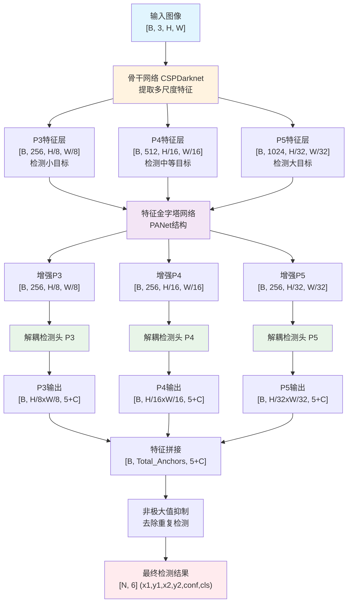
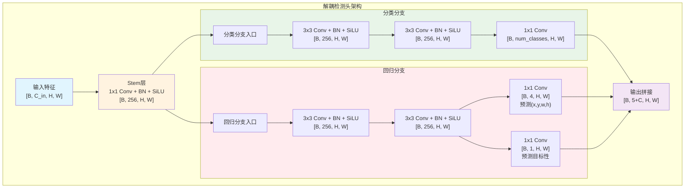
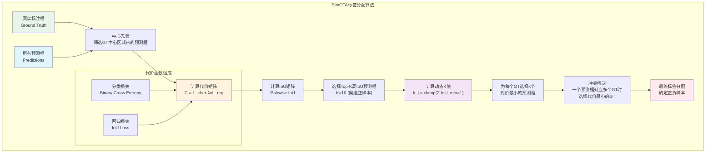
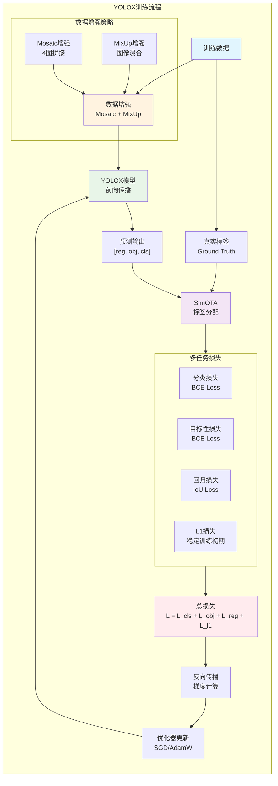
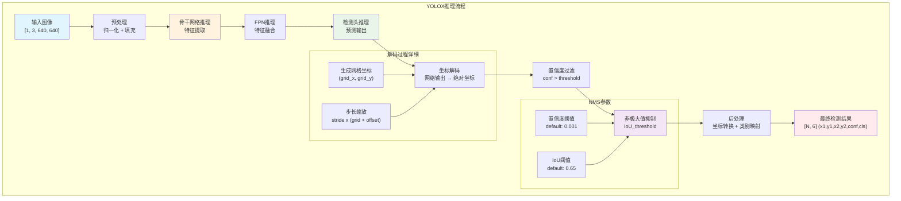
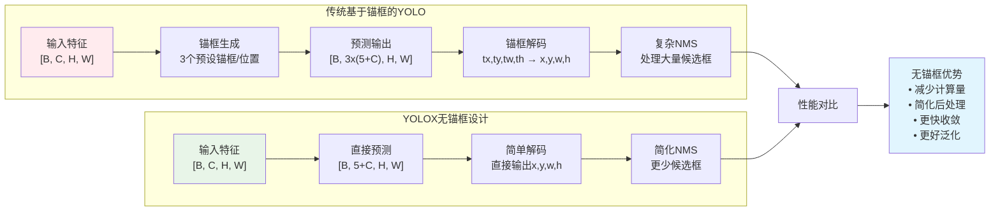
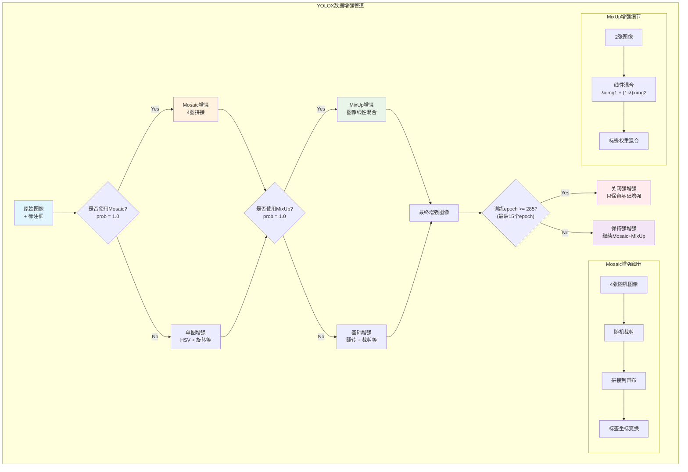
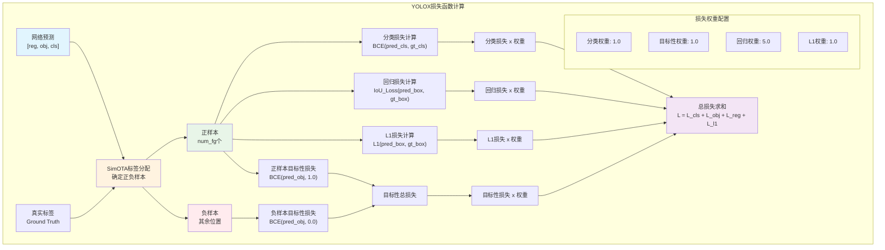
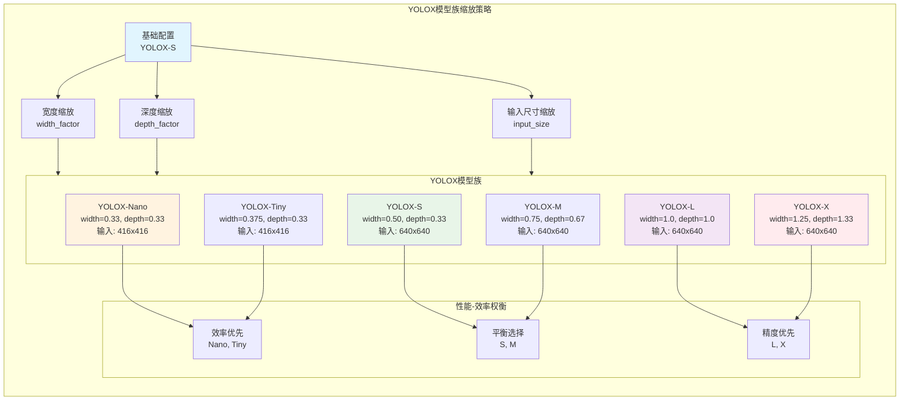
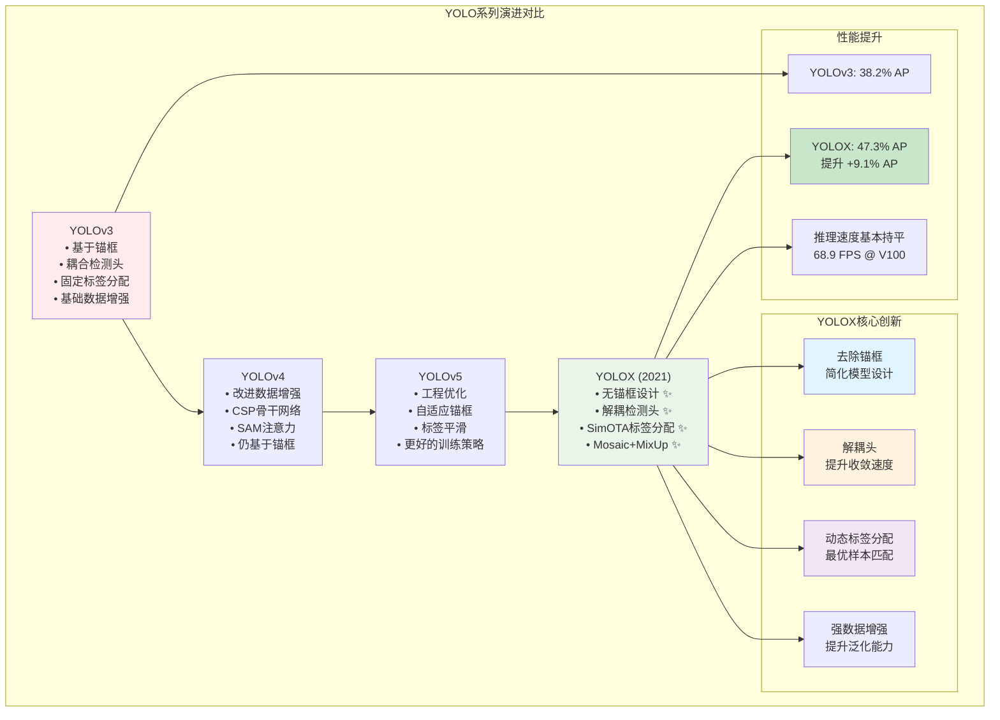

# YOLOX 流程图集合

本文档包含了YOLOX算法的各种流程图，使用Mermaid格式绘制，展示了模型架构、训练流程、数据流转等关键过程。

## 1. YOLOX整体架构流程图

## 2. 解耦检测头详细结构

## 3. SimOTA标签分配流程

## 4. 训练流程图

## 5. 推理流程图

## 6. 无锚框设计对比

## 7. 数据增强流程

## 8. 损失函数计算流程

## 9. 模型缩放策略

## 10. 与YOLO系列对比

---

**注意**: 以上流程图展示了YOLOX算法的核心流程和架构设计。每个图表都标注了关键的维度变化和参数配置，便于理解算法的实现细节。这些图表可以直接在支持Mermaid的环境中渲染显示。