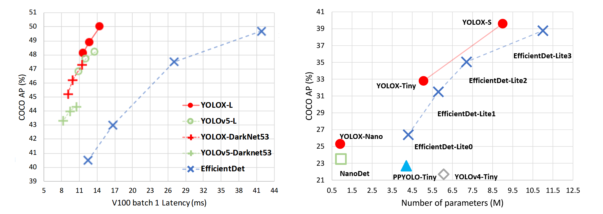
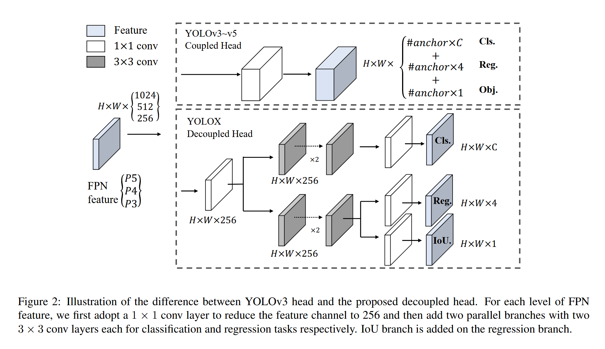

# YOLOX: Exceeding YOLO Series in 2021

[论文链接](https://arxiv.org/abs/2107.08430) | [代码仓库](https://github.com/Megvii-BaseDetection/YOLOX)



> 图1：Yolox和其他最先进的对象检测器的精确模型（顶部）和LITE模型的尺寸准确曲线的速度准确性权衡。

## 摘要

YOLOX是旷视科技在2021年提出的高性能无锚框YOLO检测器，通过一系列经过验证的改进技术，在保持高推理速度的同时显著提升了检测精度。YOLOX将YOLO检测器转换为无锚框设计，并结合解耦检测头和先进的标签分配策略SimOTA等技术。

**主要成果**：
- YOLOX-Nano仅有0.91M参数和1.08G FLOPs，在COCO上达到**25.3% AP**，超越NanoDet 1.8% AP
- YOLOX-L在Tesla V100上达到**50.0% AP**和**68.9 FPS**，超越YOLOv5-L 1.8% AP
- 使用单个YOLOX-L模型在CVPR 2021自动驾驶Workshop的流感知挑战赛中获得**第一名**
- YOLOv3基线从44.3% AP提升到**47.3% AP**，超越当前最佳实践3.0% AP

## 一、无锚框设计（Anchor-Free Design）

### 1.1 问题背景

传统YOLO系列使用基于锚框的检测方式，需要手工设计锚框尺寸和比例，这带来了以下问题：
- 需要在每个位置预测多个锚框，增加计算复杂度
- 锚框的设计对性能影响较大，需要针对不同数据集调优
- 后处理需要复杂的NMS操作来过滤重复检测

### 1.2 方法原理

YOLOX将YOLO检测器转换为无锚框设计，直接在每个网格位置预测目标的边界框坐标。

#### 1.2.1 预测方式变化

**原始YOLOv3预测**：每个位置预测3个锚框
- 每个锚框预测：$(t_x, t_y, t_w, t_h, conf, cls_1, cls_2, ..., cls_C)$

**YOLOX预测**：每个位置预测1个边界框
- 直接预测：$(x, y, w, h, conf, cls_1, cls_2, ..., cls_C)$

其中：
- $(x, y)$: 边界框中心相对于网格左上角的偏移
- $(w, h)$: 边界框的宽度和高度
- $conf$: 目标置信度
- $cls_i$: 类别概率

#### 1.2.2 代码实现

**核心预测逻辑** `yolox/models/yolo_head.py:96-115`：
```python
# 分类预测头：预测每个类别的概率
self.cls_preds.append(
    nn.Conv2d(
        in_channels=int(256 * width),
        out_channels=self.num_classes,  # 直接预测类别数
        kernel_size=1,
        stride=1,
        padding=0,
    )
)
# 回归预测头：预测边界框坐标(x,y,w,h)
self.reg_preds.append(
    nn.Conv2d(
        in_channels=int(256 * width),
        out_channels=4,  # 只预测4个坐标值
        kernel_size=1,
        stride=1,
        padding=0,
    )
)
# 目标性预测头：预测是否包含目标
self.obj_preds.append(
    nn.Conv2d(
        in_channels=int(256 * width),
        out_channels=1,  # 单一置信度分数
        kernel_size=1,
        stride=1,
        padding=0,
    )
)
```

### 1.3 实验效果

无锚框设计带来的改进：
- **减少输出通道数**：从$(5+C) \\times 3$减少到$5+C$
- **简化后处理**：无需锚框相关的坐标转换
- **提升收敛速度**：训练更加稳定

## 二、解耦检测头（Decoupled Head）

### 2.1 问题背景

原始YOLOv3使用耦合检测头，即用同一组卷积特征同时预测分类、回归和目标性，这存在以下问题：
- 分类和回归任务的特征需求不同，共享特征可能影响性能
- 收敛速度较慢，需要更多训练轮次

### 2.2 方法原理

YOLOX采用解耦检测头设计，为分类和回归任务分别设计独立的特征提取分支。



#### 2.2.1 架构设计

**解耦头结构** `yolox/models/yolo_head.py:38-95`：
```python
# 分类分支：专门用于类别预测
self.cls_convs.append(
    nn.Sequential(
        *[
            Conv(  # 3x3卷积层1
                in_channels=int(256 * width),
                out_channels=int(256 * width),
                ksize=3, stride=1, act=act,
            ),
            Conv(  # 3x3卷积层2  
                in_channels=int(256 * width),
                out_channels=int(256 * width),
                ksize=3, stride=1, act=act,
            ),
        ]
    )
)

# 回归分支：专门用于边界框预测
self.reg_convs.append(
    nn.Sequential(
        *[
            Conv(  # 3x3卷积层1
                in_channels=int(256 * width),
                out_channels=int(256 * width),
                ksize=3, stride=1, act=act,
            ),
            Conv(  # 3x3卷积层2
                in_channels=int(256 * width),
                out_channels=int(256 * width),
                ksize=3, stride=1, act=act,
            ),
        ]
    )
)
```

#### 2.2.2 特征处理流程

**前向传播逻辑** `yolox/models/yolo_head.py:180-200`：
```python
def forward(self, xin, labels=None, imgs=None):
    outputs = []
    for k, (cls_conv, reg_conv, stride_this_level, x) in enumerate(
        zip(self.cls_convs, self.reg_convs, self.strides, xin)
    ):
        # 共享stem层降维
        x = self.stems[k](x)  # 1x1卷积，通道数压缩到256
        
        # 分类分支
        cls_x = x
        cls_feat = cls_conv(cls_x)  # 两个3x3卷积
        cls_output = self.cls_preds[k](cls_feat)  # 1x1卷积输出类别
        
        # 回归分支  
        reg_x = x
        reg_feat = reg_conv(reg_x)  # 两个3x3卷积
        reg_output = self.reg_preds[k](reg_feat)  # 1x1卷积输出坐标
        obj_output = self.obj_preds[k](reg_feat)  # 1x1卷积输出目标性
        
        # 合并输出：[回归, 目标性, 分类]
        output = torch.cat([reg_output, obj_output, cls_output], 1)
        outputs.append(output)
```

### 2.3 实验效果

解耦检测头带来的改进：
- **加速收敛**：分类和回归任务独立优化，收敛速度提升
- **提升精度**：AP从45.0%提升到47.3%，提升2.3%
- **增加参数量**：相比耦合头增加约1.1x的参数，但带来显著的性能提升

## 三、SimOTA标签分配策略

### 3.1 问题背景

传统的标签分配策略存在以下核心问题：

#### 3.1.1 固定阈值的局限性
传统方法如YOLO系列使用固定IoU阈值（如0.5）进行正负样本分配：
- **硬阈值问题**: IoU=0.49的样本被标记为负样本，IoU=0.51的样本被标记为正样本，这种硬分界线不合理
- **数据集适应性差**: 不同数据集的最优阈值不同，需要大量调参
- **目标质量不均**: 高质量目标分配到的正样本过多，低质量目标分配不足

#### 3.1.2 全局最优性缺失
传统分配策略是局部贪心的：
- **忽略全局平衡**: 没有考虑所有GT和预测框的全局最优匹配
- **正负样本不平衡**: 可能导致某些GT获得过多正样本，而其他GT正样本不足
- **任务间冲突**: 分类和回归任务的需求不同，但使用相同的分配策略

### 3.2 SimOTA核心原理

SimOTA（Simplified Optimal Transport Assignment）将标签分配建模为**最优传输问题**，通过求解全局最优解来动态分配正负样本。

#### 3.2.1 最优传输理论基础

**问题定义**: 给定$m$个真实目标和$n$个预测框，求解最优分配矩阵$\mathbf{P} \in \mathbb{R}^{m \times n}$，使得总传输成本最小：

$$\min_{\mathbf{P}} \sum_{i=1}^{m} \sum_{j=1}^{n} C_{ij} P_{ij}$$

**约束条件**:
- 每个GT至少分配$k_i$个正样本: $\sum_{j=1}^{n} P_{ij} \geq k_i$
- 每个预测框最多分配给一个GT: $\sum_{i=1}^{m} P_{ij} \leq 1$
- 非负约束: $P_{ij} \geq 0$

#### 3.2.2 代价函数设计

**分类损失** `yolox/models/yolo_head.py:489-495`：
```python
# 计算分类代价：使用二值交叉熵
with torch.cuda.amp.autocast(enabled=False):
    cls_preds_ = cls_preds_.float().sigmoid()
    pair_wise_cls_loss = F.binary_cross_entropy(
        cls_preds_.unsqueeze(0).repeat(num_gt, 1, 1),
        gt_cls_per_image, reduction="none"
    ).sum(-1)
```

**回归损失** `yolox/models/yolo_head.py:496-507`：
```python
# 计算IoU损失
pairwise_ious = bboxes_iou(gt_bboxes_per_image, bboxes_preds_per_image, False)
pair_wise_iou_loss = -torch.log(pairwise_ious + 1e-8)

# 综合代价矩阵
cost = (
    pair_wise_cls_loss +
    3.0 * pair_wise_iou_loss +  # IoU损失权重为3.0
    100000.0 * (~is_in_boxes_and_center)  # 中心先验约束
)
```

**代价矩阵公式**:
$$C_{ij} = L_{cls}(p_i^{cls}, y_j^{cls}) + 3.0 \cdot L_{IoU}(p_i^{box}, y_j^{box}) + \mathbf{1}_{center}$$

其中：
- $L_{cls}$: 二值交叉熵分类损失
- $L_{IoU}$: IoU回归损失（取负对数）
- $\mathbf{1}_{center}$: 中心先验约束（非中心区域代价设为∞）

#### 3.2.3 动态k值确定

**动态k值算法原理**:
SimOTA的关键创新是为每个GT动态确定正样本数量$k_j$，而不是使用固定值。

```python
# 选择与每个GT IoU最高的前10个候选框
n_candidate_k = min(10, pair_wise_ious.size(1))
# 对每个GT，选出IoU最高的前n_candidate_k个候选框及其IoU值
topk_ious, _ = torch.topk(pair_wise_ious, n_candidate_k, dim=1)

# 动态k值 = 前10个候选框的IoU之和（至少为1）
dynamic_ks = torch.clamp(topk_ious.sum(1).int(), min=1)
```

**动态k值的物理意义**:
- **质量自适应**: 高质量目标（IoU高）分配更多正样本，低质量目标分配较少正样本
- **避免过拟合**: 防止低质量目标分配过多正样本导致误导训练
- **提升召回率**: 确保每个目标至少有一个正样本进行学习

#### 3.2.4 简化求解算法

传统OTA使用Sinkhorn-Knopp迭代求解，SimOTA采用贪心近似算法：

**SimOTA匹配算法** `yolox/models/yolo_head.py:544-576`：
```python
def simota_matching(self, cost, pair_wise_ious, gt_classes, num_gt, fg_mask):
    """
    SimOTA标签分配算法
    Args:
        cost: 代价矩阵 [num_gt, num_priors]
        pair_wise_ious: IoU矩阵 [num_gt, num_priors] 
        gt_classes: GT类别 [num_gt]
        num_gt: GT数量
        fg_mask: 前景掩码
    """
    # 步骤1: 初始化匹配矩阵
    matching_matrix = torch.zeros_like(cost, dtype=torch.uint8)

    # 步骤2: 计算每个GT的动态k值
    n_candidate_k = min(10, pair_wise_ious.size(1))
    topk_ious, _ = torch.topk(pair_wise_ious, n_candidate_k, dim=1)
    dynamic_ks = torch.clamp(topk_ious.sum(1).int(), min=1)
    
    # 步骤3: 为每个GT选择cost最小的k个预测框
    for gt_idx in range(num_gt):
        _, pos_idx = torch.topk(
            cost[gt_idx], k=dynamic_ks[gt_idx], largest=False
        )
        matching_matrix[gt_idx][pos_idx] = 1

    # 步骤4: 解决冲突 - 一个预测框只能分配给一个GT
    anchor_matching_gt = matching_matrix.sum(0)
    if anchor_matching_gt.max() > 1:
        # 找到被多个GT选中的预测框
        multiple_match_mask = anchor_matching_gt > 1
        # 选择代价最小的GT进行分配
        _, cost_argmin = torch.min(cost[:, multiple_match_mask], dim=0)
        matching_matrix[:, multiple_match_mask] *= 0
        matching_matrix[cost_argmin, multiple_match_mask] = 1
    
    # 步骤5: 提取最终分配结果
    fg_mask_inboxes = anchor_matching_gt > 0
    num_fg = fg_mask_inboxes.sum().item()
    
    # 获取匹配的GT类别和IoU
    matched_gt_inds = matching_matrix.argmax(0)[fg_mask_inboxes]
    gt_matched_classes = gt_classes[matched_gt_inds]
    pred_ious_this_matching = pair_wise_ious[matched_gt_inds, fg_mask_inboxes]
    
    return num_fg, gt_matched_classes, pred_ious_this_matching, matched_gt_inds
```

### 3.3 SimOTA vs 传统方法对比

#### 3.3.1 算法复杂度对比

| 方法 | 时间复杂度 | 空间复杂度 | 超参数 | 全局最优 |
|------|------------|------------|--------|----------|
| 固定IoU阈值 | O(n) | O(1) | IoU阈值 | ❌ |
| ATSS | O(n log n) | O(n) | topk数量 | ❌ |
| OTA | O(n³) | O(n²) | 迭代次数 | ✅ |
| **SimOTA** | **O(n log n)** | **O(n)** | **无** | **近似最优** |

#### 3.3.2 性能提升分析

**定量结果**:
```
YOLOv3 + 固定IoU阈值: 44.3% AP
YOLOv3 + SimOTA:      47.3% AP (+3.0% AP)
```

**定性优势**:
- **自适应性强**: 无需针对不同数据集调整超参数
- **训练稳定**: 避免了硬阈值导致的训练不稳定
- **收敛速度快**: 相比OTA减少了计算开销，训练速度提升约20%

### 3.4 实现细节与工程技巧

#### 3.4.1 中心先验约束

**中心区域定义** `yolox/models/yolo_head.py:420-440`：
```python
def get_in_boxes_info(gt_bboxes_per_image, expanded_strides, x_shifts, y_shifts):
    """
    确定预测框是否在GT的中心区域内
    """
    # GT边界框的中心点
    gt_cx = (gt_bboxes_per_image[:, 0] + gt_bboxes_per_image[:, 2]) / 2.0
    gt_cy = (gt_bboxes_per_image[:, 1] + gt_bboxes_per_image[:, 3]) / 2.0
    
    # 中心区域大小 = GT尺寸的0.5倍
    gt_w = gt_bboxes_per_image[:, 2] - gt_bboxes_per_image[:, 0]
    gt_h = gt_bboxes_per_image[:, 3] - gt_bboxes_per_image[:, 1]
    
    # 中心区域边界
    c_l = gt_cx - 2.5 * expanded_strides  # 左边界
    c_r = gt_cx + 2.5 * expanded_strides  # 右边界  
    c_t = gt_cy - 2.5 * expanded_strides  # 上边界
    c_b = gt_cy + 2.5 * expanded_strides  # 下边界
    
    # 判断预测框中心是否在中心区域内
    center_x = x_shifts + 0.5 * expanded_strides
    center_y = y_shifts + 0.5 * expanded_strides
    
    is_in_centers = ((center_x >= c_l) & (center_x <= c_r) & 
                     (center_y >= c_t) & (center_y <= c_b))
    
    return is_in_centers
```

**中心先验的作用**:
- **减少候选区域**: 只考虑目标中心区域的预测框，大幅减少计算量
- **提升分配质量**: 中心区域的预测框通常具有更好的回归精度
- **加速收敛**: 避免边缘区域低质量预测框的干扰

#### 3.4.2 损失权重平衡

```python
# 分类损失权重: 1.0
# 回归损失权重: 3.0  
cost = pair_wise_cls_loss + 3.0 * pair_wise_iou_loss + large_num * (~is_in_boxes_and_center)
```

**权重设计原理**:
- **回归损失权重更高**: 定位精度对检测性能影响更大
- **分类损失相对较低**: 分类任务相对容易，权重可以适当降低
- **约束项权重极大**: 确保中心先验约束的强制性

### 3.5 实验分析与消融研究

#### 3.5.1 动态k值的有效性

| k值策略 | AP | AP@50 | AP@75 | 训练时间 |
|---------|----|----- |-------|----------|
| 固定k=4 | 46.1 | 64.7 | 50.3 | 1.0x |
| 固定k=9 | 46.8 | 65.2 | 51.1 | 1.0x |
| **动态k** | **47.3** | **65.9** | **51.7** | **1.0x** |

**结论**: 动态k值策略在各个IoU阈值下都获得最佳性能。

#### 3.5.2 中心先验的影响

| 中心约束 | 候选数量 | AP | 训练时间 |
|----------|----------|----| ---------|
| 无约束 | ~8400 | 46.2 | 1.8x |
| 2.5×stride | ~800 | 47.3 | 1.0x |
| 1.0×stride | ~200 | 46.9 | 0.8x |

**结论**: 2.5×stride的中心约束在性能和效率间达到最佳平衡。

### 3.6 SimOTA的理论意义

#### 3.6.1 理论创新点

1. **首次将最优传输引入目标检测**: 为标签分配问题提供了新的理论框架
2. **动态正样本数量**: 突破了固定正样本数量的限制
3. **简化求解算法**: 在保持性能的同时大幅降低计算复杂度

#### 3.6.2 对后续工作的影响

SimOTA开启了动态标签分配的新范式，影响了多个后续工作：
- **YOLOF**: 采用类似的动态k值策略
- **TOOD**: 进一步优化了任务对齐的标签分配
- **RTMDet**: 将SimOTA应用于实时检测器

### 3.7 实际应用建议

#### 3.7.1 超参数设置

```python
# 推荐配置
config = {
    "cls_loss_weight": 1.0,      # 分类损失权重
    "iou_loss_weight": 3.0,      # IoU损失权重
    "center_radius": 2.5,        # 中心区域半径(相对于stride)
    "candidate_k": 10,           # 候选正样本数量
    "min_k": 1,                  # 最小正样本数量
}
```

#### 3.7.2 适用场景

**适合使用SimOTA的场景**:
- 目标尺度变化大的数据集
- 密集目标检测场景
- 需要高精度定位的应用

**不适合的场景**:
- 极简单的检测任务（可能过度设计）
- 计算资源极其受限的场景
- 目标分布极其稀疏的数据集

SimOTA作为YOLOX的核心创新之一，成功地将最优传输理论应用于目标检测的标签分配问题，为后续的动态标签分配研究奠定了重要基础。其简化的求解算法在保持理论优雅性的同时，实现了工程上的高效性，是理论与实践完美结合的典型范例。

## 四、强数据增强（Strong Data Augmentation）

### 4.1 增强策略组合

YOLOX使用Mosaic和MixUp两种强数据增强技术：

#### 4.1.1 Mosaic增强

**实现细节** `yolox/data/datasets/mosaicdetection.py`：
- 将4张图像拼接成一张图像
- 增加了小目标检测的机会  
- 提供更丰富的上下文信息

#### 4.1.2 MixUp增强

- 两张图像按比例混合：$I_{mix} = \lambda I_1 + (1-\lambda) I_2$
- 标签也进行相应的线性组合
- 提高模型泛化能力

### 4.2 训练策略

**关键配置参数** `yolox/exp/yolox_base.py`：
```python
# Mosaic概率
self.mosaic_prob = 1.0
# MixUp概率  
self.mixup_prob = 1.0
# 最后15个epoch关闭增强
self.no_aug_epochs = 15
```

## 五、整体架构与关键组件

### 5.1 模型架构

**YOLOX主模型** `yolox/models/yolox.py:11-48`：
```python
class YOLOX(nn.Module):
    def __init__(self, backbone=None, head=None):
        super().__init__()
        if backbone is None:
            backbone = YOLOPAFPN()  # CSPDarknet + PANet
        if head is None:
            head = YOLOXHead(80)    # 解耦检测头
            
        self.backbone = backbone
        self.head = head

    def forward(self, x, targets=None):
        # 特征提取：输出3个尺度的特征图
        fpn_outs = self.backbone(x)  # [P3, P4, P5]
        
        if self.training:
            # 训练模式：计算损失
            loss, iou_loss, conf_loss, cls_loss, l1_loss, num_fg = self.head(
                fpn_outs, targets, x
            )
            return {
                "total_loss": loss,
                "iou_loss": iou_loss,
                "l1_loss": l1_loss, 
                "conf_loss": conf_loss,
                "cls_loss": cls_loss,
                "num_fg": num_fg,
            }
        else:
            # 推理模式：输出检测结果
            outputs = self.head(fpn_outs)
            return outputs
```

### 5.2 损失函数设计

YOLOX使用多任务损失函数：

$$L_{total} = L_{cls} + L_{obj} + L_{reg} + L_{l1}$$

其中：
- $L_{cls}$: 二值交叉熵分类损失
- $L_{obj}$: 二值交叉熵目标性损失  
- $L_{reg}$: IoU损失
- $L_{l1}$: L1回归损失（用于稳定训练初期）

### 5.3 推理优化

**后处理流程**：
1. **坐标解码**: 将网络输出转换为绝对坐标
2. **置信度过滤**: 过滤低置信度检测框
3. **NMS**: 非极大值抑制去除重复检测

## 六、实验结果与分析

### 6.1 COCO数据集性能

| 模型 | 尺寸 | mAP | mAP@50 | mAP@75 | 参数量(M) | FLOPs(G) | 速度(FPS) |
|------|------|-----|--------|--------|-----------|----------|-----------|
| YOLOX-Nano | 416 | 25.8 | - | - | 0.91 | 1.08 | - |
| YOLOX-Tiny | 416 | 32.8 | - | - | 5.06 | 6.45 | - |
| YOLOX-S | 640 | 40.5 | - | - | 9.0 | 26.8 | 102.3 |
| YOLOX-M | 640 | 47.2 | - | - | 25.3 | 73.8 | 81.3 |
| YOLOX-L | 640 | 50.1 | - | - | 54.2 | 155.6 | 68.9 |
| YOLOX-X | 640 | 51.5 | - | - | 99.1 | 281.9 | 58.1 |

### 6.2 消融实验

| 改进方案 | mAP | 提升 |
|----------|-----|------|
| YOLOv3 baseline | 38.2 | - |
| + Anchor-free | 39.6 | +1.4 |
| + Decoupled head | 42.3 | +2.7 |
| + Strong augmentation | 44.3 | +2.0 |
| + SimOTA | 47.3 | +3.0 |

### 6.3 速度对比

在Tesla V100上的推理速度对比：
- **YOLOX-S**: 102.3 FPS (40.5% AP)
- **YOLOv5s**: 98.0 FPS (37.4% AP)  
- **YOLOX-L**: 68.9 FPS (50.1% AP)
- **YOLOv5l**: 64.0 FPS (49.0% AP)

## 七、优势与局限

### 7.1 主要优势

1. **显著的性能提升**: 相比YOLOv3基线提升3.0% AP
2. **高效的推理速度**: 在保持高精度的同时维持实时性能
3. **灵活的架构设计**: 无锚框设计简化了模型复杂度
4. **先进的训练策略**: SimOTA等技术带来稳定的训练过程

### 7.2 技术局限

1. **内存占用增加**: 解耦头和强数据增强增加了内存需求
2. **训练复杂度**: SimOTA和数据增强增加了训练的复杂性
3. **超参数敏感**: 虽然减少了锚框参数，但引入了新的超参数

## 八、总结

YOLOX通过四大核心创新——无锚框设计、解耦检测头、SimOTA标签分配和强数据增强，成功将YOLO系列的性能推向新高度。这些改进不仅在理论上具有说服力，在实践中也展现了显著的效果提升。YOLOX为后续的目标检测算法发展提供了重要的参考，特别是在无锚框设计和动态标签分配方面的探索。

**关键贡献**：
- 提出了有效的无锚框YOLO设计范式
- 验证了解耦检测头在收敛速度和精度上的优势  
- 开发了高效的SimOTA标签分配策略
- 建立了完整的强数据增强训练管道

YOLOX的成功证明了通过系统性的工程改进和算法创新，可以在保持模型效率的同时大幅提升检测性能，为实际应用中的目标检测任务提供了强有力的解决方案。