# YOLOv6算法流程图集合

## 1. YOLOv6整体架构流程图

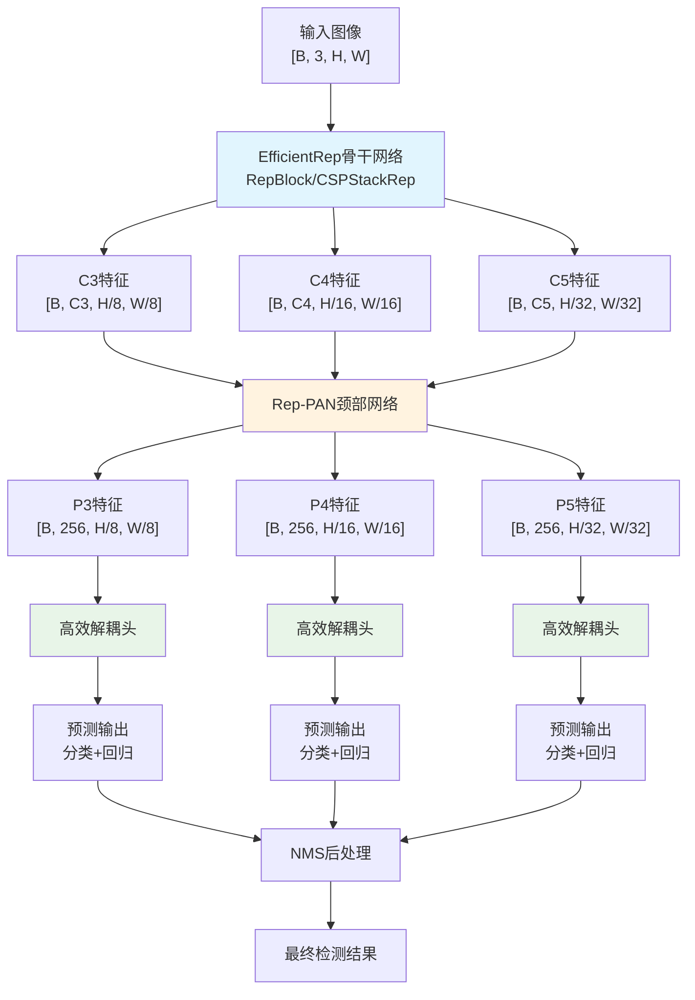

## 2. EfficientRep骨干网络架构图

```mermaid
graph TB
    subgraph SmallModels["小模型 (N/T/S)"]
        Input_S["输入"] --> RepBlock1["RepBlock<br/>stride=2"]
        RepBlock1 --> RepBlock2["RepBlock<br/>stride=2"]
        RepBlock2 --> RepBlock3["RepBlock<br/>stride=2"]
        RepBlock3 --> RepBlock4["RepBlock<br/>stride=2"]
        RepBlock4 --> RepBlock5["RepBlock<br/>stride=2"]
    end
    
    subgraph LargeModels["大模型 (M/L)"]
        Input_L["输入"] --> CSP1["CSPStackRep<br/>stride=2"]
        CSP1 --> CSP2["CSPStackRep<br/>stride=2"]
        CSP2 --> CSP3["CSPStackRep<br/>stride=2"]
        CSP3 --> CSP4["CSPStackRep<br/>stride=2"]
        CSP4 --> CSP5["CSPStackRep<br/>stride=2"]
    end
    
    style RepBlock1 fill:#e8f5e8
    style CSP1 fill:#fff3e0
```

## 3. RepBlock重参数化流程图

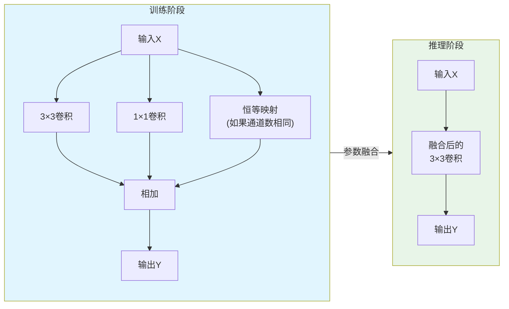

## 4. Rep-PAN with BiC颈部网络流程图 (v3.0)

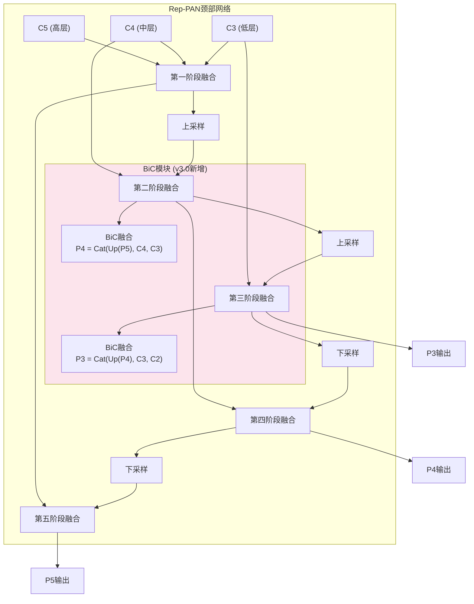

## 5. 高效解耦头结构图

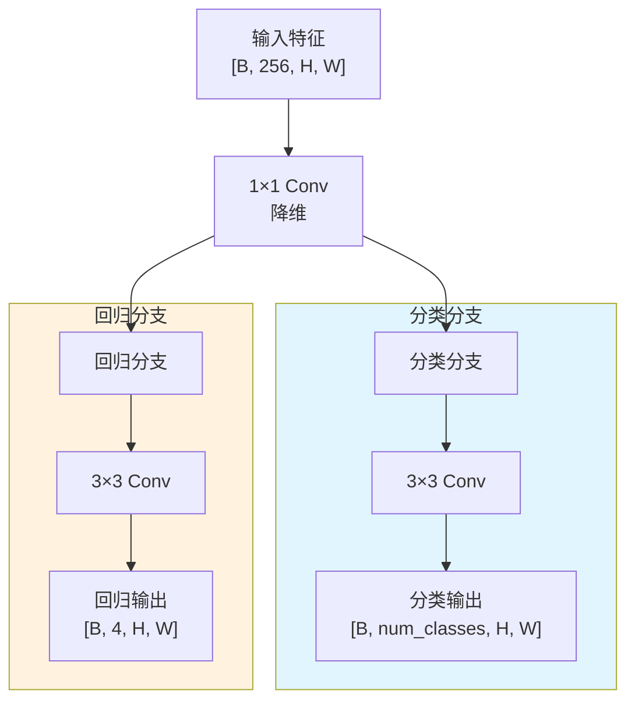

## 6. TAL标签分配流程图

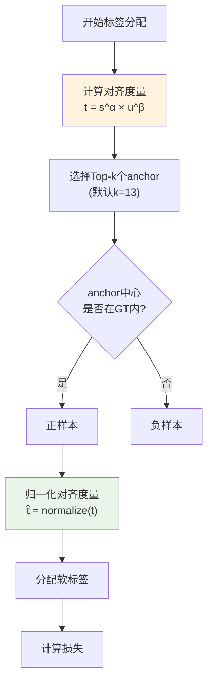

## 7. AAT锚点辅助训练流程图 (v3.0)

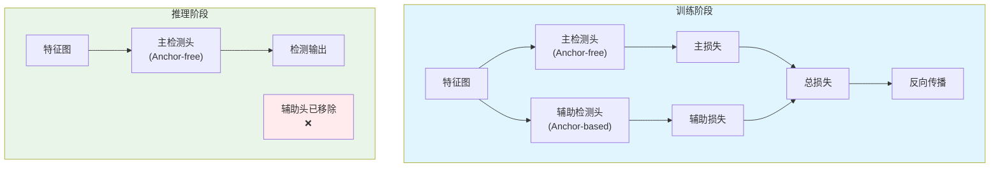

## 8. 自蒸馏训练流程图

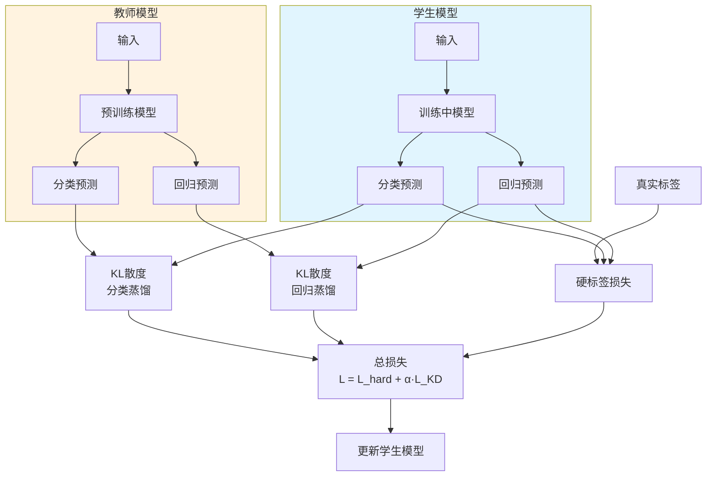

## 9. DLD解耦定位蒸馏流程图 (v3.0小模型专用)

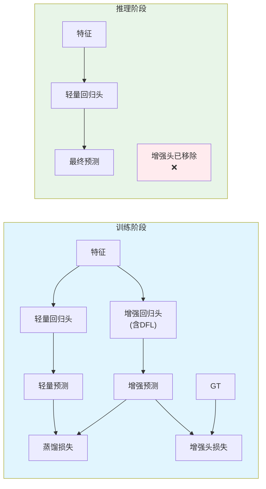

## 10. YOLOv6-N6/S6/M6/L6扩展架构流程图

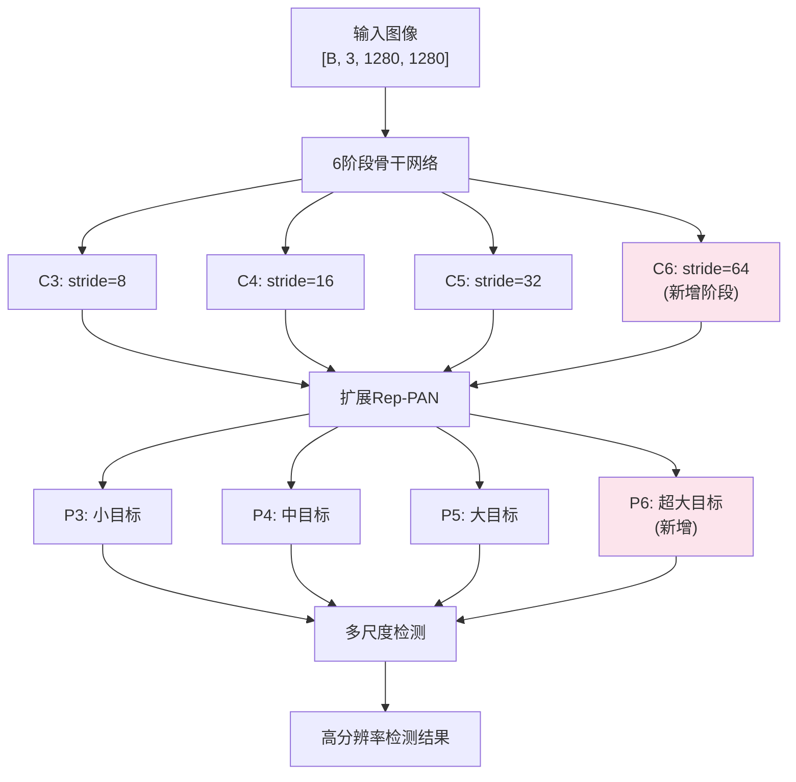

## 11. 量化部署优化流程图

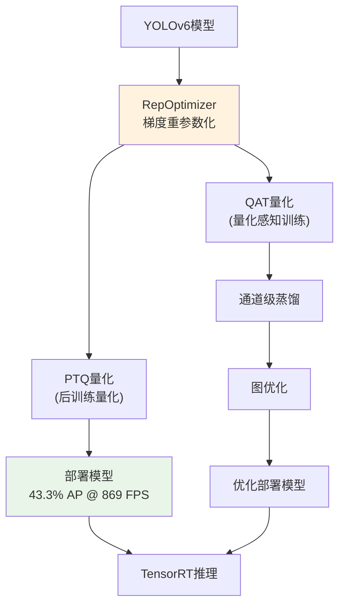

## 12. 训练策略演进流程图

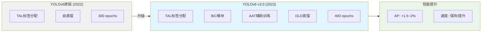

---

**说明**：
- 所有流程图基于YOLOv6原版论文（2022）和v3.0论文（2023）的设计
- 标注了v3.0的新增特性（BiC、AAT、DLD等）
- 维度标注基于COCO数据集的标准设置
- 颜色编码用于区分不同组件类型