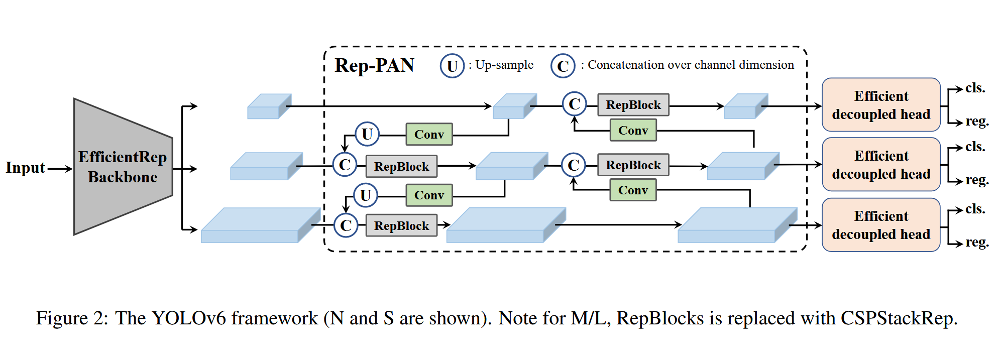
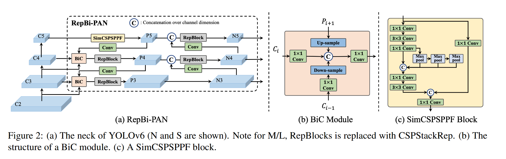
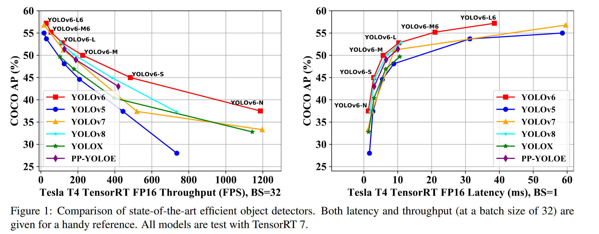
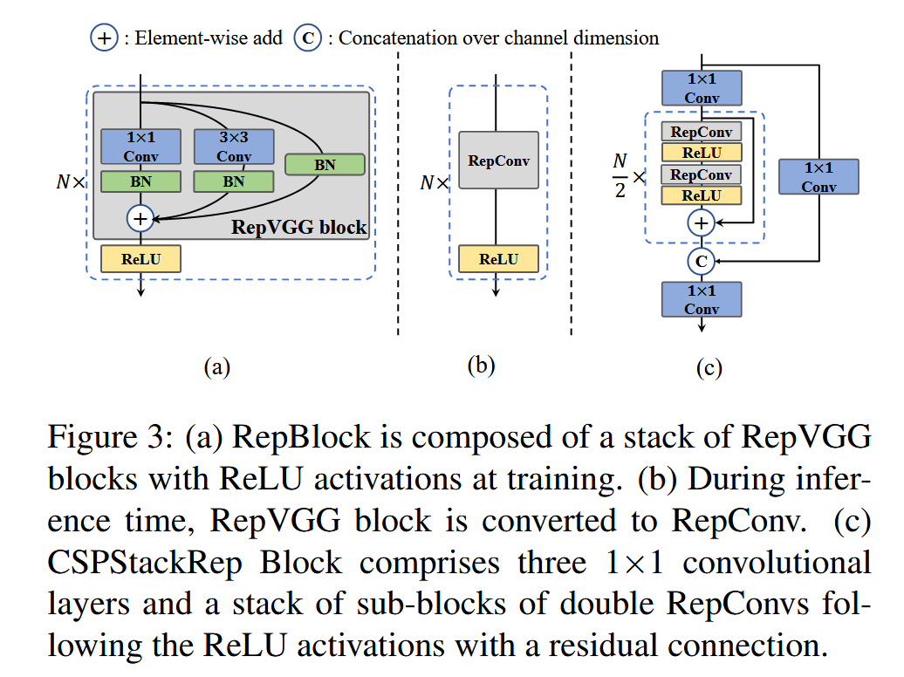
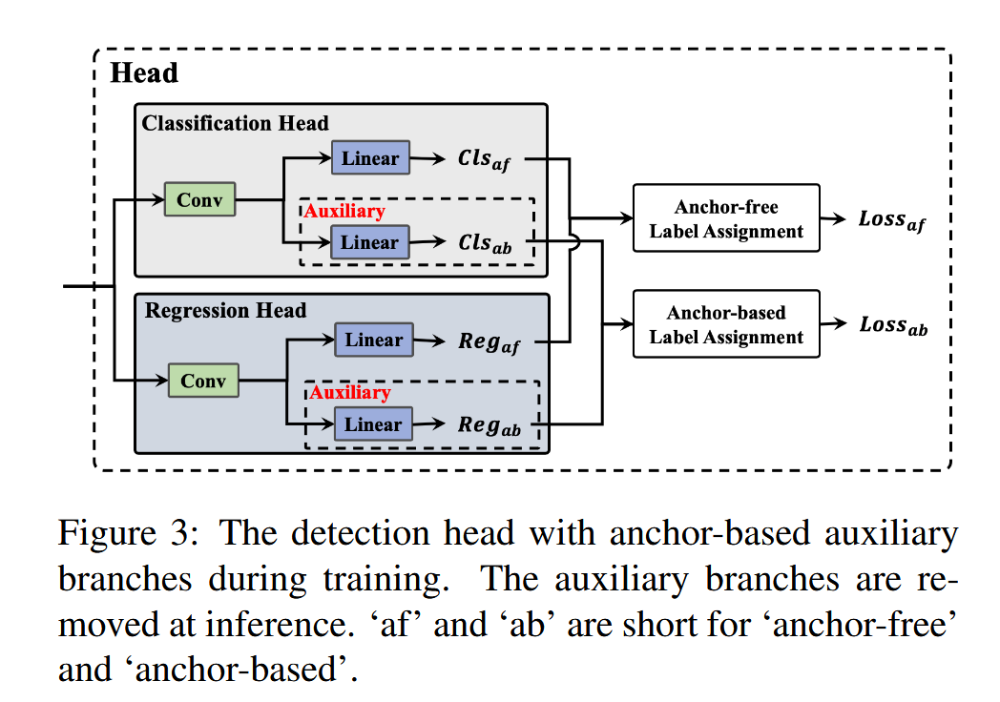

# [2023]YOLOv6: 工业级实时目标检测框架的全面升级

[**论文链接 (v1.0)**](https://arxiv.org/abs/2209.02976) | [**论文链接 (v3.0)**](https://arxiv.org/abs/2301.05586) | [**代码仓库**](https://github.com/meituan/YOLOv6)

**发表会议**: 原版技术报告于2022年发布，v3.0版本于2023年1月发布

## 摘要

YOLOv6是美团视觉智能部推出的工业级目标检测框架，经过多次迭代优化，在速度和精度上都达到了业界领先水平。本报告综合分析YOLOv6从原版（2022）到v3.0版本（2023）的技术演进。

**核心贡献与创新**：

### 原版YOLOv6 (2022)



- **EfficientRep骨干网络**：基于重参数化设计的高效特征提取网络
- **Rep-PAN颈部结构**：增强的特征融合网络
- **高效解耦头**：优化的混合通道策略检测头
- **TAL标签分配**：任务对齐的标签分配策略
- **自蒸馏策略**：分类和回归双任务知识蒸馏

### YOLOv6 v3.0 (2023) 升级点



- **BiC双向拼接模块**：增强的颈部网络，提供更准确的定位信号
- **AAT锚点辅助训练**：结合anchor-based和anchor-free的优势
- **DLD解耦定位蒸馏**：专为小模型设计的高效蒸馏策略
- **深层网络扩展**：6阶段骨干网络用于高分辨率检测

**性能突破**：
- YOLOv6-N: **37.5% AP**, 1187 FPS (Tesla T4)
- YOLOv6-S: **45.0% AP**, 484 FPS，超越同级别检测器
- YOLOv6-M: **50.0% AP**, 226 FPS
- YOLOv6-L: **52.8% AP**, 116 FPS
- YOLOv6-L6: **57.2% AP**，实时检测新SOTA


*图1: YOLOv6与主流检测器性能对比*

## 一、问题背景与动机

### 1.1 现有方法的局限性

YOLO系列作为工业界最流行的检测框架，在速度和精度平衡方面一直是业界标杆。然而，现有方法仍存在以下问题：

1. **重参数化潜力未充分利用**：RepVGG在检测领域的应用还不充分
2. **量化部署困难**：重参数化模型的量化性能下降严重
3. **部署硬件差距**：高性能GPU（V100）与实际部署GPU（T4）的性能差异
4. **小模型性能瓶颈**：小模型在精度提升方面遇到瓶颈

### 1.2 本文要解决的核心问题

1. **网络架构优化**：设计更高效的特征提取和融合网络
2. **训练策略改进**：探索更有效的训练技巧和蒸馏方法
3. **部署友好设计**：确保模型在实际硬件上的高效推理
4. **多尺度检测能力**：提升对不同尺度目标的检测性能

### 1.3 方法的理论价值和应用前景

YOLOv6通过系统性的优化，为工业应用提供了高性能的检测解决方案，特别适用于需要实时处理的场景。

## 二、方法原理与理论基础

### 2.1 整体方法概述

YOLOv6采用经典的单阶段检测器架构，包含骨干网络（Backbone）、颈部网络（Neck）和检测头（Head）三个主要组件。

### 2.2 核心算法原理

#### 2.2.1 EfficientRep骨干网络

**设计原则**：
- 小模型使用RepBlock构建单路径架构
- 大模型使用CSPStackRep Block平衡性能和效率


*RepBlock结构图*

**RepBlock重参数化**：
$$W_{merge} = W_{3×3} + W_{1×1} \cdot I_{3×3} + I_{3×3} \cdot W_{scale}$$

其中，训练时使用多分支结构，推理时融合为单个3×3卷积。

#### 2.2.2 Rep-PAN颈部网络

基于PAN拓扑结构，使用RepBlock或CSPStackRep Block增强特征融合能力。

#### 2.2.3 BiC双向拼接模块（v3.0新增）

**核心设计**：
融合三个相邻层的特征图，将更低层特征$C_{i-1}$引入$P_i$：

$$P_i = \text{Concat}(\text{Upsample}(P_{i+1}), C_i, C_{i-1})$$

这种设计显著提升了小目标检测性能。


#### 2.2.4 高效解耦头

采用混合通道策略，减少中间3×3卷积层数量，在保持性能的同时降低计算成本。

### 2.3 理论创新点分析

1. **重参数化在检测中的应用**：充分利用训练时的多分支结构和推理时的单路径效率
2. **任务对齐思想**：通过TAL策略统一分类和定位任务的优化目标
3. **锚点范式融合**：AAT策略结合两种范式的优势

## 三、算法详细设计

### 3.1 模型架构设计

#### 3.1.1 不同规模模型的架构选择

| 模型规模 | 骨干网络 | 颈部网络 | 特点 |
|---------|---------|---------|------|
| YOLOv6-N/T | RepBlock | RepBlock | 单路径，高并行度 |
| YOLOv6-S | RepBlock | RepBlock | 平衡设计 |
| YOLOv6-M/L | CSPStackRep | CSPStackRep | 多分支，更强表达能力 |

#### 3.1.2 CSPStackRep Block设计

```
CSPStackRep Block = 3个1×1卷积 + N个RepVGG块堆叠 + CSP连接
```

### 3.2 损失函数设计

#### 3.2.1 分类损失

采用VariFocal Loss (VFL)：
$$VFL = -\alpha_t \cdot (1-p_t)^\gamma \cdot \log(p_t)$$

#### 3.2.2 回归损失

- 小模型：SIoU/GIoU Loss
- 大模型：GIoU Loss + DFL（分布式焦点损失）

### 3.3 训练策略和技巧

#### 3.3.1 TAL标签分配策略

任务对齐度量：
$$t = s^{\alpha} \times u^{\beta}$$

其中$s$是分类得分，$u$是IoU，默认$\alpha=1, \beta=6$。

#### 3.3.2 AAT锚点辅助训练（v3.0新增）

**训练阶段**：
- 主分支：anchor-free检测头
- 辅助分支：anchor-based检测头
- 联合训练，共享特征

**推理阶段**：
- 仅保留anchor-free分支
- 无额外计算开销


*图3: 锚点辅助训练策略示意图*

#### 3.3.3 自蒸馏策略

**大模型自蒸馏**：
$$L_{KD} = \text{KL}(p_{t}^{cls}||p_{s}^{cls}) + \text{KL}(p_{t}^{reg}||p_{s}^{reg})$$

**小模型DLD策略**（v3.0新增）：
- 训练时增加增强回归分支（包含DFL）
- 推理时仅保留轻量级分支
- 保持DFL优势，避免速度下降

## 四、实验设计与结果分析

### 4.1 实验设置

- **数据集**：COCO 2017
- **训练设置**：300/400 epochs，8×A100 GPUs
- **评估指标**：COCO AP，FPS（Tesla T4，TensorRT FP16）

### 4.2 主实验结果分析

#### 4.2.1 YOLOv6原版性能（2022）

| 模型 | AP (%) | FPS (bs=1) | FPS (bs=32) | 延迟 (ms) |
|------|--------|------------|-------------|-----------|
| YOLOv6-N | 35.9 | 802 | 1234 | 1.2 |
| YOLOv6-S | 43.5 | 358 | 495 | 2.8 |
| YOLOv6-M | 49.5 | 179 | 233 | 5.6 |
| YOLOv6-L | 52.3 | 98 | 121 | 10.2 |

#### 4.2.2 YOLOv6 v3.0性能提升（2023）

| 模型 | AP原版 | AP v3.0 | 提升 | FPS (bs=32) |
|------|--------|---------|------|-------------|
| YOLOv6-N | 35.9% | **37.5%** | +1.6% | 1187 |
| YOLOv6-S | 43.5% | **45.0%** | +1.5% | 484 |
| YOLOv6-M | 49.5% | **50.0%** | +0.5% | 226 |
| YOLOv6-L | 52.3% | **52.8%** | +0.5% | 116 |

### 4.3 消融实验分析

#### 4.3.1 v3.0各组件贡献

| BiC+SimCSPSPPF | AAT | DLD | AP (YOLOv6-S) |
|----------------|-----|-----|---------------|
| ✗ | ✗ | ✗ | 43.5% |
| ✓ | ✗ | ✗ | 44.1% |
| ✓ | ✓ | ✗ | 44.4% |
| ✓ | ✓ | ✓ | **45.1%** |

#### 4.3.2 BiC模块效果分析

BiC模块对小目标检测的提升尤为显著：
- YOLOv6-S: APs从23.4%提升到25.0% (+1.6%)
- YOLOv6-L: APs从32.4%提升到33.6% (+1.2%)

### 4.4 与现有方法的对比

#### 4.4.1 与YOLOv5对比

| 模型对比 | AP差异 | 速度优势 |
|----------|--------|----------|
| YOLOv6-N vs YOLOv5-N | +9.5% | 2倍吞吐量 |
| YOLOv6-S vs YOLOv5-S | +7.6% | 相当 |
| YOLOv6-M vs YOLOv5-M | +4.6% | 更快 |

#### 4.4.2 与YOLOv8对比

YOLOv6在精度相当的情况下，提供显著更高的吞吐量性能。

## 五、代码实现分析

### 5.1 关键模块实现

#### 5.1.1 RepBlock实现（推测）

```python
class RepBlock(nn.Module):
    def __init__(self, in_channels, out_channels):
        super().__init__()
        # 训练时的多分支结构
        self.conv3x3 = nn.Conv2d(in_channels, out_channels, 3, padding=1)
        self.conv1x1 = nn.Conv2d(in_channels, out_channels, 1)
        self.identity = nn.BatchNorm2d(in_channels) if in_channels == out_channels else None
        
    def forward(self, x):
        if self.training:
            # 训练时使用多分支
            return self.conv3x3(x) + self.conv1x1(x) + (self.identity(x) if self.identity else 0)
        else:
            # 推理时已融合为单个卷积
            return self.conv3x3(x)
```

#### 5.1.2 BiC模块实现（推测）

```python
class BiC(nn.Module):
    def __init__(self, channels):
        super().__init__()
        self.conv = nn.Conv2d(channels * 3, channels, 1)
        
    def forward(self, p_i_plus_1, c_i, c_i_minus_1):
        # 上采样高层特征
        p_up = F.interpolate(p_i_plus_1, size=c_i.shape[2:])
        # 三层特征拼接
        concat_feat = torch.cat([p_up, c_i, c_i_minus_1], dim=1)
        # 1x1卷积融合
        return self.conv(concat_feat)
```

### 5.2 训练配置示例

```yaml
# YOLOv6-S配置
model:
  backbone: EfficientRep
  neck: RepPAN
  head: EffiDecoupledHead
  
train:
  epochs: 400
  batch_size: 32
  optimizer: SGD
  lr: 0.01
  warmup_epochs: 3
  
loss:
  cls_loss: VariFocalLoss
  reg_loss: GIoULoss
  
augmentation:
  mosaic: true
  mixup: true
```

## 六、总结与展望

### 6.1 主要贡献总结

1. **架构创新**：EfficientRep骨干网络和Rep-PAN颈部结构的设计
2. **训练策略**：TAL标签分配、自蒸馏、AAT锚点辅助训练
3. **v3.0升级**：BiC模块、DLD蒸馏、深层网络扩展
4. **工业部署**：量化友好设计，支持高效部署

### 6.2 方法优势与局限性

**优势**：
- 速度精度最优平衡
- 部署友好，支持多种硬件
- 完整的模型规模覆盖

**局限性**：
- 大模型训练成本较高
- 某些创新（如DLD）仅适用于特定规模

### 6.3 未来改进方向

1. **进一步优化量化性能**：探索更好的量化感知训练方法
2. **动态网络设计**：自适应调整网络结构
3. **多任务扩展**：支持实例分割、关键点检测等任务

## 七、版本对比总结

### 7.1 YOLOv6原版 vs v3.0主要差异

| 特性 | 原版 (2022) | v3.0 (2023) | 改进效果 |
|------|-------------|-------------|----------|
| 颈部网络 | Rep-PAN | Rep-PAN + BiC | 小目标检测提升 |
| 训练策略 | TAL + 自蒸馏 | TAL + AAT + DLD | 精度提升1-2% |
| 网络深度 | 5阶段 | 支持6阶段（-N6/S6/M6/L6） | 高分辨率检测 |
| 小模型蒸馏 | 标准KD | DLD解耦蒸馏 | 避免速度损失 |

### 7.2 关键技术影响力

YOLOv6的多项创新已被后续工作采用：
- **重参数化设计**：被YOLOv7、YOLOv8等借鉴
- **TAL标签分配**：成为主流方法
- **混合通道解耦头**：优化了推理效率

## 参考文献

1. Li, C., Li, L., Jiang, H., et al. (2022). YOLOv6: A single-stage object detection framework for industrial applications. arXiv:2209.02976.

2. Li, C., Li, L., Geng, Y., et al. (2023). YOLOv6 v3.0: A Full-Scale Reloading. arXiv:2301.05586.

3. Ding, X., Zhang, X., Ma, N., et al. (2021). RepVGG: Making VGG-style ConvNets Great Again. CVPR 2021.

4. Feng, C., Zhong, Y., Gao, Y., et al. (2021). TOOD: Task-aligned One-stage Object Detection. ICCV 2021.

---

*技术报告生成时间：2024年*

*基于YOLOv6原版（2022年9月）和v3.0版本（2023年1月）论文综合分析*